## 2.1. La tangente y los problemas de la velocidad {#seccion_2.1}

	
### El problema de la tangente
	
La palabra **tangente** deriva del latín *tangens* que significa "tocar". Así, podramos decir que una recta tangente a una curva es una recta que toca a la curva. 
	
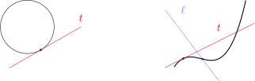{fig-align="center" width=60%}
	
Cuando la curva es una circunferencia, la recta tangente es aquella que la interseca en un solo punto. Sin embargo, para curvas más generales esta definición no parece adecuada: la recta $\ell$ corta a la curva una sola vez, pero no se parece a lo que consideramos una tangente. Por otro lado, la recta $t$ se parece a una tangente, pero la interseca más de una vez.

::: {.example-box}

Ejemplo
 

 Encontrar la ecuación de la recta tangente a la parbola $y=x^2$ en el punto $P=(1,1)$.
:::	

::: {.callout-tip collapse="true"}
## Solución

Para dar la ecuación de la recta necesitamos conocer su pendiente. Como sólo se cuenta con un punto, tomamos $Q=(x,x^2)$ con $x\neq 1$ y estimamos la pendiente $m$ con la de la recta secante $PQ$, dada por

$$
m_{PQ}=\frac{x^2-1}{x-1}.
$$

En la siguiente tabla observamos los valores de $m_{PQ}$ para distintos valores de $x$.

::: {.math-table}

| $x$ | $m_{PQ}$ |
|---------|---------|
| 0   | 1  | 
| 0.5 | 1.5 | 
| 0.9| 1.9    | 
| 0.99| 1.99 |
| 0.999| 1.999  |
| 1.001| 2.001  |
| 1.01|  2.01 |
| 1.1|  2.1 |
| 1.5| 2.5  |
| 2| 3  |
:::

Podemos ver que, conforme $x$ está más cerca de $1$, $m_{PQ}$ estará más cerca de 2. Conjeturamos entonces que la pendiente buscada es $2$. Decimos que la pendiente $m$ es el **límite** de las pendientes de las rectas secantes $m_{PQ}$, y escribimos

$$
m=\lim_{Q\to P} m_{PQ} \quad \text{ y también }\quad    m=\lim_{x\to 1} \frac{x^2-1}{x-1}=2.
$$

Utilizando este valor de $m$ podemos ver que la recta buscada tiene ecuación

$$
y-1=2(x-1) \quad \text{ o equivalentemente }\quad  y=2x-1.
$$

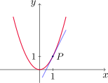{fig-align="center" width=40%}

:::

### El problema de la velocidad

En física resulta sencillo calcular una velocidad como el cociente entre el espacio recorrido y el tiempo que se tarda en recorrerlo. Sin embargo, en este caso se supone que la velocidad es constante durante el experimento. ¿Qué sucede entonces cuando la velocidad varía? ¿Cómo puede determinarse en cada instante de tiempo?
	
::: {.example-box}

Ejemplo
 

Se deja caer una pelota desde la plataforma de observación de la Torre CN en Toronto, a 450 metros por encima del nivel del suelo. Encontrar la velocidad de la pelota una vez que transcurren cinco segundos.

:::

::: {.callout-tip collapse="true"}
## Solución

Si $s(t)$ representa la distancia en metros recorrida por la pelota, a tiempo $t$ medido en segundos, entonces la **ley de Galileo** establece que

$$
s(t)=4.9\, t^2
$$

Podemos comenzar calculando la velocidad promedio en distintos intervalos de tiempo. Si $h>0$, la velocidad promedio de la pelota en el intervalo $[t, t+h]$ viene dada por

$$
\frac{s(t+h)-s(t)}{h}.
$$

	
En la siguiente tabla tenemos el cálculo de velocidades promedio para intervalos de diferentes amplitudes.

::: {.math-table}

| Intervalo de tiempo | velocidad promedio $(m/s)$ |
|---------|---------|
| [5,6] | 53.9 |
| [5,5.1] | 49.49 |
| [5,5.05] | 49.245 |
| [5,5.01] | 49.049 |
| [5,5.001] | 49.0049 |
:::

Conforme se achica el intervalo las velocidades promedio se aproximan a 49 $m/s$. La **velocidad instantánea** se define como el límite de las velocidades promedio cuando la amplitud de los intervalos se achica. Esta idea se precisará mejor más adelante. Con esto, podemos conjeturar que la velocidad instantánea de la pelota después de cinco segundos es de 49 $m/s$.

:::

Existe una relación entre los dos problemas presentados. Si dibujamos la función del ejemplo anterior 

$$
s(t)=4.9\, t^2
$$

y consideramos los puntos $P=(a, 4.9\,a^2)$ y $Q=(a+h, 4.9\,(a+h)^2)$ entonces la pendiente de la secante $PQ$ está dada por

$$
m_{PQ}=\frac{4.9\,(a+h)^2- 4.9\,a^2}{(a+h)-a}=\frac{4.9\,(a+h)^2- 4.9\,a^2}{h}.
$$

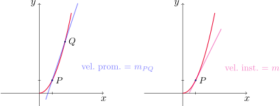{fig-align="center" width=70%}

Luego, la velocidad instantánea representa la pendiente de la recta tangente en el punto $P$, que es el límite de las velocidades promedio dadas por las pendientes de las rectas secantes $m_{PQ}$ conforme $Q$ se aproxima a $P$.

[↑ Volver al inicio de la sección](#seccion_2.1)	

## 2.2. Límite de una función {#seccion_2.2}

En esta sección definiremos el concepto de **límite** de una función, surgido al intentar calcular la recta tangente a una curva dada. Consideremos $f(x)=x^2-x+2$ y observemos los valores de $f$ cuando $x$ está cerca de 2.
	
::: {.math-table}

| **$x$** | **$f(x)$** | **$x$** | **$f(x)$** |
| --- | --- | --- | --- |
| 1.0 | 2.000000 | 3.0 | 8.000000 |
| 1.5 | 2.750000 | 2.5 | 5.750000 |
| 1.8 | 3.440000 | 2.2 | 4.640000 |
| 1.9 | 3.710000 | 2.1 | 4.310000 |
| 1.95 | 3.852500 | 2.05 | 4.152500 |
| 1.99 | 3.970100 | 2.01 | 4.030100 |
| 1.995 | 3.985025 | 2.005 | 4.015025 |
| 1.999 | 3.997001 | 2.001 | 4.003001 |
|  |  |  |  |
:::	
	
De la tabla anterior podemos deducir que cuando $x$ está cerca de 2 (por la izquierda o la derecha), $f(x)$ está cerca de 4.
	
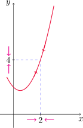{fig-align="center" width=30%}

De hecho, se pueden acercar los valores de $f(x)$ tanto a 4 como se desee, conforme se elija $x$ suficientemente cercano a 2.

Esto se expresa diciendo que: "el límite de la función $f(x)=x^2-x+2$, cuando $x$ tiende a 2, es igual a 4" y se escribe

$$
\lim_{x\to 2} \,(x^2-x+2) =4.
$$

::: {.callout-note title="Definición (Límite de una función)"}

Decimos que el **límite** cuando $x$ tiende a $a$ de $f(x)$ es $L$, y lo escribimos
		
$$
\lim_{x\to a} f(x)=L
$$

si los valores de $f$ pueden acercarse arbitrariamente a $L$ conforme $x$ se elija suficientemente cerca de $a$, pero **$x\neq a$**.
		
También podemos decir esto escribiendo $f(x)\to L$ cuando $x\to a$.

:::

::: {.callout-caution title="Importante"}
 Notar que en la definición consideramos $x\neq a$. Esto significa que $f$ no necesita estar definida en $x=a$ para calcular su límite para $x\to a$. Lo importante es que $f$ esté definida *cerca* de $a$.
:::

En los tres gráficos de abajo se cumple que $\lim_{x\to a}f(x)=L$.
	
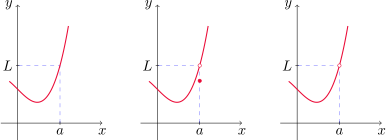{fig-align="center" width=60%}

::: {.example-box}

Ejemplo
 

Conjeturar el valor del límite $\displaystyle \lim_{x\to 1} \frac{x-1}{x^2-1}$.

:::

::: {.callout-tip collapse="true"}
## Solución

Notemos que $f$ no está definida en $x=1$. Sin embargo, esto no importa pues a los efectos de calcular el límite debemos considerar $x$ cerca de $1$, pero $x\neq 1$.
	
La siguiente tabla muestra los valores de $f(x)$ cuando $x$ está cerca de $1$, por izquierda y por derecha.

::: {.columns}
::: {.column width="40%"}

::: {.math-table}

| **$x<1$** | **$f(x)$** |
| --- | --- |
| 0.5 | 0.666667 |
| 0.9 | 0.526316 |
| 0.99 | 0.502513 |
| 0.999 | 0.500250 |
| 0.9999 | 0.500025 |
|  |  |
:::	

:::
::: {.column width="40%"}

::: {.math-table}

| **$x>1$** | **$f(x)$** |
| --- | --- |
| 1.5 | 0.400000 |
| 1.1 | 0.476190 |
| 1.019 | 0.497512 |
| 1.001 | 0.499750 |
| 1.0001 | 0.499975 |
|  |  |
:::	

:::
:::

Esto sugiere que $\operatorname{lím}_{x\to 1}f(x)=\frac{1}{2}$, como comprobaremos luego.

Aquí podemos ver el gráfico de $f$ junto al de la función
$$
g(x)=
\begin{cases}
f(x) & \text{ si } x\neq 1,\\
2 & \text{ si } x=1.
\end{cases}
$$
	

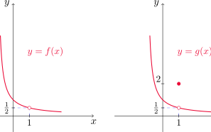{fig-align="center" width=60%}

Ambas tiene el mismo límite para $x\to 1$ ya que sólo difieren en $x=1$.

:::	

::: {.example-box}

Ejemplo
 

Estimar el valor de $\displaystyle \lim_{t\to 0} f(t)$, siendo $\displaystyle f(t)=\frac{\sqrt{t^2+9}-3}{t^2}$.

:::

::: {.callout-tip collapse="true"}
## Solución

Nuevamente realizamos una tabla evaluando la función en valores de $t$ cercanos a $0$, $t\neq 0$. 

::: {.math-table}

| $t$ | $f(t)$ |
| --- | --- |
| $\pm\,$ 1.0 | 0.16228 |
| $\pm\,$ 0.5 | 0.16553 |
| $\pm\,$ 0.1 | 0.16662 |
| $\pm\,$ 0.05 | 0.16666 |
| $\pm\,$ 0.01 | 0.16667 |
:::	

Conforme $t$ se acerca a $0$, los valores de la función parecen acercarse a $1/6$, con lo que conjeturamos que

$$
 \lim_{t\to 0}\frac{\sqrt{t^2+9}-3}{t^2}=\frac{1}{6}.
$$

:::

¿Qué sucedería si eligiésemos valores de $t$ más cercanos a $0$?

::: {.math-table}

| $t$ | $f(t)$ |
| --- | --- |
| $\pm\,$ 0.0005 | 0.16800 |
| $\pm\,$ 0.0001 | 0.20000 |
| $\pm\,$ 0.00005 | 0.00000 |
| $\pm\,$ 0.00001 | 0.00000 |
:::	

En general, si elegimos valores de $t$ suficientemente chicos, habrá un momento en que la calculadora nos arroje como resultado $0$. Esto no significa que el límite es cero, sino que la diferencia del numerador es tan pequeña que hace que esta expresión parezca $0$ para la precisión que la calculadora maneja.

::: {.callout-caution title="Importante"}
 Si bien una tabla de valores muchas veces ayuda a entender el comportamiento de una función al analizar límites, **no debe usarse como herramienta formal**.
:::		

::: {.example-box}

Ejemplo
 

Investigar el valor de $\displaystyle \lim_{x\to 0}\operatorname{sen}\left(\frac{\pi}{x}\right)$.

:::

::: {.callout-tip collapse="true"}
## Solución

Nuevamente $f(x)=\operatorname{sen}(\pi/x)$ no está definida en $x=0$. Si $n\in\mathbb{N}$, observemos que

$$
f\left(\frac{1}{n}\right)=\operatorname{sen}(n\pi)=0.
$$

Como esto vale para cualquier $n\in\mathbb{N}$ (más aún, es cierto para todo $n$ entero no nulo), podríamos estar tentados a suponer que

$$
\lim_{x\to 0} f(x)=0.
$$

Sin embargo, esto es erróneo pues podemos comprobar que
$$
f\left(\frac{2}{4n+1}\right)=1 \quad \text { y }\quad f\left(\frac{2}{4n-1}\right)=-1 
$$

para cualquier $n\in\mathbb{N}$.

Esto muestra que los valores de $f(x)$ oscilan constantemente cuando se eligen distintos valores de $x$ cercanos a cero. En este caso, el límite **no existe** por oscilación, como lo muestra la gráfica.

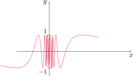{fig-align="center" width=60%}

:::
	
::: {.example-box}

Ejemplo
 

Encontrar el valor de $\displaystyle \lim_{x\to 0} \left(x^3+\frac{\cos(5x)}{10000}\right)$.

:::	
	
::: {.callout-tip collapse="true"}
## Solución

Realizando una tabla de valores, tenemos lo siguiente

::: {.math-table}

| $x$ | $f(x)$ |
| --- | --- |
| 1 | 1.000028 |
| 0.5 | 0.124920 |
| 0.1 | 0.001088 |
| 0.05 | 0.000222 |
| 0.01 | 0.000101 |

:::	
	
Esto parece indicar que el lmite es cero. Sin embargo, si consideramos valores más pequeños de $x$ obtenemos

::: {.math-table}

| $x$ | $f(x)$ |
| --- | --- |
| 0.005 | 0.00010009 |
| 0.001 | 0.00010000 |

:::			
			
En realidad, veremos más adelante que $\lim_{x\to 0}\cos(5x)=1$, con lo cual 

$$
\lim_{x\to 0} \left(x^3+\frac{\cos(5x)}{10000}\right)=\frac{1}{10000}=0.0001.
$$

:::

La **función de Heaviside** $H$ se define mediante la expresión

$$
H(t)=
\begin{cases}
0 & \text{ si } t<0,\\
1 & \text{ si } t\geq 1.
\end{cases}
$$

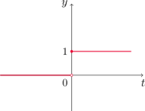{fig-align="center" width=40%}

Notemos que $H(t)$ se aproxima a 1 cuando $t$ se aproxima a cero por la derecha, y se aproxima a 0 cuando $t$ se acerca a cero por la izquierda. Esto podemos escribirlo como

$$
\lim_{t\to 0^+} H(t)=1 \quad \text{ y } \quad \lim_{t\to 0^-} H(t)=0.
$$

No hay un único valor $L$ al que $H(t)$ se aproxime cuando $t$ tiende a cero, por lo que el límite $\lim_{t\to 0} H(t)$ no existe. 

::: {.callout-note title="Definición (Límites laterales)"}

- Decimos que el límite de $f(x)$ cuando $x$ se aproxima a $a$ por la **izquierda**   es $L$ y lo denotamos

$$
\lim_{x\to a^-} f(x)=L
$$

si los valores $f(x)$ pueden aproximarse al número $L$ tanto como se desee, siempre que se elija $x$ lo suficientemente cerca de $a$, pero **$x<a$**.

- Análogamente, decimos que el límite de $f(x)$ cuando $x$ tiende a $a$ por la **derecha** es $L$ y lo expresamos

$$
\lim_{x\to a^+} f(x)=L
$$

si $f(x)$ puede aproximarse al número $L$ tanto como se quiera, siempre que elijamos $x$ lo suficientemente cercano a $a$, pero **$x>a$**.

:::
	
Al comparar la definición de límite con la de límites laterales, tenemos que

::: {.formula-box}

$$
\lim_{x\to a} f(x)=L \quad \Longleftrightarrow \quad \lim_{x\to a^-} f(x)=L \quad \text{ y } \quad \lim_{x\to a^+} f(x)=L.
$$
 
:::

::: {.example-box}

Ejemplo

Dar los valores de los siguientes límites (si existen) observando la gráfica.

::: {.columns}
::: {.column width="40%"}

- $\lim_{x\to 2^-}\,g(x)$
- $\lim_{x\to 2^+}\,g(x)$
- $\lim_{x\to 2}\,g(x)$

:::
::: {.column width="40%"}

- $\lim_{x\to 5^-}\, g(x)$
- $\lim_{x\to 5^+}\, g(x)$
- $\lim_{x\to 5}\, g(x)$

:::

:::

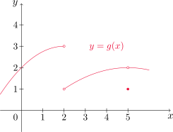{fig-align="center" width=50%}

:::

::: {.callout-tip collapse="true"}
## Solución

Observando el gráfico vemos que $g$ se aproxima a 3 cuando $x$ se acerca a 2 por la izquierda, y a 1 cuando $x$ se aproxima a 2 por la derecha. En consecuencia 

$$
\lim_{x\to 2^-}g(x)=3\quad \text{ y } \quad \lim_{x\to 2^+} g(x)=1.
$$

Como los límites laterales son distintos, concluimos que el límite $\lim_{x\to 2} g(x)$ no existe.

Por otra parte, también podemos ver que $g$ se aproxima a 2 cuando $x$ se acerca a 5, tanto por la derecha como por la izquierda, con lo cual 

$$
\lim_{x\to 5^-} g(x)=2=\lim_{x\to 5^+} g(x),
$$

y en conclusión $\lim_{x\to 5} g(x)=2$. Notar que $g(5)=1\neq 2$, sin embargo esto no infliuye en el cálculo del límite pues al hacerlo consideramos $x\neq 5$.

:::
			
### Límites infinitos

Vamos a investigar a continuación el comportamiento de la función

$$
\displaystyle f(x)=\frac{1}{x^2}
$$
 
cuando $x$ se aproxima a cero.	Cuando $x$ tiende a cero, tanto por la derecha como por la izquierda, $1/x^2$ se hace cada vez más grande. Más aún, podemos hacer que $1/x^2$ sea tan grande como deseemos, siempre que elijamos $x$ lo suficientemente cerca de cero. En la siguiente tabla se muestran algunos valores de $f$ cuando $x$ toma valores cercanos a cero.
	
::: {.math-table}

| $x$ | $f(x)$ |
| --- | --- |
| $\pm \,$ 1 | 1 |
| $\pm \,$ 0.5 | 4 |
| $\pm \,$ 0.2 | 25 |
| $\pm \,$ 0.1 | 100 |
| $\pm \,$ 0.05 | 400 |
| $\pm \,$ 0.01 | 10000 |
| $\pm \,$ 0.001 | 1000000 |
:::	
		
Este comportamiento se puede observar también con el gráfico de la función.
			
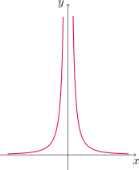{fig-align="center" width=40%}

En este caso, decimos que $\lim_{x\to 0} f(x)$ no existe **por infinitud**.  Para indicar este tipo de comportamiento, escribiremos

$$
\lim_{x\to 0} \frac{1}{x^2}=\infty.
$$

::: {.callout-important title="Importante"}
 Esto no significa que consideremos a $\infty$ como un número ni que el límite dado exista. La notación sólamente establece de qué manera el límite no existe.	
:::	

::: {.callout-note title="Definición (Límites infinitos)"}
Sea $f$ una función definida en ambos lados de $a$, excepto quizás en $a$. 
	
-  La expresión

$$
\lim_{x\to a} f(x)=\infty
$$

significa que $f(x)$ puede hacerse arbitrariamente grande conforme $x$ se elija lo suficientemente cerca de $a$, pero $x\neq a$.

-  Por otro lado

$$
\lim_{x\to a} f(x)=-\infty
$$
	
quiere decir que $f(x)$ puede hacerse arbitrariamente grande y negativa siempre que $x$ se elija lo suficientemente cerca de $a$, pero $x\neq a$.
:::	
		
Otra notación para $\lim_{x\to  a} f(x)=\infty$ es: $f(x)\to \infty$ cuando $x\to a$, y se lee
	
-   "el límite cuando $x\to a$ de $f(x)$ es infinito", o
-   "$f(x)$ se vuelve infinita cuando $x$ se aproxima a $a$", o bien
-   "$f(x)$ se incrementa sin límite cuando $x$ tiende a $a$".
	
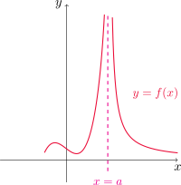{fig-align="center" width=40%}

		
Para $\lim_{x\to a} f(x)=-\infty$ podemos escribir: $f(x)\to -\infty$ cuando $x\to a$, y leerlo
	
-   "el límite cuando $x\to a$ de $f(x)$ es el infinito negativo", o
-   "$f(x)$ decrece sin cota cuando $x$ se aproxima a $a$".
		
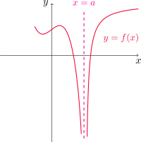{fig-align="center" width=40%}

Definiciones similares pueden darse para

$$
\lim_{x\to a^-} f(x)=\infty \quad \text{ y }\quad \lim_{x\to a^+} f(x)=\infty.
$$

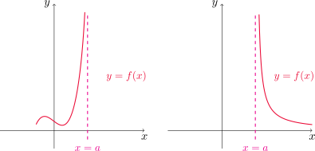{fig-align="center" width=70%}

Y también para
	
$$
\lim_{x\to a^-} f(x)=-\infty \quad \text{ y }\quad \lim_{x\to a^+} f(x)=-\infty.
$$
	
	
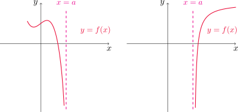{fig-align="center" width=70%}

::: {.callout-note title="Definición (Asíntota vertical)"}
La recta $x=a$ se llama **asíntota vertical** de la curva $y=f(x)$ si al menos uno de los siguientes enunciados es verdadero

::: {.columns}
::: {.column width="40%"}

- $\lim_{x\to a}\,f(x)=\infty$
- $\lim_{x\to a^-}\,f(x)=\infty$
- $\lim_{x\to a^+}\,f(x)=\infty$

:::
::: {.column width="40%"}

- $\lim_{x\to a}\,f(x)=-\infty$
- $\lim_{x\to a^-}\,f(x)=-\infty$
- $\lim_{x\to a^+}\,f(x)=-\infty$

:::
:::

:::	

::: {.example-box}

Ejemplo

Determinar

$$
\lim_{x\to 3^+} \frac{2x}{x-3} \quad \text{ y } \quad  \lim_{x\to 3^-} \frac{2x}{x-3}.
$$

:::

::: {.callout-tip collapse="true"}
## Solución
Veamos primero $\lim_{x\to 3^+} \frac{2x}{x-3}$. Notemos que el denominador se aproxima a cero y el numerador a $6\neq 0$, con lo que el límite resultará infinito. Para saber si es $\infty$ o $-\infty$, observemos que $x\to 3^+$ implica que $x>3$, lo que equivale a que $x-3>0$. Entonces al ser numerador y denominador positivos para todo $x>3$ resulta 

$$
\lim_{x\to 3^+} \frac{2x}{x-3}=\infty.
$$

Para el otro caso, procediendo de forma similar y notando que $x\to 3^-$ implica que $x-3<0$ para todo $x<3$ obtenemos

$$
\lim_{x\to 3^-} \frac{2x}{x-3}=-\infty.
$$

:::

::: {.example-box}

Ejemplo

Hallar las asíntotas verticales de $f(x)=\tan x$.

:::

::: {.callout-tip collapse="true"}
## Solución

Recordemos que $\tan x=\frac{\operatorname{sen} x}{\cos x}$, por lo tanto tendremos posibles asíntotas verticales cuando $\cos x=0$. Esto ocurre, por ejemplo, cuando $x=\pi/2$. En este caso, si $x$ está cerca de $\pi/2$ y $x>\pi/2$, $\cos x$ se aproxima a cero con valores negativos, mientras que $\operatorname{sen} x$ se aproxima a 1. Con lo cual

$$
\lim_{x\to (\pi/2)^+} \tan x=-\infty.
$$

Por otra parte, si $x$ está cerca de $\pi/2$ y $x<\pi/2$, $\cos x$ se aproxima a cero con valores negativos, y $\operatorname{sen} x$ sigue aproximándose a 1. Por lo tanto

$$
\lim_{x\to (\pi/2)^-} \tan x=\infty.
$$

Estos cálculos muestran que $x=\pi/2$ es una asíntota vertical de $f$. De manera similar podemos ver que todas las asíntotas de $f$ son de la forma

$$
x=\left(2n+1\right)\frac{\pi}{2} \quad \text{ con }\quad n\in\mathbb{Z}.
$$

:::

[↑ Volver al inicio de la sección](#seccion_2.2)

## 2.3. Leyes de los límites {#seccion_2.3}

Hasta ahora hemos conjeturado el valor de ciertos límites a partir de una tabla o de observar el comportamiento de sus gráficos.
	
En esta sección calcularemos los límites utilizando propiedades, lo que nos conducirá a los valores exactos, cuando estos límites existen.

::: {#teo-leyes-limites .theorem}

Propiedad (Leyes de los límites)

Sea $c$ una constante y supongamos que los límites
$$
\lim_{x\to a} f(x) \quad \text{ y } \quad \lim_{x\to a}g(x)
$$		

existen. Entonces
		
1. $\lim_{x\to a}\,[f(x)+g(x)]=\lim_{x\to a}f(x)+\lim_{x\to a} g(x)$.

2.  $\lim_{x\to a}\, [f(x)-g(x)]=\lim_{x\to a} f(x)-\lim_{x\to a} g(x)$.

3.  $\lim_{x\to a} \,[cf(x)]=c\lim_{x\to a} f(x)$.

4.  $\lim_{x\to a} [f(x)g(x)]=\lim_{x\to a} f(x) \lim_{x\to a} g(x)$.

5.  $\displaystyle \lim_{x\to a} \frac{f(x)}{g(x)}= \frac{\lim_{x\to a} f(x)}{\lim_{x\to a} g(x)}$, siempre que $\lim_{x\to a} g(x)\neq 0$.

:::

Aplicando la ley **(4)** con $f=g$ repetidas veces, obtenemos
	
::: {.theorem}

6. $\lim_{x\to a}\,(f(x))^n=\left(\lim_{x\to a}f(x)\right)^n$, con $n$ entero positivo.
:::

Dos límites especiales que vale la pena mencionar son

::: {.theorem}

7. $\lim_{x\to a}\, c=c$.

8. $\lim_{x\to a}\, x=a$.
:::
	
Combinando las leyes **(6)** y **(8)** obtenemos
	
::: {.theorem}

9. $\lim_{x\to a}\, x^n=a^n$.
:::		
		
Para el caso de races, si $n\in\mathbb{N}$ tenemos que

::: {.theorem}

10. $\lim_{x\to a}\, \sqrt[n]{x}=\sqrt[n]{a}\quad$ ($a>0$ si $n$ es par).

11. $\lim_{x\to a}\, \sqrt[n]{f(x)}=\sqrt[n]{\lim_{x\to a}f(x)}\quad$ ($\lim_{x\to a} f(x)>0$ si $n$ es par).

:::

::: {.example-box}

Ejemplo

Evaluar los siguientes lmites y justificar cada paso.

1. $\lim_{x\to 5}\, (2x^2-3x+4)$.

2. $\displaystyle \lim_{x\to -2}\, \frac{x^3+2x^2-1}{5-3x}$.

:::

::: {.callout-tip collapse="true"}
## Solución
Comencemos con el primer límite.  Utilizando la ley **(6)** con $n=2$ junto a la ley **(8)** obtenemos que 

$$
\lim_{x\to 5} x^2 = 5^2 =25,
$$

y por la ley **(3)**

$$
\lim_{x\to 5} 2x^2 = 2\left(\lim_{x\to 5} x^2\right) =2\cdot 25=50.
$$

Por otra parte, combinando las leyes **(3)** y **(8)**

$$
\lim_{x\to 5} 3x = 3\left(\lim_{x\to 5} x\right) =3\cdot 5=15.
$$

Finalmente, por las leyes **(1)**, **(2)** y **(7)**

$$
\lim_{x\to 5}\, (2x^2-3x+4)=\lim_{x\to 5}\, 2x^2 - \lim_{x\to 5}\, 3x+ \lim_{x\to 5} 4 = 50-15+4=39.
$$

Para calcular el segundo límite, notemos que se trata de una función racional, es decir, cociente de polinomios. Procediendo como en el caso anterior podemos ver que 

$$
\lim_{x\to -2}\, (x^3+2x^2-1) = (-2)^3+2(-2)^2-1=-1
$$

y también

$$
\lim_{x\to -2}\, (5-3x) = 5-3(-2)=11.
$$

Entonces, utilizando la ley **(5)** concluimos que 

$$
\lim_{x\to -2}\, \frac{x^3+2x^2-1}{5-3x}=\frac{\lim_{x\to -2}\, (x^3+2x^2-1)}{\lim_{x\to -2}\, (5-3x)}=-\frac{1}{11}.
$$

:::

El procedimiento utilizado en el ejemplo anterior puede repetirse para cualquier función polinómica o racional, lo que nos conduce a la siguiente propiedad.

::: {#teo-sust-directa .theorem}
Propiedad de sustitución directa

Si $f$ es un **polinomio** o una **función racional** y $a$ está en el dominio de $f$, entonces

$$
\lim_{x\to a}\, f(x)=f(a).
$$

Las funciones que cumplen la igualdad de arriba se dicen **continuas** en $a$. Este concepto lo trataremos más adelante.
		
:::

::: {.example-box #ejemplo-cuadratica-lineal}

Ejemplo

Hallar $\displaystyle \lim_{x\to 1} \frac{x^2-1}{x-1}$.
:::

::: {.callout-tip collapse="true"}
## Solución

Recordemos que a los efectos de operar con límites importan los valores de $f(x)$ para  $x$ cerca de $1$, pero $x\neq 1$. Si tomamos $x\neq 1$ entonces podemos escribir

$$
\frac{x^2-1}{x-1}=\frac{(x-1)(x+1)}{x-1}=x+1.
$$

La igualdad de arriba es cierta siempre que $x\neq 1$, por lo tanto

$$
\lim_{x\to 1} \frac{x^2-1}{x-1}=\lim_{x\to 1}\, (x+1)
$$

pero como $x+1$ es un polinomio, la [propiedad de sustitución directa](#teo-sust-directa) nos da

$$
\lim_{x\to 1}\, (x+1) =2,
$$

con lo cual

$$
\lim_{x\to 1} \frac{x^2-1}{x-1}=2.
$$

:::

::: {.example-box}

Ejemplo

Encontrar $\displaystyle \lim_{x\to 1} g(x)$, siendo

$$
g(x)=
\begin{cases}
x+1 & \text{ si } x\neq 1,\\
\pi & \text{ si } x=1.
\end{cases}
$$

:::

::: {.callout-tip collapse="true"}
## Solución

En este caso sabemos que $g(x)=x+1$ para todo $x\neq 1$. Por lo tanto

$$
\lim_{x\to 1} g(x)=\lim_{x\to 1}\, (x+1)=2,
$$

por la propíedad de sustitución directa.

:::

::: {.example-box}

Ejemplo

Calcular $\displaystyle \lim_{h\to 0} \frac{(3+h)^2-9}{h}$.

:::

::: {.callout-tip collapse="true"}
## Solución

Procedemos como antes. Primero consideramos $h\neq 0$ y escribimos

$$
\frac{(3+h)^2-9}{h}=\frac{9+6h+h^2-9}{h}=\frac{h(6+h)}{h}=6+h.
$$

Entonces

$$
\lim_{h\to 0} \frac{(3+h)^2-9}{h} =\lim_{h\to 0}\, (6+h) = 6.
$$

:::

::: {.example-box}

Ejemplo

Encontrar $\displaystyle \lim_{t\to 0} \frac{\sqrt{t^2+9}-3}{t^2}$.	

:::

::: {.callout-tip collapse="true"}
## Solución

Consideremos $t\neq 0$. Multiplicando y dividiendo por $\sqrt{t^2+9}+3$ obtenemos

$$
\frac{\sqrt{t^2+9}-3}{t^2}=\frac{\sqrt{t^2+9}-3}{t^2}\frac{\sqrt{t^2+9}+3}{\sqrt{t^2+9}+3}=\frac{\left(\sqrt{t^2+9}\right)^2-3^2}{t^2(\sqrt{t^2+9}+3)}=\frac{t^2}{t^2(\sqrt{t^2+9}+3)}=\frac{1}{\sqrt{t^2+9}+3}.
$$

Con esto

$$
\lim_{t\to 0} \frac{\sqrt{t^2+9}-3}{t^2} =\lim_{t\to 0} \frac{1}{\sqrt{t^2+9}+3},
$$

por lo que es suficiente con calcular este último límite. Para ello, por la [propiedad de sustitución directa](#teo-sust-directa) observemos primero que 

$$
\lim_{t\to 0} (t^2+9)=9>0
$$

y utilizando la ley **(11)**

$$
\lim_{t\to 0} \sqrt{t^2+9}=\sqrt{9}=3.
$$

Esto nos indica que 

$$
\lim_{t\to 0} \left(\sqrt{t^2+9}+3\right)=3+3=6.
$$

Finalmente, utilizando la ley **(5)**

$$
\lim_{t\to 0} \frac{1}{\sqrt{t^2+9}+3}=\frac{\lim_{t\to 0} 1}{\lim_{t\to 0}\left(\sqrt{t^2+9}+3\right)}=\frac{1}{6}.
$$

:::

A veces resulta útil estudiar un límite a partir de los correspondientes límites laterales. Recordemos el siguiente resultado de la [Sección 2.2](#seccion_2.2).
	
::: {.theorem}

Relación entre límite y límites laterales

$$
\lim_{x\to a} f(x) = L \quad \Longleftrightarrow \quad \lim_{x\to a^-} f(x) = L\quad \text{ y } \quad  \lim_{x\to a^+} f(x) = L.
$$

:::	
	
Las leyes de los límites vistas anteriormente **también valen** cambiando $x\to a$ por $x\to a^+$ o $x\to a^-$.

::: {.example-box}

Ejemplo

Demostrar  que $\displaystyle \lim_{x\to 0} |x|=0$.	

:::

::: {.callout-tip collapse="true"}
## Solución

Vale la pena recordar la definición de valor absoluto vista en la Sección 1.1

$$
|x|=
\begin{cases}
x & \text{ si } x\geq 0,\\
-x & \text{ si } x<0.
\end{cases}
$$

Como la definición de $|x|$ depende de si nos encontramos a la derecha o a la izquierda de cero, debemos analizar los límites laterales.

$$
\lim_{x\to 0^+} |x|=\lim_{x\to 0^+} x = 0
$$

y también

$$
\lim_{x\to 0^-} |x|=\lim_{x\to 0^-} (-x) = 0.
$$

Como los límites laterales existen y coinciden, concluimos que

$$
\lim_{x\to 0} |x|=0.
$$

:::

::: {.example-box}

Ejemplo

Comprobar que el límite $\displaystyle \lim_{x\to 0} \frac{|x|}{x}$ no existe.
:::

::: {.callout-tip collapse="true"}
## Solución

Nuevamente estudiamos los límites laterales, ya que aparece $|x|$ en la expresión de la función.

$$
\lim_{x\to 0^+} \frac{|x|}{x}=\lim_{x\to 0^+} \frac{x}{x} = \lim_{x\to 0^+} 1=1.
$$

Por otro lado,

$$
\lim_{x\to 0^-} \frac{|x|}{x}=\lim_{x\to 0^-} \frac{-x}{x} = \lim_{x\to 0^-} -1=-1.
$$

Es decir, los límites laterales existen pero son distintos. Entonces concluimos que el límite dado no existe.
:::	

::: {.example-box}

Ejemplo

Sea $f$ la función definida por 
$$
f(x)=
\begin{cases}
\sqrt{x-4} & \text{ si } x>4,\\
 8-2x & \text{ si } x<4.
\end{cases}
$$
 
Determinar, si existe, $\lim_{x\to 4} f(x)$.
:::

::: {.callout-tip collapse="true"}
## Solución

La función $f$ está definida de formas distintas a la derecha e izquierda de $x=4$, con lo cual analizamos los límites laterales.

$$
\lim_{x\to 4^-} f(x)=\lim_{x\to 4^-} (8-2x) = 8-2\cdot 4=0
$$

y, por la ley **(11)**

$$
\lim_{x\to 4^+} f(x)=\lim_{x\to 4^+} \sqrt{x-4}= 8-2\cdot 4=0.
$$

Como los límites laterales existen y son iguales, concluímos que $\displaystyle \lim_{x\to 4} f(x)=0$.

:::

:::{.theorem}

Teorema 

Sean $f$ y $g$ dos funciones tales que $f(x)\leq g(x)$ cuando $x$ está cerca de $a$ (excepto quizás en $a$) y los límites
$$
\lim_{x\to a} f(x) \quad \text{ y } \quad \lim_{x\to a} g(x)
$$

existen, entonces se cumple que

$$
\lim_{x\to a} f(x)\leq \lim_{x\to a} g(x).
$$

:::

:::{#teo-compresion .theorem} 
Teorema de la compresión

Sean $f$, $g$ y $h$ tres funciones tales que
$$
f(x)\leq  g(x)\leq h(x)
$$
	
para $x$ cerca de $a$ (excepto, quizás en $x=a$) y además

$$
\lim_{x\to a} f(x)=\lim_{x\to a} h(x)=L.
$$
Entonces
$$
\lim_{x\to a} g(x)=L.
$$

::: 
		
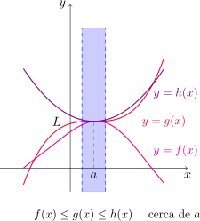{fig-align="center" width=50%}

::: {.example-box}

Ejemplo

Demostrar que $\displaystyle \lim_{x\to 0} x^2\operatorname{sen}\left(\frac{1}{x}\right)=0$.
:::	
	
::: {.callout-tip collapse="true"}
## Solución

Sea $x\neq 0$. Observemos primero que

$$
-1\leq \operatorname{sen}\left(\frac{1}{x}\right)\leq 1
$$

dado que la función seno toma valores entre $-1$ y $1$. Multiplicando cada miembro por $x^2\geq 0$ resulta 

$$
-x^2\leq x^2\operatorname{sen}\left(\frac{1}{x}\right)\leq x^2
$$

para cualquier $x\neq 0$. Como

$$
\lim_{x\to 0} x^2=0 \quad \text{ y }\quad \lim_{x\to 0} (-x^2)=0
$$

utilizando el [teorema de la compresión](#teo-compresion) podemos concluir que

$$
\lim_{x\to 0} x^2\operatorname{sen}\left(\frac{1}{x}\right)=0.
$$

:::

[↑ Volver al inicio de la sección](#seccion_2.3)
	
## 2.5. Continuidad {#seccion_2.5}

::: {.callout-note title="Definición (continuidad)"}

Una función $f$ es **continua** en $a$ si se cumple que

$$
\lim_{x\to a} f(x)=f(a).
$$
	
Esta definición involucra implícitamente tres cosas:
	
-  $f(a)$ existe (es decir, $a$ está en el dominio de $f$).
-  $\lim_{x\to a} f(x)$ existe.
-  $\lim_{x\to a} f(x)=f(a)$.
	
Esta condición implica que $f(x)$ está cerca de $f(a)$ cuando $x$ está cerca de $a$. Es decir, un cambio pequeño en $x$ sólo produce una alteración pequeña en $f(x)$.

Si $f$ está definida cerca de $a$ (excepto quizás en $a$), decimos que $f$ es **discontinua** en $a$ si $f$ no es continua en $a$.

:::

El gráfico de una función continua no presenta saltos ni interrupciones abruptas.
 
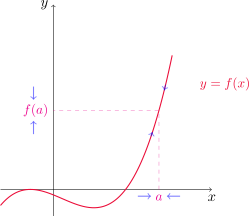{fig-align="center" width=50%}

::: {.example-box}

Ejemplo

En la figura se muestra el gráfico de $y=f(x)$. ¿En qué puntos es $f$ discontinua? ¿Por qué?

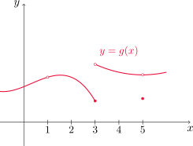{fig-align="center" width=50%}

:::

::: {.callout-tip collapse="true"}
## Solución

Observando el gráfico podemos decir que $f$ es discontinua en $x=1$ dado que $f(1)$ 
no existe. 

Por otro lado, notemos que $f(3)$ existe pero $\displaystyle \lim_{x\to 3} f(x)$ no, con lo cual $f$ también es discontinua en $x=3$. 

Por último $f$ resulta  discontinua en $x=5$ ya que, si bien existen $f(5)$ y $\lim_{x\to 5} f(x)$, no coinciden. En los demás puntos $f$ resulta continua.

:::

::: {.example-box}

Ejemplo

¿En qué puntos son continuas cada una de las siguientes funciones?

::: {.columns}

::: {.column width="50%"}

1. $\displaystyle f_1(x)=\frac{x^2-x-2}{x-2}$.

2. $\displaystyle f_2(x)=\begin{cases} 
\frac{1}{x^2} & \text{ si } x\neq 0,\\
1 & \text{ si } x=0.
\end{cases}$

:::

::: {.column width="50%"}

3.  $\displaystyle f_3(x)=\begin{cases} 
\frac{x^2-x-2}{x-2} & \text{ si } x\neq 2,\\
1 & \text{ si } x=2.
\end{cases}$

4. $\displaystyle f_4(x)=\frac{|x|}{x}$.

:::

:::

:::

::: {.callout-tip collapse="true"}
## Solución

Comencemos con $f_1$. Si factorizamos el polinomio del numerador obtenemos

$$
f_1(x)=\frac{(x-2)(x+1)}{x-2}=x+1
$$

para todo $x\neq 2$. Como $f(2)$ no existe, $f$ es discontinua en $x=2$. Si $a\neq 2$ entonces por la [propiedad de sustitución directa](#teo-sust-directa)

$$
\lim_{x\to a} f_1(x)=\lim_{x\to a} (x+1)=a+1=f_1(a), 
$$

con lo que $f_1$ resulta continua en $a$. De hecho, notar que la función $f_1$ resulta ser la recta $y=x+1$, con la excepción de que en $x=2$ tenemos un punto faltante, ya que $f_1(2)$ no existe.

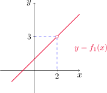{fig-align="center" width=40%}

Ahora analicemos $f_2$. Si bien $f_2(0)=1$, tenemos que $\lim_{x\to 0} f(x)$ no existe por infinitud, con lo cual $f_2$ es discontinua en $x=0$. Si $a\neq 0$, entonces nuevamente por la [propiedad de sustitución directa](#teo-sust-directa)

$$
\lim_{x\to a} f_2(x)=\lim_{x\to a} \frac{1}{x^2}=\frac{1}{a^2}=f_2(a),
$$

con lo cual $f_2$ es continua en $a$.

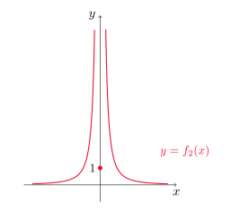{fig-align="center" width=50%}

Para el caso de $f_3$, notar que se trata de la misma función que $f_1$, excepto que ahora sí tenemos definido su valor en $x=2$. Como vimos que $f_1$ era continua en todo $x\neq 2$, lo mismo ocurrirá con $f_3$. Veamos si ésta es continua en $x=2$. Factorizando como antes obtenemos

$$
\lim_{x\to 2} f_3(x)=\lim_{x\to 2}\frac{(x-2)(x+1)}{x-2}=\lim_{x\to 2} (x+1)=3, 
$$

sin embargo $f_3(2)=1\neq 3$, con lo que $f_3$ es discontinua en $x=2$.

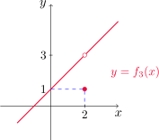{fig-align="center" width=35%}

Por último, para $f_4$ observemos que esta función puede ser reescrita como

$$
f_4(x)=\begin{cases} 
1 & \text{ si } x> 0,\\
-1 & \text{ si } x<0.
\end{cases}
$$

Como $y=x$ e $y=-x$ son funciones continuas, $f_4$ resulta continua en todo $x\neq 0$. Como $f_4(0)$ no existe, $f_4$ es discontinua en $x=0$.

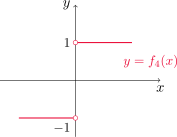{fig-align="center" width=35%}

:::

El tipo de discontinuidad que aparece en $f_1$ y $f_3$ del ejemplo anterior se conoce como discontinuidad **removible** o **evitable**, pues podría eliminarse al cambiar (redefinir) el valor de la función en ese punto por su límite en ese punto.

La función $f_2$ presenta una discontinuidad **de salto infinito** y $f_4$ una discontinuidad de **salto finito**.

::: {.callout-note title="Definición (continuidad lateral)"}

Una función $f$ es **continua por derecha** en $a$ si se cumple que

$$
\lim_{x\to a^+}f(x)=f(a).
$$

De manera similar, $f$ es **continua por izquierda** en $a$ si se verifica que

$$
\lim_{x\to a^-}f(x)=f(a).
$$

:::

::: {.callout-note title="Definición (continuidad en un intervalo)"}

Una función $f$ es **continua sobre el intervalo $(a,b)$** si es continua en $x$, para todo $a<x<b$. 

Decimos que $f$ es **continua sobre $[a,b]$** si es continua en $(a,b)$, y además resulta continua por la derecha en $a$ y por la izquierda en $b$.

:::

Una definición análoga puede darse para los intervalos $[a,b)$ y $(a,b]$.
	
::: {.example-box}

Ejemplo

Mostrar que $f(x)=1-\sqrt{1-x^2}$ es continua sobre el intervalo $[-1,1]$.

:::

::: {.callout-tip collapse="true"}
## Solución

Consideremos primero $-1<a<1$. Dado que $1-a^2>0$, por la ley **(11)** de límites obtenemos que 

$$
\lim_{x\to a} \sqrt{1-x^2}=\sqrt{1-a^2},
$$

y de esta manera, por la ley **(2)**

$$
\lim_{x\to a} f(x)=\lim_{x\to a}\,1 -\lim_{x\to a} \sqrt{1-x^2}=1-\sqrt{1-a^2}=f(a),
$$

lo que nos indica que $f$ es continua en $a$. Para terminar, veamos que $f$ es continua por derecha en $x=-1$ y por izquierda en $x=1$. 

Si $-1<x<0$, entonces $x^2<1$ y $1-x^2>0$. Utilizando las leyes **(11)** y **(2)** resulta

$$
\lim_{x\to -1^+} f(x)=\lim_{x\to -1^+} \,\left(1-\sqrt{1-x^2}\right)=1-0=1=f(-1).
$$

Si $0<x<1$, entonces también es cierto que $x^2<1$, o equivalentemente $1-x^2>0$. La ley **(11)** combinada con la **(2)** en este caso nos da

$$
\lim_{x\to 1^-} f(x)=\lim_{x\to 1^-} \,\left(1-\sqrt{1-x^2}\right)=1-0=1=f(1).
$$

Por lo tanto, $f$ es continua en todo el intervalo $[-1,1]$.

:::

::: {#teo-continuas .theorem}

Teorema

Sean $f$ y $g$ funciones continuas en $a$ y $c$ una constante real. Entonces las siguientes funciones también son continuas en $a$
		
::: {.columns}
::: {.column width="50%"}
-  $f+g$.

-  $f-g$.

-  $cf$. 
		
:::

::: {.column width="50%"}
-  $fg$.

-  $\displaystyle \frac{f}{g}$, si $g(a)\neq  0$.
:::

:::		
			
:::

::: {.theorem}

Teorema

-  Cualquier polinomio es continuo en su dominio, es decir, es continuo sobre $\mathbb{R}$.

-  Cualquier función racional es continua siempre que esté definida, es decir, es continua en su dominio.

:::

::: {.example-box}

Ejemplo

Encontrar $\lim_{x\to -2} f(x)$, siendo

$$
f(x)=\frac{x^3+2x^2-1}{5-3x}.
$$

:::

::: {.callout-tip collapse="true"}
## Solución

Notemos que $f$ es racional y $-2\in D_f$, por lo que usando la [propiedad de sustitución directa](#teo-sust-directa) obtenemos

$$
\lim_{x\to -2} f(x)=f(-2)=\frac{(-2)^3+2(-2)^2-1}{5-3(-2)}=-\frac{1}{11}.
$$

:::

La mayor parte de las funciones estudiadas hasta aquí son continuas, como establece el siguiente teorema.

::: {.theorem}

Teorema

Los siguientes tipos de funciones son continuas en sus respectivos dominios.

::: {.columns}
::: {.column width="50%"}

-  Polinomios.

-  Funciones racionales.

-  Funciones raíz.

-  Trigonométricas.
:::

::: {.column width="50%"}

-  Trigonométricas inversas.

-  Exponenciales.

-  Logarítmicas.

:::

:::		
			
:::
	
::: {.example-box}

Ejemplo

¿Dónde es continua la función $\displaystyle f(x)=\frac{\ln x+\arctan x}{x^2-1}$?
	
:::

::: {.callout-tip collapse="true"}
## Solución

Notemos que $y=\ln x$ e $y=\arctan x$ son continuas en sus respectivos dominios, es decir, en $(0,\infty)$ y $\mathbb{R}$. Por lo tanto el numerador de $f$ es continuo en $(0,\infty)$.

Por otro lado, $y=x^2-1$ es continua en $\mathbb{R}$ por ser un polinomio, y el cociente será continuo en todos los puntos de $(0,\infty)$ tales que $x^2-1\neq 0$. Por lo tanto, $f$ es continua en $(0,1)\cup (1,\infty)$.

:::

::: {.example-box}

Ejemplo

Hallar $\displaystyle \lim_{x\to \pi} \frac{\operatorname{sen} x}{2+\cos x}$.

:::

::: {.callout-tip collapse="true"}
## Solución

Como $y=\operatorname{sen} x$ e $y=2+\cos x$ son funciones continuas en $x=\pi$ y  $2+\cos \pi =1\neq 0$, el cociente es continuo y por lo tanto

$$
\lim_{x\to \pi} \frac{\operatorname{sen} x}{2+\cos x}=\frac{\operatorname{sen} \pi}{2+\cos \pi}=\frac{0}{2-1}=0.
$$

:::

::: {#teo-limite-composicion .theorem}

Teorema (límite de la composición de funciones)

Si $f$ es continua en $b$ y $\lim_{x\to a} g(x)=b$ entonces

$$
\lim_{x\to a}f(g(x))=f(b).
$$

Esto también puede reformularse como sigue

$$
\lim_{x\to a}f(g(x))=f\left(\lim_{x\to a}g(x)\right).
$$		

:::

::: {.example-box}

Ejemplo

Calcular $\displaystyle \lim_{x\to 1} \operatorname{arcsen}\left(\frac{1-\sqrt{x}}{1-x}\right)$.
:::

::: {.callout-tip collapse="true"}
## Solución

Sean $f(x)=\operatorname{arcsen} x$ y $g(x)=\displaystyle \frac{1-\sqrt{x}}{1-x}$. Calculamos primero $\lim_{x\to 1} g(x)$. En efecto, si $x\neq 1$ escribimos

$$
\frac{1-\sqrt{x}}{1-x}=\frac{1-\sqrt{x}}{1-x}\,\frac{1+\sqrt{x}}{1+\sqrt{x}}=\frac{1^2-(\sqrt{x})^2}{(1-x)(1+\sqrt{x})}=\frac{1-x}{(1-x)(1+\sqrt{x})}=\frac{1}{1+\sqrt{x}}.
$$

Luego

$$
\lim_{x\to 1} \frac{1-\sqrt{x}}{1-x} =\lim_{x\to 1} \frac{1}{1+\sqrt{x}}=\frac{1}{1+\sqrt{1}}=\frac{1}{2},
$$
dado que $y_1=1$ e $y_2=1+\sqrt{x}$ son continuas en $x=1$ e $y_2(1)\neq 0$.

Ahora bien, como $y=\operatorname{arcsen} x$ es continua en $x=1/2$, por el [teorema del límite de la composición de funciones](#teo-limite-composicion) obtenemos 

$$
\lim_{x\to 1} \operatorname{arcsen}\left(\frac{1-\sqrt{x}}{1-x}\right)= \operatorname{arcsen}\left(\lim_{x\to 1} \frac{1-\sqrt{x}}{1-x}\right)=\operatorname{arcsen}\left(\frac{1}{2}\right)=\frac{\pi}{6}.
$$

:::

::: {#teo-continuidad-composicion .theorem}

Teorema (continuidad de la composición de funciones)

Si $g$ es continua en $a$ y $f$ es continua en $g(a)$, entonces la composición $(f\circ g)(x)=f(g(x))$ es continua en $a$.
:::

::: {.example-box}

Ejemplo

¿Dónde son continuas las siguientes funciones?

- $h(x)=\operatorname{sen}(x^2)$.
- $F(x)=\ln(1+\cos x)$.

:::
	
::: {.callout-tip collapse="true"}
## Solución

Podemos expresar $h(x)=f(g(x))$, donde $f(x)=\operatorname{sen} x$ y $g(x)=x^2$. Si $x\in \mathbb{R}$, entonces $g$ es continua en $x$ por ser un polinomio y además $g(x)\in [0,+\infty)$. Como $f$ es continua en $\mathbb{R}$, en particular es continua en $[0,+\infty)$. Por lo tanto, el [teorema de la continuidad de la composición](#teo-continuidad-composicion) establece que $h$ es continua en $\mathbb{R}$. 

Para el segundo caso, escribimos $F(x)=f(g(x))$ siendo $f(x)=\ln x$ y $g(x)=1+\cos x$. Notemos que $g$ es continua en $\mathbb{R}$ y $f$ es continua en $(0,+\infty)$, por lo tanto la composición $F$ será continua en todos los puntos $x$ tales que $1+\cos x>0$. Dado que $\cos x\geq -1$, la desigualdad anterior se cumple siempre y cuando $1+\cos x\neq 0$, es decir, cuando $\cos x \neq -1$. 

Observar que 

$$
\cos x=-1 \quad \Longleftrightarrow \quad x=(2n+1)\pi, n\in\mathbb{Z}.
$$

Entonces $f$ es continua en $(0,+\infty)\setminus \{x: x=(2n+1)\pi, n\in\mathbb{Z}\}$.

:::

::: {#teo-valor-intermedio .theorem}

Teorema (teorema del valor intermedio)

Sea $f$ una función continua en el intervalo cerrado $[a,b]$ y sea $N$ un número entre $f(a)$ y $f(b)$ (suponemos que $f(a)\neq f(b)$). Entonces existe un número $c \in(a,b)$ tal que $f(c)=N$.

:::
	
Este teorema nos dice que una función continua en $[a,b]$ toma todos los valores intermedios comprendidos entre $f(a)$ y $f(b)$.
			
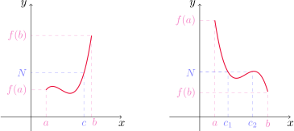{fig-align="center" width=70%}

::: {.example-box}

Ejemplo

Demostrar que existe una raíz $r$ de la ecuación $4x^3-6x^2+3x-2=0$ que cumple $1<r<2$.

:::

::: {.callout-tip collapse="true"}
## Solución	

Definimos $f(x)=4x^3-6x^2+3x-2$. Entonces $f$ es continua por ser un polinomio. En particular, $f$ es continua en el intervalo $[1,2]$. Además $f(1)=-1<0$ y $f(2)=12>0$, es decir, $f(1)<0<f(2)$. Por el [teorema del valor intermedio](#teo-valor-intermedio) existe un número $c\in (1,2)$ tal que $f(c)=0$ y esto nos dice que $c$ es una raíz de la ecuación dada.

:::	

[↑ Volver al inicio de la sección](#seccion_2.5)

## 2.6. Límites al infinito, asíntotas horizontales {#seccion_2.6}

Consideremos la función

$$
f(x)= \frac{x^2-1}{x^2+1}
$$

cuya gráfica se muestra a continuación.
   	
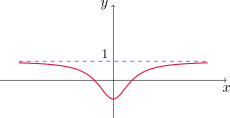{fig-align="center" width=45%}

Si le damos distintos valores a $x$ podemos ver que los valores de la función se estacionan conforme $x$ se hace grande en magnitud, como se observa en la siguiente tabla.
		
::: {.math-table}

| $x$ | $f(x)$ |
|---------|---------|
| 0 | 1 |
| $\pm\,$ 1 | 0 |
| $\pm\,$ 2 | 0.600000 |
| $\pm\,$ 3 | 0.800000 |
| $\pm\,$ 4 | 0.882353 |
| $\pm\,$ 5 | 0.923077 |
| $\pm\,$ 10 | 0.980198 |
| $\pm\,$ 50 | 0.999200 |
| $\pm\,$ 100 | 0.999800 |
| $\pm\,$ 1000 | 0.999998 |
:::

Parece que podemos acercar $f(x)$ tanto a $1$ como deseemos, siempre que elijamos $x$ lo suficientemente grande en magnitud. Esto lo expresamos escribiendo

$$
\lim_{x\to\infty} \frac{x^2-1}{x^2+1}=1.
$$	
	
::: {.callout-note title="Definición (límite en el infinito)"}

Sea $f$ una función definida en algún intervalo de la forma $(a,\infty)$. Entonces
$$
\lim_{x\to \infty} f(x)=L 
$$

significa que $f(x)$ puede aproximarse a $L$ tanto como se quiera, siempre que se elija $x$ suficientemente grande.
		
También escribiremos: $f(x)\to L$ cuando $x\to\infty$. La expresión de arriba se lee
		
-  "el límite de $f(x)$ cuando $x$ tiende a infinito es $L$", o
-  "el límite de $f(x)$ cuando $x$ se hace infinito es $L$"", o
-  "$f(x)$ tiende a $L$ cuando $x$ crece sin cota".

:::
		
Vemos que $f$ puede aproximarse a $L$ de diferentes maneras, como muestra la siguiente figura.
			
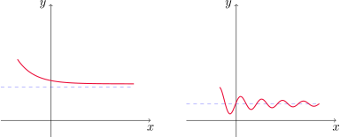{fig-align="center" width=70%}

::: {.callout-note title="Definición (límite en el infinito negativo)"}

Sea $f$ una función definida en algún intervalo de la forma $(-\infty,a)$. Entonces

$$
\lim_{x\to -\infty} f(x)=L 
$$

significa que $f(x)$ puede aproximarse a $L$ tanto como se quiera, siempre que se elija $x$ negativo y suficientemente grande en magnitud.
		
También escribiremos: $f(x)\to L$ cuando $x \to -\infty$ y se lee "el límite de $f(x)$ cuando $x$ tiende a infinito negativo es $L$".

:::		

::: {.callout-note title="Definición (asíntota horizontal)"}

La recta $y=L$ se llama **asíntota horizontal** de la curva $y=f(x)$ si 
$$
\lim_{x\to\infty} f(x)=L \quad \text{ o bien si } \quad \lim_{x\to -\infty} f(x)=L. 
$$

:::

Un ejemplo de función con dos asíntotas horizontales es $y= \arctan x$.
	
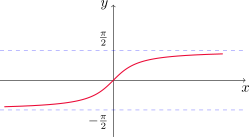{fig-align="center" width=50%}

En este caso tenemos que

$$
\lim_{x\to \infty } \arctan x=\frac{\pi}{2} \quad \text{ y }\quad  \lim_{x\to -\infty } \arctan x=-\frac{\pi}{2}.
$$

La mayor parte de las [leyes de los límites](#teo-leyes-limites) que estudiamos en la [Sección 2.3](#seccion_2.3) también se cumple para límites en el infinito. Las leyes vistas (con excepción de la **(9)** y la **(10)**) siguen siendo válidas reemplazando $x\to a$ por $x \to \infty$ o $x\to -\infty$.

::: {.theorem}

Teorema

Sea $r>0$ un número racional. Entonces

-  $\displaystyle\lim_{x\to \infty} \frac{1}{x^r}=0$.

-  Si $x^r$ está definido para todo $x$, entonces $\displaystyle\lim_{x\to -\infty} \frac{1}{x^r}=0$.

:::

::: {.example-box}

Ejemplo

Calcular 
$$
\lim_{x\to \infty}\frac{3x^2-x-2}{5x^2+4x+1}
$$
	
e indicar las propiedades que se utilizan en cada paso.
:::
	
::: {.callout-tip collapse="true"}
## Solución	

Para $x>0$ podemos escribir

$$
\frac{3x^2-x-2}{5x^2+4x+1}=\frac{x^2\left(3-\frac{x}{x^2}-\frac{2}{x^2}\right)}{x^2\left(5+\frac{4x}{x^2}+\frac{1}{x^2}\right)}=\frac{3-\frac{1}{x}-\frac{2}{x^2}}{5+\frac{4}{x}+\frac{1}{x^2}}.
$$

Por el teorema anterior tenemos que 

$$
\lim_{x\to \infty} \frac{1}{x}=0 \quad \text{ y }\quad \lim_{x\to \infty} \frac{1}{x^2}=0.
$$

Por las leyes **(2)** y **(3)**

$$
\lim_{x\to \infty} \left(3-\frac{1}{x}-\frac{2}{x^2}\right)=\lim_{x\to \infty} 3-\lim_{x\to \infty} \frac{1}{x}-2\lim_{x\to \infty} \frac{1}{x^2}=3-0-0=3.
$$

De la misma forma 

$$
\lim_{x\to \infty} \left(5+\frac{4}{x}+\frac{1}{x^2}\right)=\lim_{x\to \infty} 5+4\lim_{x\to \infty} \frac{1}{x}+\lim_{x\to \infty} \frac{1}{x^2}=5-0-0=5.
$$

Finalmente, usando la ley **(5)** del cociente obtenemos

$$
\lim_{x\to \infty} \frac{3-\frac{1}{x}-\frac{2}{x^2}}{5+\frac{4}{x}+\frac{1}{x^2}}=\frac{\lim_{x\to\infty}\left(3-\frac{1}{x}-\frac{2}{x^2}\right)}{\lim_{x\to\infty} \left(5+\frac{4}{x}+\frac{1}{x^2}\right)}=\frac{3}{5}.
$$

:::

::: {.example-box}

Ejemplo

Determinar las asíntotas horizontales y verticales de la gráfica de la función
$$
f(x)=\frac{\sqrt{2x^2+1}}{3x-5}.
$$

:::

::: {.callout-tip collapse="true"}
## Solución	

Observemos que el denominador se anula cuando $x=5/3$. Si $x$ se aproxima a $5/3$ por la derecha, entonces el numerador se aproxima a $\sqrt{59}/3>0$ y $3x-5$ se aproxima a cero con valores positivos, con lo cual

$$
\lim_{x\to (5/3)^+} f(x)=+\infty,
$$

y un análisis similar muestra que

$$
\lim_{x\to (5/3)^-} f(x)=-\infty.
$$

Por lo tanto $\displaystyle x=\frac{5}{3}$ es una asíntota vertical de $f$. Dado que $f$ es continua en todo $x\neq 5/3$, ésta es la única asíntota vertical de la función.

Para calcular las asíntotas horizontales, debemos hacer $x\to \pm \infty$. Primero notemos que, si $x>0$ 

$$
\frac{\sqrt{2x^2+1}}{3x-5}=\frac{\sqrt{x^2\left(2+\frac{1}{x^2}\right)}}{x\left(3-\frac{5}{x}\right)}=\frac{|x|\sqrt{2+\frac{1}{x^2}}}{x\left(3-\frac{5}{x}\right)}=\frac{\sqrt{2+\frac{1}{x^2}}}{3-\frac{5}{x}}.
$$

Por las leyes **(1)** y **(11)** tenemos que 

$$
\lim_{x\to \infty} \sqrt{2+\frac{1}{x^2}}=\sqrt{\lim_{x\to \infty} \left(2+\frac{1}{x^2}\right)}=\sqrt{2}.
$$

Además, por la ley **(2)**

$$
\lim_{x\to \infty} \left(3-\frac{5}{x}\right)=\lim_{x\to \infty} 3- \lim_{x\to \infty} \frac{5}{x}=3-0=3.
$$

Finalmente, por la ley **(5)** del cociente

$$
\lim_{x\to \infty} \frac{\sqrt{2x^2+1}}{3x-5}=\lim_{x\to\infty}\frac{\sqrt{2+\frac{1}{x^2}}}{3-\frac{5}{x}}=\frac{\lim_{x\to\infty} \sqrt{2+\frac{1}{x^2}}}{\lim_{x\to\infty}\left(3-\frac{5}{x}\right)}=\frac{\sqrt{2}}{3}.
$$

Con esto, $y=\sqrt{2}/3$ es asíntota horizontal de $f$. Para $x\to-\infty$ consideramos $x<0$ y escribimos 

$$
\frac{\sqrt{2x^2+1}}{3x-5}=\frac{\sqrt{x^2\left(2+\frac{1}{x^2}\right)}}{x\left(3-\frac{5}{x}\right)}=\frac{|x|\sqrt{2+\frac{1}{x^2}}}{x\left(3-\frac{5}{x}\right)}=-\frac{\sqrt{2+\frac{1}{x^2}}}{3-\frac{5}{x}}.
$$	

Repitiendo el proceso anterior podemos concluir que 

$$
\lim_{x\to -\infty} \frac{\sqrt{2x^2+1}}{3x-5}=\lim_{x\to-\infty}-\frac{\sqrt{2+\frac{1}{x^2}}}{3-\frac{5}{x}}=-\frac{\sqrt{2}}{3},
$$

por lo que $y=-\sqrt{2}/3$ es otra asíntota horizontal de $f$.

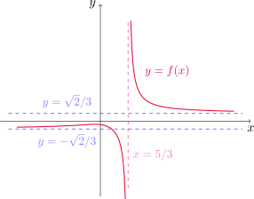{fig-align="center" width=50%}

:::
 
::: {.example-box}

Ejemplo

Calcular $\displaystyle \lim_{x\to \infty} \left(\sqrt{x^2+1}-x\right)$.

:::

::: {.callout-tip collapse="true"}
## Solución	

Considerando $x>0$, multiplicamos y dividimos por $\sqrt{x^2+1}+x$

$$
\sqrt{x^2+1}-x=\left(\sqrt{x^2+1}-x\right)\frac{\sqrt{x^2+1}+x}{\sqrt{x^2+1}+x}=\frac{\left(\sqrt{x^2+1}\right)^2-x^2}{\sqrt{x^2+1}+x}=\frac{1}{\sqrt{x^2+1}+x}.
$$

Factorizando el denominador de la expresión resultante, tenemos que 

$$
\frac{1}{\sqrt{x^2+1}+x}=\frac{1}{\sqrt{x^2\left(1+\frac{1}{x^2}\right)}+x}=\frac{1}{\sqrt{x^2}\sqrt{1+\frac{1}{x^2}}+x}=\frac{1}{x}\,\frac{1}{\sqrt{1+\frac{1}{x^2}}+1}.
$$

Ahora, sabiendo que

$$
\lim_{x\to \infty} \frac{1}{x}=0 \quad \text{ y } \quad \lim_{x\to\infty} \frac{1}{\sqrt{1+\frac{1}{x^2}}+1}=\frac{1}{2}
$$

por la ley **(3)** del producto concluímos que 

$$
\lim_{x\to \infty} \left(\sqrt{x^2+1}-x\right) = \left(\lim_{x\to \infty} \frac{1}{x}\right) \left(\lim_{x\to\infty} \frac{1}{\sqrt{1+\frac{1}{x^2}}+1}\right)=0\cdot \frac{1}{2}=0.
$$

:::

En base al gráfico de $y=e^x$, podemos ver que la recta $y=0$ es asíntota horizontal de su gráfico. 

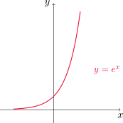{fig-align="center" width=40%}

Esto nos dice que

::: {#form-limite-exp .formula-box}

$$
\lim_{x\to -\infty} e^{x}=0. 
$$
:::

::: {.example-box}

Ejemplo

Evaluar $\lim_{x\to 0^-} e^{1/x}$.

:::

::: {.callout-tip collapse="true"}
## Solución	

Sea $t=1/x$. Dado que

$$
\lim_{x\to 0^-} \frac{1}{x} = -\infty,
$$

tenemos que $t\to -\infty$ cuando $x\to 0^-$. Expresando el límite en términos de la variable $t$ resulta

$$
\lim_{x\to 0^-} e^{1/x}=\lim_{t\to -\infty} e^{t}=0,
$$

de acuerdo a la [fórmula](#form-limite-exp) anterior.

:::

### Límites infinitos en el infinito

::: {.callout-note title="Definición (límite infinito en infinito)"}

Al escribir

$$
\lim_{x\to \infty} f(x)=\infty
$$
		
indicamos que $f(x)$ crece sin cota cuando $x$ se hace grande.
		
De manera similar se definen las expresiones

$$
\lim_{x\to -\infty}f(x)=\infty, \quad \lim_{x\to\infty }f(x)=-\infty \quad  \text{ y } \quad \lim_{x\to -\infty}f(x)=-\infty.
$$

:::

::: {.example-box}

Ejemplo

Determinar $\lim_{x\to \infty } x^3$ y $\lim_{x\to -\infty} x^3$.

:::

::: {.callout-tip collapse="true"}
## Solución	

Si $x$ crece sin cota, entonces su cubo también (de hecho, $x^3>x$ para $x>1$), por lo tanto $\lim_{x\to \infty } x^3=\infty$.

Cuando $x$ se hace grande y negativo, su cubo también es negativo y grande en magnitud, por lo tanto $\lim_{x\to -\infty } x^3=-\infty$.

:::

Si observamos nuevamente el gráfico de $y=e^x$, también podemos concluir que

::: {.formula-box}

$$
\lim_{x\to \infty} e^{x}=\infty. 
$$
:::

::: {.example-box}

Ejemplo

Calcular $\lim_{x\to \infty} \left(x^2-x\right)$.

:::

::: {.callout-tip collapse="true"}
## Solución	

En este caso conviene factorizar de la siguiente manera

$$
x^2-x=x(x-1).
$$

Cuando $x$ se hace grande, $x-1$ también. Por lo tanto el producto crecerá sin cota. Así

$$
\lim_{x\to \infty} \left(x^2-x\right)=\lim_{x\to \infty} x(x-1)=\infty.
$$

:::

::: {.example-box}

Ejemplo

Calcular $\lim_{x\to \infty} \displaystyle \frac{x^2+x}{3-x}$.

:::

::: {.callout-tip collapse="true"}
## Solución	

Extrayendo la potencia de mayor orden de factor común en el numerador y el denominador, para $x>0$ resulta

$$
\frac{x^2\left(1+\frac{1}{x}\right)}{x\left(\frac{3}{x}-1\right)}=x\,\frac{1+\frac{1}{x}}{\frac{3}{x}-1}.
$$

Ahora bien,
$$
\lim_{x\to \infty} \frac{1+\frac{1}{x}}{\frac{3}{x}-1}=-1
$$

y $\lim_{x\to \infty} x=\infty$, por lo tanto el límite del producto es $-\infty$.

:::

[↑ Volver al inicio de la sección](#seccion_2.6)

## 2.7. Derivadas y razones de cambio {#seccion_2.7}

###	Tangentes
	
Consideremos el problema de encontrar la recta tangente a una curva $C$ que es el gráfico de la función $y=f(x)$ en el punto $P=(a,f(a))$. 
		
Para ello, consideramos un punto cercano $Q=(x,f(x))$ con $x\neq a$ y calculamos la pendiente de la recta secante $PQ$
$$
m_{PQ}=\frac{f(x)-f(a)}{x-a}.
$$

Si dejamos que $x$ se aproxime a $a$, la recta secante se aproxima a la recta tangente buscada. Si $m_{PQ}$ se aproxima a un número $m$, definimos la **recta tangente** como la recta que pasa por $P$ y tiene pendiente $m$.

::: {.callout-note title="Definición (recta tangente)"}

La **recta tangente** a la curva $y=f(x)$ en el punto $P=(a,f(a))$ es la recta que pasa por $P$ con pendiente

$$
m=\lim_{x\to a}\frac{f(x)-f(a)}{x-a}
$$
siempre y cuando este límite exista.

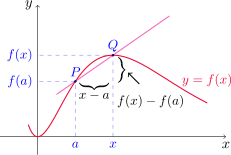{fig-align="center" width=50%}

::: 

::: {.example-box}

Ejemplo

Encontrar una ecuación de la recta tangente a la parábola $y=f(x)=x^2$ en el punto $P=(1,1)$.

:::

::: {.callout-tip collapse="true"}
## Solución	

La recta buscada tiene pendiente

$$
m=\lim_{x\to 1} \frac{f(x)-f(1)}{x-1}=\lim_{x\to 1}\frac{x^2-1}{x-1}=2,
$$

según vimos en el [Ejemplo 11](#ejemplo-cuadratica-lineal). Como además pasa por el punto $(1,1)$ utilizando la [ecuación punto-pendiente de la recta](#recta-punto-pendiente) que pasa por $(x_1,y_1)$ con pendiente $m$ obtenemos

::: {#recta-punto-pendiente .callout-note collapse="true"}
## 📐 Ecuación punto - pendiente de la recta

$$
y-y_1=m(x-x_1)
$$
:::

$$
y-1=2(x-1) \quad \text{ o de forma equivalente }\quad y=2x-1.
$$

{fig-align="center" width=40%}

:::

A menudo se hace referencia a la pendiente de la recta tangente a una curva en un punto como la **pendiente de la curva** en ese punto. La idea es que, acercándonos lo suficiente al punto, la curva se parece mucho a su recta tangente.

Podemos escribir la pendiente de la recta tangente de una forma equivalente: si $x\to a$, entonces $h=x-a\to 0$. Con este cambio, $x=a+h$ y cuando $x$ se aproxima a $a$, $h$ se aproxima a 0. De esta manera tenemos

$$
m_{PQ}=\frac{f(a+h)-f(a)}{h} \quad \text{ y }\quad m=\lim_{h\to 0} \frac{f(a+h)-f(a)}{h}.
$$

::: {.example-box}

Ejemplo

Encontrar una ecuación de la recta tangente a $\displaystyle y=f(x)=\frac{3}{x}$ en el punto $P=(3,1)$.

:::

::: {.callout-tip collapse="true"}
## Solución	

La recta buscada tiene pendiente 

$$
\begin{aligned}
m=\lim_{h\to 0} \frac{f(3+h)-f(3)}{h}=\lim_{h\to 0} \frac{\frac{3}{(3+h)}-1}{h}=\lim_{h\to 0} \frac{\frac{3-(3+h)}{(3+h)}}{h}&=\lim_{h\to 0} -\frac{h}{h(3+h)}\\
\\
&=\lim_{h\to 0} -\frac{1}{3+h}\\
\\
&=-\frac{1}{3}.
\end{aligned}
$$

Como además la recta pasa por $(3,1)$, usando nuevamente la [ecuación punto-pendiente de la recta](#recta-punto-pendiente) resulta

$$
y-1=-\frac{1}{3}(x-3) \quad \text{ o bien } \quad y=-\frac{1}{3}x+2.
$$

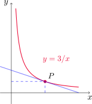{fig-align="center" width=40%}

:::

### Velocidades

Supongamos que un objeto se mueve a lo largo de una línea recta y su **función de posición** es $s=f(t)$, donde $s$ es el desplazamiento respecto del origen en el instante $t$. El cambio de posición en el intervalo de tiempo desde $t=a$ hasta $t=a+h$ es $f(a+h)-f(a)$. La velocidad promedio es

$$
\text{vel. promedio} =\frac{\text{desplazamiento}}{\text{tiempo}}=\frac{f(a+h)-f(a)}{(a+h)-a}=\frac{f(a+h)-f(a)}{h},
$$

que podemos interpretar como la pendiente de la recta secante que une los puntos $P=(a,f(a))$ y $Q=(a+h,f(a+h))$. Al hacer la amplitud de los intervalos más y más chica, se puede definir la **velocidad** o **velocidad instantánea** como el límite de estas velocidades promedio

$$
v(a)=\lim_{h\to 0} \frac{f(a+h)-f(a)}{h}.
$$

La velocidad instantánea puede interpretarse como la pendiente de la recta tangente en $P$.
			
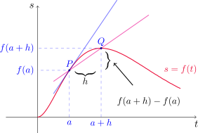{fig-align="center" width=50%}

::: {.example-box}

Ejemplo

Se deja caer una pelota desde la plataforma superior de observación de la Torre CN, a 450 m sobre el nivel del suelo.

-  ¿Cuál es la velocidad de la pelota después de 5 segundos?
-   ¿Con qué velocidad viaja cuando choca contra el suelo?

:::

::: {.callout-tip collapse="true"}
## Solución	

Podemos modelar el movimiento de la pelota con la función de posición $f(t)=4.9\,t^2$. Calculemos $v(a)$, la velocidad en un instante de tiempo genérico $a$. Es decir, escribimos

$$
v(a)=\lim_{h\to 0} \frac{f(a+h)-f(a)}{h}=\lim_{h\to 0} \frac{4.9\,(a+h)^2-4.9\,a^2}{h}
$$

Si $h\neq 0$ entonces

$$
\frac{4.9\,(a+h)^2-4.9\,a^2}{h}=\frac{4.9\, a^2+9.8\,ah+4.9\,h^2-4.9\,a^2}{h}=\frac{h(9.8\,a+4.9\,h)}{h}=9.8\,a+4.9\,h.
$$

Con esto, obtenemos que 

$$
\lim_{h\to 0} \frac{4.9\,(a+h)^2-4.9\,a^2}{h}=\lim_{h\to 0} (9.8\,a+4.9\,h)=9.8\,a.
$$

Es decir, $v(a)=9.8\, a$. En particular, si $a=5$, la velocidad después de 5 segundos es $v(5)=9.8\cdot 5 =49$.

Para la segunda pregunta, primero debemos determinar $t_0$ el instante de tiempo en que la pelota toca el suelo. Para ello, debe ocurrir que el espacio recorrido coincida con la altura de la torre, es decir $f(t_0)=450$, con lo cual

$$
450=4.9\, t_0^2,
$$

y despejando obtenemos $t_0\approx 9.58$, con lo cual la velocidad de la pelota en ese instante es $v(t_0)\approx v(9.58)\approx 46.9$ m/seg. 

:::

### Derivadas

Con las motivaciones vistas hasta ahora, estamos en condiciones de definir el concepto de **derivada**.

::: {#definicion-derivada .callout-note title="Definición (derivada)"}
La **derivada de una función $f$ en un número $a$** se denota $f'(a)$ y se define por
$$
f'(a)=\lim_{h\to 0}\frac{f(a+h)-f(a)}{h},
$$	

siempre que este límite exista. De manera equivalente, podemos escribir

$$
f'(a)=\lim_{x\to a}\frac{f(x)-f(a)}{x-a}.
$$

:::

De acuerdo con esta definición y la de recta tangente dada anteriormente, podemos hacer la siguiente observación.

::: {.formula-box}

La derivada de la función $y=f(x)$ en el punto $x=a$ representa la **pendiente de la recta tangente** al gráfico de $f$ en el punto $(a,f(a))$.

:::

::: {.example-box}

Ejemplo

Hallar $f'(a)$ si $f(x)=x^2-8x+9$.

:::

::: {.callout-tip collapse="true"}
## Solución	
Por definición es

$$
f'(a)=\lim_{h\to 0} \frac{f(a+h)-f(a)}{h}.
$$

Si $h\neq 0$, entonces

$$
\frac{f(a+h)-f(a)}{h}=\frac{(a+h)^2-8(a+h)+9-[a^2-8a+9]}{h}=\frac{2ah+h^2-8h}{h}=2a+h-8.
$$

Entonces

$$
\lim_{h\to 0} \frac{f(a+h)-f(a)}{h}=\lim_{h\to 0}\,(2a+h-8)=2a-8.
$$

:::

La **recta tangente** a la curva $y=f(x)$ en el punto $P=(a,f(a))$ es la recta que pasa por $P$ y cuya pendiente es $f'(a)$, es decir, la derivada de $f$ en $a$. 	
				
			
Usando la [ecuación punto-pendiente](#recta-punto-pendiente) podemos encontrar la ecuación de esta recta.

::: {#form-recta-tangente .formula-box}

Ecuación de la recta tangente al gráfico de $y=f(x)$ en el punto $(a,f(a))$

$$
 y=f(a)+f'(a)(x-a).
$$	

:::

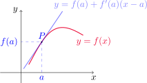{fig-align="center" width=50%}

::: {.example-box}

Ejemplo

Hallar la ecuación de la recta tangente al gráfico de $y=x^2-8x+9$ en $(3,-6)$.

:::

::: {.callout-tip collapse="true"}
## Solución	

En el ejemplo anterior vimos que $f'(a)=2a-8$. Usando la [ecuación de la recta tangente](#form-recta-tangente) con $a=3$ obtenemos

$$
y=f(3)+f'(3)(x-3)
$$

y como $f'(3)=2\cdot 3-8=-2$, resulta
$$
y=-6-2(x-3) \quad \text{o bien}\quad y=-2x.
$$

:::

### Relaciones de cambio
	
Supongamos que $y$ depende de $x$ mediante la relación $y=f(x)$. Si $x$ cambia de $x_1$ a $x_2$, el **incremento en $x$** está dado por

$$
\Delta x=x_2-x_1
$$

mientras que el correspondiente **incremento en $y$** es

$$
\Delta y=f(x_2)-f(x_1).
$$ 

El cociente de diferencias

$$
\frac{\Delta y}{\Delta x}=\frac{f(x_2)-f(x_1)}{x_2-x_1}
$$
	
se llama **razón de cambio promedio** de $y$ con respecto a $x$ en el intervalo $[x_1,x_2]$. Ésta puede interpretarse como la pendiente de la recta secante $PQ$ del siguiente gráfico
	
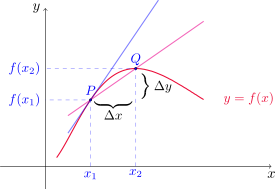{fig-align="center" width=50%}

Si consideramos intervalos $[x_1,x_2]$ cada vez más pequeños (esto es, hacemos $x_2$ acercarse a $x_1$) el límite de estas razones de cambio promedio (si existe) se llama **razón de cambio instantánea** de $y$ con respecto a $x$ en $x=x_1$, y puede interpretarse como la pendiente de la recta tangente a la curva en el punto $P$.

$$
\text{Razón de cambio instantánea} =\lim_{\Delta x\to  0}\frac{\Delta y}{\Delta x}=\lim_{x_2\to x_1}\frac{f(x_2)-f(x_1)}{x_2-x_1}.
$$

El límite de arriba resulta ser $f'(x_1)$. Esto nos da otra interpretación para la derivada:

::: {.formula-box}

La derivada $f'(a)$ es la razón de cambio instantánea de $y=f(x)$ con respecto a $x$, cuando $x=a$.

:::
				
Si dibujamos la curva $y=f(x)$, la razón de cambio instantánea es la pendiente de la tangente a esta curva en el punto $(a,f(a))$. Cuando la derivada es grande, los valores de $y$ cambian rápidamente respecto de los de $x$ y en consecuencia
la curva es escarpada, como sucede en el punto $P$. Cuando la derivada es pequeña, los valores de $y$ cambian lentamente en relación a $x$ y  la curva es relativamente plana, como en el punto $Q$. 
			
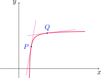{fig-align="center" width=40%}

Cuando $s=f(t)$ es la función posición de una partícula a tiempo $t$ que se mueve a lo largo de una línea recta, $f'(a)$ es la **velocidad** de la partícula en $t=a$.

La **rapidez** de la partícula es el valor absoluto de la velocidad, es decir $|f'(a)|$.

Esto muestra que la velocidad de una partícula puede ser positiva, negativa o cero, mientras que la rapidez siempre es no negativa.
			
[↑ Volver al inicio de la sección](#seccion_2.7)

## 2.8. La derivada como una función {#seccion_2.8}

Hemos definido la derivada de $f$ en $a$ como el límite

$$
f'(a)=\lim_{h\to 0}\frac{f(a+h)-f(a)}{h}
$$

siempre que este límite exista. Si dejamos que el número $a$ varíe, podemos escribir

$$
f'(x)=\lim_{h\to 0}\frac{f(x+h)-f(x)}{h}.
$$

De modo que $f'(x)$ está bien definida para todo número $x$ tal que el límite anterior existe. Entonces podemos considerar a $f'$ como una nueva función, definida como el límite de arriba, y llamada **derivada** de $f$.
	
El valor que toma $f'$ en $x$, denotado $f'(x)$ representa la pendiente de la recta tangente al gráfico de $y=f(x)$ en el punto $(x,f(x))$.

Observemos que

$$
D_{f'}=\{x\in D_f: f'(x) \text{ existe}\}.
$$
	
En general, $D_{f'}\subseteq D_{f}$, pudiendo esta contención ser estricta.

::: {.example-box}

Ejemplo

En la siguiente figura se muestra el gráfico de una función $f$. Usarla para dibujar el gráfico de $f'$.

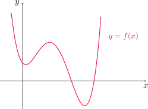{fig-align="center" width=50%}

:::	

::: {.callout-tip collapse="true"}
## Solución	

Para realizar el gráfico de $f'$ podemos seleccionar distintos puntos $(x,f(x))$ en el gráfico de $f$ e intentar estimar la pendiente de la recta tangente allí. Este método, si bien nos ayuda a visualizar el gráfico de $f'$ de manera aproximada, no es exacto y la técnica es un poco engorrosa. 
	
Más adelante veremos herramientas que nos permitirán dar un esbozo más preciso del gráfico de una función.
			
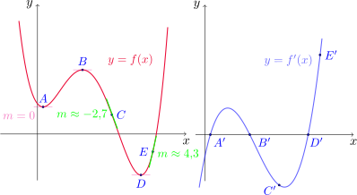{fig-align="center" width=60%}

:::

::: {#ejemplo-derivada-cubica .example-box}

Ejemplo

Si $f(x)=x^3-x$, encontrar una fórmula para $f'(x)$ e ilustrarla comparando las gráficas de $f$ y $f'$.

:::

::: {.callout-tip collapse="true"}
## Solución	

Por definición, debemos calcular

$$
\lim_{h\to 0} \frac{f(x+h)-f(x)}{h}
$$

para cualquier $x\in\mathbb{R}$.

Fijado $x$, si $h\neq 0$, entonces tenemos que

$$ \small
\frac{f(x+h)-f(x)}{h}=\frac{(x+h)^3-(x+h)-[x^3-x]}{h}=\frac{3x^2h+3xh^2+h^3-h}{h}=3x^2+3xh+h^2-1.
$$

Entonces

$$
\lim_{h\to 0} \frac{f(x+h)-f(x)}{h}=\lim_{h\to 0} (3x^2+3xh+h^2-1)=3x^2-1.
$$

Por lo tanto, $f'(x)=3x^2-1$.

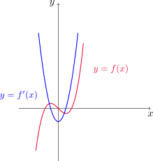{fig-align="center" width=50%}

:::

::: {.example-box}

Ejemplo

Si $f(x)=\sqrt{x}$, calcular $f'(x)$ y dar su dominio.

:::

::: {.callout-tip collapse="true"}
## Solución	

Vamos a calcular

$$
\lim_{h\to 0} \frac{f(x+h)-f(x)}{h}
$$

para $x\geq 0$.

Fijado $x$, tomando $h\neq 0$ escribimos

$$
\frac{f(x+h)-f(x)}{h}=\frac{\sqrt{x+h}-\sqrt{x}}{h}=\frac{\sqrt{x+h}-\sqrt{x}}{h}\,\frac{\sqrt{x+h}+\sqrt{x}}{\sqrt{x+h}+\sqrt{x}}=\frac{1}{\sqrt{x+h}+\sqrt{x}}.
$$

Utilizando las leyes **(11)** y **(1)** obtenemos

$$
\lim_{h\to 0} \frac{f(x+h)-f(x)}{h}=\lim_{h\to 0} \frac{1}{\sqrt{x+h}+\sqrt{x}}=\frac{1}{2\sqrt{x}},
$$

por lo tanto $f'(x)=\displaystyle \frac{1}{2\sqrt{x}}$, siempre que $x>0$.

¿Es $f$ derivable en $x=0$? Para responder esta pregunta, analizamos

$$
\lim_{h\to 0^+} \frac{f(0+h)-f(0)}{h}=\lim_{h\to 0^+} \frac{\sqrt{h}-0}{h}=\lim_{h\to 0^+} \frac{1}{\sqrt{h}}=\infty,
$$

con lo cual el límite no existe por infinitud y $f$ no es derivable en $x=0$. Entonces $D_{f'}=(0,\infty)$.

:::

::: {.example-box}

Ejemplo

Encontrar $f'(x)$ si $\displaystyle f(x)=\frac{1-x}{2+x}$.

:::

::: {.callout-tip collapse="true"}
## Solución	

Notemos que $D_f=\mathbb{R}\backslash {-2}$. Para $x\neq -2$, calculamos

$$
\lim_{h\to 0} \frac{f(x+h)-f(x)}{h}.
$$

Fijemos $x$ y $h\neq 0$. Entonces

$$ \small
\frac{f(x+h)-f(x)}{h}=\frac{\frac{1-(x+h)}{2+(x+h)}-\frac{1-x}{2+x}}{h}=\frac{1}{h}\, \frac{(2+x)(1-x-h)-(2+x+h)(1-x)}{(2+x+h)(2+x)}=-\frac{3}{(2+x+h)(2+x)}.
$$

Por la [propiedad de sustitución directa](#teo-sust-directa) y las leyes **(4)** y **(5)** del producto y del cociente resulta

$$
\lim_{h\to 0} \frac{f(x+h)-f(x)}{h}=\lim_{h\to 0} -\frac{3}{(2+x+h)(2+x)}=-\frac{3}{(2+x)^2}.
$$

:::

### Otras notaciones

Si escribimos $y=f(x)$, donde $x$ es la variable independiente e $y$ la dependiente, otras formas de representar a la derivada de $f$ en $x$ son

$$
f'(x)=y'(x)=\frac{dy}{dx}(x)=\frac{df}{dx}(x)=Df(x)=D_xf(x).
$$

Los símbolos $D$ y $d/dx$ se llaman **operadores de derivación**. El símbolo $dy/dx$ introducido por Leibniz es otra forma de escribir $f'(x)$. En término de incrementos, tenemos que

$$
\frac{dy}{dx}=\lim_{\Delta x\to 0} \frac{\Delta y}{\Delta x}.
$$

::: {.callout-note title="Definición (Función derivable)"}

Una función $f$ es **derivable en $a$** si $f'(a)$ existe. 
		
Si $-\infty\leq a<b\leq \infty$, decimos que $f$ es **derivable en $(a,b)$** si $f$ es derivable en todo punto del intervalo.

:::

::: {.example-box}

Ejemplo

¿Dónde es derivable la función $f(x)=|x|$?

:::

::: {.callout-tip collapse="true"}
## Solución	

Consideremos diferentes casos. Supongamos primero que $x>0$ y $h\neq 0$ es suficientemente pequeño como para que $x+h>0$, esto es, elegimos $h>-x$. Entonces

$$
\frac{f(x+h)-f(x)}{h}=\frac{|x+h|-|x|}{h}=\frac{x+h-x}{h}=1,
$$
dado que tanto $x$ como $x+h$ son positivos.

Luego

$$
\lim_{h\to 0} \frac{f(x+h)-f(x)}{h} = \lim_{h\to 0} 1=1.
$$

Con esto concluimos que $f'(x)=1$ para cualquier $x>0$.

Ahora consideremos $x<0$ y $h\neq 0$ suficientemente pequeño en magnitud como para que $x+h<0$. Entonces

$$
\frac{f(x+h)-f(x)}{h}=\frac{|x+h|-|x|}{h}=\frac{-x-h+x}{h}=-1,
$$
pues ambos $x$ y $x+h$ son negativos. Así,

$$
\lim_{h\to 0} \frac{f(x+h)-f(x)}{h} = \lim_{h\to 0} -1=-1.
$$

Por lo tanto, $f'(x)=-1$ para todo $x<0$.

Finalmente, estudiamos el caso $x=0$. Como $f$ cambia su definición en $x=0$, estudiamos los límites laterales

$$
\lim_{h\to 0^+} \frac{f(0+h)-f(0)}{h}=\lim_{h\to 0^+} \frac{h-0}{h}= 1
$$

y

$$
\lim_{h\to 0^-} \frac{f(0+h)-f(0)}{h}=\lim_{h\to 0^+} \frac{-h-0}{h}= -1.
$$

Como los límites laterales no coinciden, el límite

$$
\lim_{h\to 0} \frac{f(0+h)-f(0)}{h}
$$

no existe y por lo tanto $f$ no es derivable en $x=0$. Es decir, $f(x)=|x|$ es derivable en todo $x\neq 0$ y 

$$
f'(x)=
\begin{cases}
1 & \text{ si } x>0,\\
-1 & \text{ si } x<0.
\end{cases}
$$

:::

::: {#teo-derivable-continua .theorem}

Teorema

Si $f$ es derivable en $a$, entonces $f$ es continua en $a$.

:::

::: {.callout-caution title="Importante"}
  El recíproco del [teorema](#teo-derivable-continua) anterior es **falso**. En efecto, la función $f(x)=|x|$ es continua en $x=0$ pero no es derivable en este punto.	
:::	
	
### ¿Cómo deja de ser derivable una función?

Si la gráfica de una función presenta "esquinas" o  "rizos" en ciertos puntos, $f$ no tiene recta tangente allí y resulta no derivable. Esto se debe a que al intentar calcular $f'(a)$, los límites laterales son distintos.

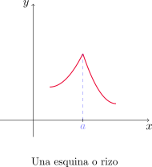{fig-align="center" width=40%}

El [teorema](#teo-derivable-continua) anterior da otra forma en que una función no es derivable en un punto: si $f$ no es continua en $a$, entonces no puede ser derivable en este punto. Si $f$ tiene una discontinuidad en $a$ (como por ejemplo un salto) entonces $f'(a)$ no existe.

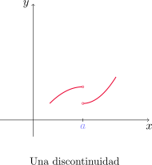{fig-align="center" width=40%}

Una tercera posibilidad es que $f$ presente una **recta tangente vertical** en $x=a$, es decir, $f$ es continua en $a$ y se cumple que

$$
\lim_{x\to a}|f'(x)|=\infty.
$$

Esto significa que las tangentes se vuelven más empinadas conforme $x\to a$.

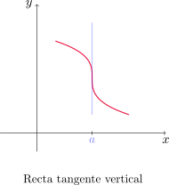{fig-align="center" width=40%}

### Derivadas superiores
	
Si $f$ es una función derivable, $f'$ también es una función y podemos derivarla. La derivada de la derivada de $f$ ($(f')'=f''$) se denomina **derivada segunda** de $f$. En la notación de Leibniz, si $y=f(x)$ podemos escribir

$$
f''(x)=\frac{d}{dx}\left(\frac{df}{dx}\right)=\frac{d^2f}{dx^2}.
$$

::: {#ejemplo-derivada-segunda .example-box}

Ejemplo

Si $f(x)=x^3-x$, hallar e interpretar $f''(x)$.

:::

::: {.callout-tip collapse="true"}
## Solución	

En el [Ejemplo 41](#ejemplo-derivada-cubica) vimos que $f'(x)=3x^2-1$. Usando la [definición de derivada](#definicion-derivada), tenemos que 

$$
f''(x)=\lim_{h\to 0} \frac{f'(x+h)-f'(x)}{h}.
$$

Para $x$ fijo y $h\neq 0$, calculamos

$$
\frac{f'(x+h)-f'(x)}{h}=\frac{3(x+h)^2-1-(3x^2-1)}{h}=\frac{6xh+3h^2}{h}=\frac{h(6x+3h)}{h}=6x+3h.
$$

Luego

$$
\lim_{h\to 0} \frac{f'(x+h)-f'(x)}{h}=\lim_{h\to 0} (6x+3h)=6x.
$$

Por lo tanto, $f''(x)=6x$. Como $f''$ resulta ser la derivada de $f'$, $f''(x)$ nos da la pendiente de la recta tangente al gráfico de $f'$ en el punto $(x,f'(x))$.

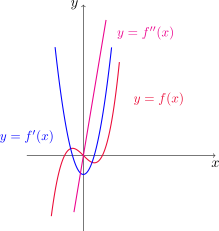{fig-align="center" width=40%}

:::

En general podemos interpretar a la segunda derivada como una razón de cambio de una razón de cambio. Si $s=s(t)$ es la función de posición de un objeto que se mueve en línea recta, entonces

$$
v(t)=s'(t)=\frac{ds}{dt}
$$

es la velocidad del objeto. La razón de cambio de la velocidad con respecto al tiempo es la **aceleración** del objeto. Ésta es la derivada de la velocidad y, en consecuencia, la derivada segunda de la posición

$$
a(t)=\frac{d}{dt}\left(\frac{ds}{dt}\right)=\frac{d^2s}{dt^2}
$$
en la notación de Leibniz.
	
La **tercera derivada** $f'''$ es la derivada de la derivada segunda de $f$, es decir

$$
y'''=f'''=\frac{d}{dx}\left(\frac{d^2y}{dx^2}\right)=\frac{d^3y}{dx^3}.
$$

Este proceso puede continuar siempre y cuando el límite del cociente de diferencias exista. En general, la **derivada $n-$ésima** se denota por $f^{(n)}$, o bien
	
$$
y^{(n)}=f^{(n)}(x)=\frac{d^nf}{dx^n}.
$$	
	
::: {.example-box}

Ejemplo

Si $f(x)=x^3-x$, hallar $f'''(x)$ e interpretar $f^{(4)}(x)$.

:::

::: {.callout-tip collapse="true"}
## Solución	

En el [Ejemplo 45](#ejemplo-derivada-segunda) obtuvimos que $f''(x)=6x$. Usando la [definición de derivada](#definicion-derivada) con $f''$, obtenemos 

$$
f'''(x)=\lim_{h\to 0} \frac{f''(x+h)-f''(x)}{h}.
$$

Si $x\in\mathbb{R}$ está fijo y $h\neq 0$ tenemos que 

$$
\frac{f''(x+h)-f''(x)}{h}=\frac{6(x+h)-6x}{h}=\frac{6h}{h}=6,
$$

con lo cual

$$
\lim_{h\to 0} \frac{f''(x+h)-f''(x)}{h}=\lim_{h\to 0} 6= 6
$$

y en consecuencia $f'''(x)=6$, es decir, $f'''$ es una función constante. Si calculamos la derivada de ésta última función, obtenemos

$$
f^{(4)}(x)=\lim_{h\to 0} \frac{f'''(x+h)-f'''(x)}{h}=\lim_{h\to 0} \frac{6-6}{h}=0.
$$

Por lo tanto, $f^{(4)}(x)=0$. En el siguiente gráfico se muestra $f''$ junto a $f'''$ y $f^{(4)}$.

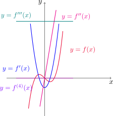{fig-align="center" width=40%}

:::

Para el caso de la función posición de un objeto, la tercera derivada $s'''$ se denomina **jerk** (impulso) y es la derivada de la aceleración. Tenemos que

$$
j=\frac{da}{dt}=\frac{d^3s}{dt^3}.
$$

[↑ Volver al inicio de la sección](#seccion_2.8)