## 3.1.  Derivadas de polinomios y funciones exponenciales {#seccion_3.1}

Comenzamos considerando la función constante $f(x)=c$, donde $c$ es un número real.
	
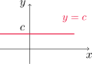{fig-align="center" width=25%}
	
El gráfico de $f$ es simplemente una recta horizontal, cuya pendiente es cero. Entonces debería ocurrir que $f'(x)=0$. En efecto,

$$
f'(x)=\lim_{h\to 0} \frac{f(x+h)-f(x)}{h}=\lim_{h\to 0} \frac{c-c}{h}=\lim_{h\to 0}0=0.
$$

::: {.formula-box}

$$
\frac{d}{dx}(c)=0.
$$

:::
 
### Funciones potencia

Si consideramos $f(x)=x$, el gráfico es la recta identidad, que tiene pendiente uno.
	
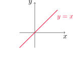{fig-align="center" width=30%}
	
Entonces

$$
f'(x)=\lim_{h\to 0} \frac{f(x+h)-f(x)}{h}=\lim_{h\to 0} \frac{x+h-x}{h}=\lim_{h\to 0}\frac{h}{h}=1.
$$

Por lo tanto

::: {.formula-box}

$$
\frac{d}{dx}(x)=1.
$$

::: 

Se puede comprobar fácilmente que

::: {.formula-box}

$$
\frac{d}{dx}\left(x^2\right)=2x \quad \text { y } \quad \frac{d}{dx}\left(x^3\right)=3x^2. 
$$

::: 

Para el caso $f(x)=x^4$ podemos comprobar que

$$
f'(x)=\lim_{h\to 0} \frac{f(x+h)-f(x)}{h}=\lim_{h\to 0} \frac{(x+h)^4-x^4}{h}=\lim_{h\to 0}\left(4x^3+6x^2h+4xh^2+h^3\right)=4x^3.
$$

Por lo tanto

::: {.formula-box}

$$
\frac{d}{dx}\left(x^4\right)=4x^3.
$$

:::

En general, tenemos la siguiente **regla de la potencia**: si $n$ es un entero positivo, entonces

 
::: {.formula-box}

$$
\frac{d}{dx}\left(x^n\right)=nx^{n-1}.
$${#eq-regla-potencia}

:::

::: {.example-box}

Ejemplo

 Utilizar la regla de la potencia para hallar la derivada en cada caso.

::: {.columns}
::: {.column width="40%"}

- $f(x)=x^6$.

- $y=x^{1000}$.
 
:::

::: {.column width="40%"}

- $y=t^4$.

- $g(r)=r^3$.

:::

:::

:::

::: {.callout-tip collapse="true"}
## Solución

Aplicando la [regla de la potencia](#eq-regla-potencia) en cada caso, obtenemos

- $\,\,\displaystyle \frac{df}{dx}(x)=\frac{d}{dx}(x^6)=6x^{6-1}=6x^5$.

- $\,\,\displaystyle \frac{dy}{dx}(x)=\frac{d}{dx}(x^1000)=1000x^{1000-1}=1000x^999$.

- $\,\,\displaystyle \frac{dy}{dt}(t)=\frac{d}{dt}(t^4)=4t^{4-1}=4t^3$.

- $\,\,\displaystyle \frac{dg}{dr}(r)=\frac{d}{dr}(r^3)=3r^{3-1}=3r^2$.

:::

::: {.callout-question}

### ¿Qué ocurre cuando $n$ es entero negativo?	

- Consideremos primero $f(x)=1/x$. Podemos ver que

$$
\frac{f(x+h)-f(x)}{h}=\frac{\frac{1}{x+h}-\frac{1}{x}}{h}=-\frac{1}{x(x+h)},
$$
		
para todo $h\neq 0$. Entonces

$$
\lim_{h\to 0}\frac{f(x+h)-f(x)}{h}=\lim_{h\to 0}\left(-\frac{1}{x(x+h)}\right)=-\frac{1}{x^2}=(-1)x^{-1-1}.
$$

- En la Sección 2.8 vimos que 

$$
\frac{d}{dx}\left(\sqrt{x}\right)=\frac{1}{2\sqrt{x}}=\frac{1}{2}x^{1/2-1}.
$$

Esto parece indicar que la regla de la potencia vale para cualquier $n\in\mathbb{R}$. Es decir, si $f(x)=x^n$ con $n\in\mathbb{R}$, entonces

$$
\frac{d}{dx}\left(x^n\right)=nx^{n-1}.
$${#eq-potencia-general}

Esto lo comprobaremos más adelante.

:::

::: {.example-box}

Ejemplo

Derivar las funciones
	
- $f(x)=1/x^2$
- $y=\sqrt[3]{x^2}$

:::

::: {.callout-tip collapse="true"}
## Solución

Utilizando la [regla general de la potencia](#eq-potencia-general), obtenemos

$$
\frac{df}{dx}(x)=\frac{d}{dx}\left(x^{-2}\right)=(-2)x^{-2-1}=-2x^{-3}=-\frac{2}{x^3}
$$

y también

$$
\frac{dy}{dx}(x)=\frac{d}{dx}\left(\sqrt[3]{x^2}\right)=\frac{d}{dx}\left(x^{2/3}\right)=\frac{2}{3}x^{2/3-1}=\frac{2}{3}x^{-1/3}=\frac{2}{3 \sqrt[3]{x}}.
$$

:::

### Rectas tangente y normal

A partir de la derivada de una función podemos encontrar también rectas normales a una curva en un punto dado. La **recta normal** a una curva $C$ en un punto $P$ es aquella que pasa por $P$ y es ortogonal a la tangente por $C$ en ese punto.
		
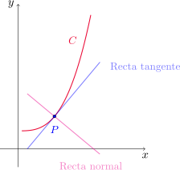{fig-align="center" width=40%}		

Supongamos que la curva $C$ está dada por el gráfico de $y=f(x)$ y $f$ es derivable en $a$. Recordemos que la ecuación de la recta tangente a $C$ en el punto $(a,f(a))$ es

$$
y=f(a)+f'(a)(x-a).
$$
	
La recta normal es aquella perpendicular a la tangente y que pasa por $(a,f(a))$. Su ecuación es

:::{.formula-box}

$$
y=f(a)-\frac{1}{f'(a)}(x-a)
$$

:::

siempre que $f'(a)\neq 0$. Cuando $f'(a)=0$, la recta normal será simplemente $x=a$.

::: {.example-box}

Ejemplo

Hallar la ecuación de la recta tangente y de la recta normal a la curva $y=x\sqrt{x}$ en el punto $(1,1)$. Dibujar ambas rectas junto al gráfico de la función.

:::

::: {.callout-tip collapse="true"}
## Solución

Para encontrar las rectas deseadas necesitamos calcular $y'(1)$. Utilizando la [regla general de la potencia](#eq-regla-potencia) resulta

$$
y'(x)=(x\sqrt{x})'=\left(x^{3/2}\right)'=\frac{3}{2} x^{1/2}.
$$

La recta tangente tiene pendiente $y'(1)=\frac{3}{2}$ y pasa por $(1,1)$. Su ecuación es

$$
y-1=\frac{3}{2}(x-1) \quad \text{ o equivalentemente } \quad y=\frac{3}{2}x-\frac{1}{2}.
$$

La recta normal en $P$ tiene pendiente $m=-\frac{1}{y'(1)}=-\frac{2}{3}$ y pasa también por $(1,1)$. Su ecuación es

$$
y-1=-\frac{2}{3}(x-1) \quad \text{ o también } \quad y=-\frac{2}{3}x+\frac{5}{3}.
$$

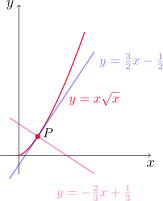{fig-align="center" width=40%}

:::

### Nuevas derivadas a partir de otras conocidas

:::{#teo-propiedades-derivada .theorem}

Propiedad

Sean $f$ y $g$ dos funciones derivables y $c$ un número real. Entonces valen las siguientes propiedades
		
- $\displaystyle \frac{d}{dx}(cf(x))=c\frac{df}{dx}(x)\quad$ **(regla del múltiplo constante)**

- $\displaystyle \frac{d}{dx}(f(x)+g(x))=\frac{df}{dx}(x)+\frac{dg}{dx}(x)\quad$**(regla de la suma)**

- $\displaystyle \frac{d}{dx}(f(x)-g(x))=\frac{df}{dx}(x)-\frac{dg}{dx}(x)\quad$**(regla de la resta)**

:::
	
::: {.example-box}

Ejemplo

Calcular $f'$ si $f(x)=x^8+12x^5-4x^4+10x^3-8x+5$.

:::

::: {.callout-tip collapse="true"}
## Solución

Utilizamos las reglas de la [propiedad](#teo-propiedades-derivada) anterior para escribir

$$
f'(x)=(x^8+12x^5-4x^4+10x^3-8x+5)'=\left(x^8\right)'+12\left(x^5\right)'-4\left(x^4\right)'+10\left(x^3\right)'-8x'+5'.
$$

Ahora, por la [regla de la potencia](#eq-regla-potencia) obtenemos

$$
f'(x)=8x^7+60x^4-16x^3+30x^2-8.
$$

:::

::: {.example-box}

Ejemplo

Encontrar los puntos de la curva $y=x^4-6x^2+4$ donde la recta tangente es horizontal.

:::

::: {.callout-tip collapse="true"}
## Solución

Una recta tangente horizontal tiene pendiente cero, es decir, queremos encontrar los puntos $x_0$ tales que $y'(x_0)=0$. Combinando las [reglas de derivación](#teo-propiedades-derivada) para la suma, resta y múltiplo constante con la [regla de la potencia](#eq-regla-potencia) obtenemos

$$
y'(x)=4x^3-12x.
$$

Entonces $y'(x)=0$ si y sólo si $4x(x^2-3)=0$, de donde deducimos que $x=-\sqrt{3}$, $x=0$ y $x=\sqrt{3}$. Luego, los puntos buscados son $(-\sqrt{3},y(-\sqrt{3}))=(-\sqrt{3},-5)$, $(0,y(0))=(0,4)$ y $(\sqrt{3},y(\sqrt{3}))=(\sqrt{3},-5)$.

:::

::: {.example-box}

Ejemplo

La ecuación del movimiento de una partícula es $s=2t^3-5t^2+3t+4$, donde $s$ se mide en centímetros y $t$ en segundos. Hallar la aceleración como una función del tiempo. ¿Cuál es la aceleración después de dos segundos?

:::

::: {.callout-tip collapse="true"}
## Solución

Recordemos que la aceleración es la derivada de la velocidad, es decir, la derivada segunda de la posición. Entonces

$$
a(t)=\frac{d^2 s}{dt^2}(t)=\frac{d}{dt}\left(\frac{ds}{dt}(t)\right)=\frac{d}{dt}\left(6t^2-10t+3\right)=12t-10.
$$

La aceleración después de dos segundos es $a(2)=12\cdot 2-10=14\, cm/s^2$.

:::

### Función exponencial
		
Si $f(x)=a^x$, al calcular $f'$ por definición tenemos que

$$
f'(x)=\lim_{h\to 0} \frac{f(x+h)-f(x)}{h}=\lim_{h\to 0} \frac{a^{x+h}-a^x}{h}=\lim_{h\to 0} a^x\left(\frac{a^h-1}{h}\right).
$$

Notemos que si el límite

$$
\lim_{h\to 0} \frac{a^h-1}{h}
$$
 	
existe, entonces es $f'(0)$ y en consecuencia

$$
f'(x)=f'(0) \,a^x=f'(0)\,f(x).
$$

Esto nos dice que si una función exponencial es derivable en cero, entonces es derivable en todo $x$ y la derivada es proporcional a la misma función. 
 		
Recordando el desarrollo de la Sección 1.5, hemos definido al número $e$ como aquella base que hace que el gráfico de $y=e^x$ en el punto $(0,1)$ tenga recta tangente con pendiente $1$. En otras palabras, el número $e$ verifica que
 		
$$
\lim_{h\to 0}\frac{e^h-1}{h}=1.
$$

Usando este resultado, podemos concluir que 

::: {.formula-box}

$$
\frac{d}{dx}\left(e^x\right)=e^x.
$$

:::

::: {.example-box}

Ejemplo

Si $f(x)=e^x-x$, encontrar $f'$ y $f''$. Comparar el gráfico de $f$ con el de $f'$.

:::

::: {.callout-tip collapse="true"}
## Solución

Utilizando la derivada de $y=e^x$ y de $y=x$ escribimos

$$
f'(x)=\left(e^x-x\right)'=\left(e^x\right)'-x'=e^x-1
$$

y también

$$
f''(x)=\left(f'(x)\right)'=\left(e^x-1\right)'=\left(e^x\right)'-1'=e^x.
$$

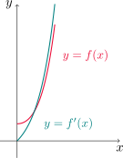{fig-align="center" width=35%}

:::

::: {.example-box}

Ejemplo

¿En qué punto de la curva $y=e^x$ la recta tangente es paralela a $y=2x$?

:::

::: {.callout-tip collapse="true"}
## Solución

La recta tangente en $(x_0, y(x_0))$ será paralela a $y=2x$ si tiene la misma pendiente que esta recta. Como la pendiente es la derivada, estamos buscando los puntos $x_0$ tales que $y'(x_0)=2$. Como $y'(x)=e^x$, entonces buscamos $x_0$ tal que

$$
e^{x_0}=2,
$$

lo que nos da $x_0=\ln 2$. El punto de la curva buscado es $P=(\ln 2, y(\ln 2))=(\ln 2,2)$.

:::

[↑ Volver al inicio de la sección](#seccion_3.1)
	
## 3.2. Regla del producto y del cociente {#seccion_3.2} 

### Derivada del producto

Las propiedades vistas hasta ahora podrían sugerir que la derivada de un producto de funciones es el producto de las derivadas de cada una. Sin embargo, esto es **erróneo**: si $f(x)=x$ y $g(x)=x^2$, entonces $(fg)(x)=x^3$ y

$$
\frac{d}{dx}(fg)=\frac{d}{dx}(x^3)=3x^2
$$

mientras que 

$$
\left(\frac{df}{dx}(x)\right)\left(\frac{dg}{dx}(x)\right)=1\cdot 2x=2x.
$$

Consideremos dos funciones $f$ y $g$, derivables en $x$. Entonces

$$
\begin{aligned}
(fg)'(x)&=\lim_{h\to 0}\frac{(fg)(x+h)-(fg)(x)}{h} \\
\\
&=\lim_{h\to 0}
\left(\frac{f(x+h)g(x+h)-\color{red}{f(x+h)g(x)}}{h}
+\frac{{\color{red}{f(x+h)g(x)}}-f(x)g(x)}{h}\right)\\
\\
&=\lim_{h\to 0}
\left(f(x+h)\,\frac{g(x+h)-g(x)}{h}
+g(x)\,\frac{f(x+h)-f(x)}{h}\right).
\end{aligned}
$${#eq-derivada-producto}

Como tanto $f$ como $g$ son derivables en $x$, tenemos que

$$
\lim_{h\to 0}\frac{f(x+h)-f(x)}{h}=f'(x)\quad\text{ y }\quad \lim_{h\to 0}\frac{g(x+h)-g(x)}{h}=g'(x).
$$

Por otra parte, como $f$ es derivable en $x$ también es continua en $x$. Por lo tanto

$$
\lim_{h\to 0} f(x+h)=f\left(\lim_{h\to 0}[x+h]\right)=f(x).
$$

Combinando estos resultados con las leyes de los límites para el producto y la suma, volviendo a (-@eq-derivada-producto) resulta

$$
(fg)'(x)=f(x)g'(x)+g(x)f'(x).
$$

En conclusión, la **regla del producto** establece que si $f$ y $g$ son derivables en $x$, entonces 

::: {.formula-box}

$$
\frac{d}{dx}(fg)(x)=f(x)\frac{dg}{dx}(x)+g(x)\frac{df}{dx}(x).
$${#eq-regla-producto}

:::

::: {.example-box}

Ejemplo

Si $f(x)=x\,e^x$ hallar $f'(x)$. Encontrar también la $n$-ésima derivada de $f$, $f^{(n)}(x)$.
 	
:::

::: {.callout-tip collapse="true"}
## Solución

Por la [regla del producto](#eq-regla-producto) obtenemos

$$
f'(x)=x'e^x+x\left(e^x\right)'=e^x+xe^x=(1+x)e^x.
$$

Aplicando nuevamente esta regla

$$
f''(x)=(1+x)'e^x+(1+x)\left(e^x\right)'=e^x+(1+x)e^x=(2+x)e^x.
$$

Repitiendo este procedimiento para más derivadas, en general tendremos que 

$$
f^{(n)}(x)=(n+x)e^x.
$$

:::

::: {.example-box}

Ejemplo

Derivar la función $f(t)=\sqrt{t}\,(a+tb)$.
 	
:::

::: {.callout-tip collapse="true"}
## Solución

Utilizando la [regla del producto](#eq-regla-producto) escribimos

$$
\frac{df}{dt}(t)=\frac{d}{dt}\left(\sqrt{t}\right)(a+tb)+\sqrt{t}\frac{d}{dt}(a+tb)=\frac{1}{2}t^{-1/2}(a+tb)+t^{1/2}b=\frac{1}{2}t^{-1/2}a+\frac{3}{2}t^{1/2}b.
$$

:::

::: {.example-box}

Ejemplo

Si $f(x)=\sqrt{x}\,g(x)$, donde $g(4)=2$ y $g'(4)=3$, hallar $f'(4)$.
 	
:::

::: {.callout-tip collapse="true"}
## Solución

Primero calculamos $f'(x)$ usando la [regla del producto](#eq-regla-producto). Tenemos que 

$$
f'(x)=\left(\sqrt{x}\right)'g(x)+\sqrt{x}g'(x)=\frac{1}{2}x^{-1/2}\,g(x)+\sqrt{x}\,g'(x).
$$

Ahora evaluamos en $x=4$ utilizando la información dada

$$
f'(4)=\frac{1}{2} 4^{-1/2}\,g(4)+\sqrt{4}\,g'(4)=\frac{1}{4}\cdot 2+2\cdot 3=\frac{13}{2}.
$$

:::

### Derivada del cociente

De manera similar a lo que ocurre con el producto, podemos verificar que $(f/g)'\neq f'/g'$, es decir, la derivada de un cociente de funciones **no es** el cociente de las derivadas de cada una. Para encontrar una fórmula procederemos nuevamente por definición.

Si $f$ y $g$ son funciones derivables en $x$, y además $g(x)\neq 0$, entonces 

$$
\begin{aligned}
\left(\frac{f}{g}\right)'(x)&=\lim_{h\to 0}\frac{\left(\frac{f}{g}\right)(x+h)-\left(\frac{f}{g}\right)(x)}{h}\\
\\
&=\lim_{h\to 0} \frac{1}{h}\left(\frac{f(x+h)}{g(x+h)}{\color{red}{-\frac{f(x)}{g(x+h)}}+\frac{f(x)}{g(x+h)}}-\frac{f(x)}{g(x)}\right)\\
\\
&=\lim_{h\to 0} \left[\frac{1}{g(x+h)}\left(\frac{f(x+h)-f(x)}{h}\right)-\frac{f(x)}{g(x+h)g(x)}\frac{g(x+h)-g(x)}{h}\right].
\end{aligned}
$${#eq-derivada-cociente}

Como $f$ y $g$ son derivables en $x$, por definición de derivada sabemos que

$$
\lim_{h\to 0}\frac{f(x+h)-f(x)}{h}=f'(x)\quad\text{ y }\quad \lim_{h\to 0}\frac{g(x+h)-g(x)}{h}=g'(x).
$$

Además, $g$ es derivable en $x$ y por lo tanto también es continua en $x$. De esta manera

$$
\lim_{h\to 0}\frac{1}{g(x+h)}=\frac{1}{g(x)},
$$

dado que el denominador tiene como límite $g(x)\neq 0$ por hipótesis. Volviendo a la expresión calculada en (-@eq-derivada-cociente) resulta

$$
\left(\frac{f}{g}\right)'(x)=\frac{f'(x)}{g(x)}-\frac{f(x)g'(x)}{(g(x))^2}=\frac{f'(x)g(x)-f(x)g'(x)}{(g(x))^2}.
$$

En conclusión, la **regla del cociente** establece que si $f$ y $g$ son derivables en $x$ y $g(x)\neq 0$, entonces

::: {.formula-box}

$$
\frac{d}{dx}\left(\frac{f}{g}\right)(x)=\frac{\frac{df}{dx}(x)g(x)-f(x)\frac{dg}{dx}(x)}{g^2(x)}.
$${#eq-regla-cociente}

:::
 	
::: {.example-box}

Ejemplo

Sea $\displaystyle y=\frac{x^2+x-2}{x^3+6}$. Calcular $y'$.
 	
:::

::: {.callout-tip collapse="true"}
## Solución

Aplicando la [regla del cociente](#eq-regla-cociente) podemos escribir

$$
\begin{aligned}
y'=\frac{(x^2+x-2)'(x^3+6)-(x^2+x-2)(x^3+6)'}{(x^3+6)^2}&=\frac{(2x+1)(x^3+6)-(x^2+x-2)(3x^2)}{(x^3+6)^2}\\
\\
&=\frac{-x^4-2x^3+6x^2+12x+6}{(x^3+6)^2}.
\end{aligned}
$$

:::

::: {.example-box}

Ejemplo

Encontrar una ecuación de la recta tangente a 

$$
\displaystyle y=\frac{e^x}{1+x^2}
$$ 

en el punto $(1,e/2)$.
 	
:::

::: {.callout-tip collapse="true"}
## Solución

Primero calculamos $y'(x)$ usando la [regla del cociente](#eq-regla-cociente)

$$
y'(x)=\frac{\left(e^x\right)'(1+x^2)-e^x(1+x^2)'}{(1+x^2)^2}=\frac{e^x(1+x^2)-2x\,e^x}{(1+x^2)^2}=\frac{e^x(x-1)^2}{(1+x^2)^2}.
$$

La recta tangente buscada pasa por $(1,e/2)$ y tiene pendiente $y'(1)=0$. Por lo tanto, su ecuación es

$$
y-\frac{e}{2}=0(x-1) \quad \text{ o equivalentemente } \quad y=\frac{e}{2}.
$$

:::

[↑ Volver al inicio de la sección](#seccion_3.2) 	

## 3.3. Derivadas de las funciones trigonométricas {#seccion_3.3}

### Derivada de la función seno

Comencemos considerando la función $f(x)=\operatorname{sen} x$. Esta función nos da el seno de un ángulo cuya medida en radianes es $x$. Queremos calcular

$$
f'(x)=\lim_{h\to 0}\frac{f(x+h)-f(x)}{h}.
$$

Considerando $h\neq 0$ y aplicando la identidad 

$$
\operatorname{sen}(\alpha+\beta)=\operatorname{sen} \alpha\cos \beta+\cos\alpha \operatorname{sen} \beta 
$$

escribimos
 	
$$
\begin{aligned}
\frac{f(x+h)-f(x)}{h}=\frac{\operatorname{sen}(x+h)-\operatorname{sen} x}{h}&=
\frac{\operatorname{sen} x\cos h+\cos x\operatorname{sen} h-\operatorname{sen} x}{h}\\
\\
&=\operatorname{sen} x\left(\frac{\cos h-1}{h}\right)+\cos x\left(\frac{\operatorname{sen} h}{h}\right).
\end{aligned}
$${#eq-derivada-seno}	
 	
Demostraremos que

::: {.formula-box}

$$
\lim_{h\to 0}\frac{\operatorname{sen} h}{h}=1.
$${#eq-limite-seno}

:::

y también que

::: {.formula-box}

$$
\lim_{h\to 0}\frac{\cos h-1}{h}=0.
$${#eq-limite-coseno}

:::

Utilizando estos límites en (-@eq-derivada-seno) resulta que

$$
\begin{aligned}
\lim_{h\to 0} 	\frac{f(x+h)-f(x)}{h}&=\lim_{h\to 0} \left[\operatorname{sen} x\left(\frac{\cos h-1}{h}\right)+\cos x\left(\frac{\operatorname{sen} h}{h}\right)\right]\\
\\
&=\operatorname{sen} x\left(\lim_{h\to 0}\frac{\cos h-1}{h}\right)+\cos x\left(\lim_{h\to 0}\frac{\operatorname{sen} h }{h}\right)\\
\\
&=\operatorname{sen} x \cdot 0+\cos x\cdot 1\\
\\
&=\cos x. 
\end{aligned}
$$	
 	
Concluimos que

::: {#form-derivada-seno .formula-box}

$$
\frac{d}{dx}(\operatorname{sen} x)=\cos x.
$$

:::
 	
Ahora procedemos a demostrar la validez del límite (-@eq-limite-seno). Consideremos $0<\theta<\pi/2$ y un sector circular con centro $O$, radio 1 y ángulo central $\theta$.
 	
 	
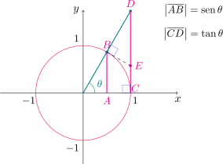{fig-align="center" width=45%}
 	
- Si prolongamos el segmento que va desde el origen al punto $B$, éste corta a la tangente a la circunferencia por $C$ en un punto $D$.

- Trazamos la tangente a la circunferencia por el punto $B$,
que corta al segmento $\overline{CD}$ en un punto $E$.

- Observemos también que $|\overline{AB}|=\operatorname{sen} \theta$ y $|\overline{CD}|=\tan \theta$.

Entonces resulta que

$$
\operatorname{sen}\theta =|\overline{AB}|\leq \text{longitud arco}(BC)=\theta
$$

y adem'as

$$
\theta = \text{longitud arco}(BC)\leq |\overline{CE}|+|\overline{EB}|\leq |\overline{CE}|+|\overline{ED}|=|\overline{CD}|=\tan \theta.
$$

Es decir, hemos probado que 

$$
\operatorname{sen}{\theta} \leq \theta \leq \tan\theta, 
$$

de donde podemos deducir que 

$$
\cos \theta \leq \frac{\operatorname{sen} \theta}{\theta}\leq 1
$$

para $0<\theta<\pi/2$.

Si $-\pi/2<\theta<0$, entonces $0<-\theta<\pi/2$. Aplicando la desigualdad de arriba para $-\theta$ resulta

$$
\cos (-\theta) \leq \frac{\operatorname{sen} (-\theta)}{-\theta}\leq 1.
$$

Sabiendo que el seno es una función impar y el coseno es par, lo reescribimos como

$$
\cos \theta \leq \frac{\operatorname{sen} (\theta)}{\theta}\leq 1.
$$

Por lo tanto, la desigualdad de arriba es válida para todo $\theta\in (-\pi/2,\pi/2)$, $\theta\neq 0$. 

Dado que

$$
\lim_{\theta\to 0} \cos \theta=1 \quad\text{ y }\quad\lim_{\theta \to 0}1=1
$$

el [teorema de la compresión](#teo-compresion) nos permite deducir que 

$$
\lim_{\theta\to 0} \frac{\operatorname{sen}\theta}{\theta}=1,
$$

lo que nos da la validez de la fórmula (-@eq-limite-seno). Ahora, la fórmula (-@eq-limite-coseno) es consecuencia directa de ésta última. En efecto, para $h\neq 0$ tenemos que

$$
\frac{\cos h-1}{h}=\frac{\cos h-1}{h}\,\,\frac{\cos h+1}{\cos h+1}=-\frac{\operatorname{sen}^2 h}{h(\cos h+1)}=-\frac{\operatorname{sen} h}{h}\frac{\operatorname{sen} h}{\cos h +1}.
$$

Y usando el límite anterior junto a las leyes de los límites

$$
\lim_{h\to 0} \frac{\cos h-1}{h}=\left(\lim_{h\to 0}-\frac{\operatorname{sen} h}{h}\right)\left(\lim_{h\to 0}\frac{\operatorname{sen} h}{\cos h+1}\right)=(-1)\cdot 0=0,
$$

lo que muestra la validez de la fórmula (-@eq-limite-coseno).
 
::: {.example-box}

Ejemplo

Derivar $y=x^2\operatorname{sen} x$.
 	
:::

::: {.callout-tip collapse="true"}
## Solución

Calculamos $\displaystyle\frac{dy}{dx}$ combinando la [regla del producto](#eq-regla-producto) con la [fórmula para la derivada del seno](#form-derivada-seno)

$$
\frac{dy}{dx}(x)=\frac{d}{dx}\left(x^2\right) \operatorname{sen} x + x^2 \frac{d}{dx}\left(\operatorname{sen} x\right)= 2x\operatorname{sen} x+x^2\cos x=x(2\operatorname{sen} x+x\cos x).
$$
:::
 

### Derivada de las funciones coseno y tangente
 
Consideremos ahora $f(x)=\cos x$. Si $h\neq 0$, aplicamos la identidad

$$
\cos(\alpha+\beta)=\cos \alpha \cos \beta -\operatorname{sen} \alpha \operatorname{sen} \beta
$$

para escribir

$$
\frac{\cos(x+h)-\cos(x)}{h}=\frac{\cos x\cos h-\operatorname{sen} x\operatorname{sen} h-\cos x}{h}
 	=\cos x\left(\frac{\cos h-1}{h}\right)-\operatorname{sen} x\frac{\operatorname{sen} h}{h}.
$$

Utilizando los límites dados por las fórmulas (-@eq-limite-seno) y (-@eq-limite-coseno) tenemos que 
$$
\begin{aligned}
\lim_{h\to 0}\frac{\cos(x+h)-\cos(x)}{h}
 	&=\lim_{h\to 0}\left[\cos x\left(\frac{\cos h-1}{h}\right)-\operatorname{sen} x\frac{\operatorname{sen} h}{h}\right]\\
	\\
 	&=\cos x\lim_{h\to 0}\frac{\cos h-1}{h}-\operatorname{sen} x\lim_{h\to 0}\frac{\operatorname{sen} h}{h}\\
	\\
 	&=\cos x\cdot 0-\operatorname{sen} x\cdot 1\\
 	\\
	&=-\operatorname{sen} x.
\end{aligned}
$$ 

Como conclusión, obtenemos que 

::: {.formula-box}

$$
\frac{d}{dx}(\cos x)=-\operatorname{sen} x.
$$

:::

Para $f(x)=\tan x$, como $\tan x=\operatorname{sen} x/\cos x$, podemos utilizar la [regla del cociente](#eq-regla-cociente). Así

$$
f'(x)=\frac{(\operatorname{sen} x)'\cos x-\operatorname{sen} x(\cos x)'}{\cos^2 x}=\frac{\cos^2 x+\operatorname{sen}^2 x}{\cos^2 x}=\frac{1}{\cos^2 x}=\sec^2 x.
$$

En definitiva

::: {.formula-box}

$$
\frac{d}{dx}(\tan x)=\sec^2 x.
$$

:::

Como aplicación de la regla del cociente podemos deducir también las siguientes fórmulas

::: {.formula-box}

$$
\frac{d}{dx}(\csc x)=-\csc x\cot x.
$$

$$
\frac{d}{dx}(\sec x)=\sec x\tan x.
$$

$$
\frac{d}{dx}(\cot x)=-\csc^2 x.
$$

:::

::: {.example-box}

Ejemplo

Derivar la función $\displaystyle f(x)=\frac{\sec x}{1+\tan x}$. ¿Para qué valores de $x$ la gráfica de $f$ tiene una tangente horizontal?

:::

::: {.callout-tip collapse="true"}
## Solución

Utilizamos las reglas de $\sec x$ y $\tan x$ junto a la del cociente, es decir

$$
f'(x)=\frac{(\sec x)'(1+\tan x)-\sec x (1+\tan x)'}{(1+\tan x)^2}=\frac{\sec x\tan x (1+\tan x)-\sec x \sec^2 x}{(1+\tan x)^2}=\frac{\operatorname{sen} x-\cos x}{1+2\operatorname{sen}\cos x}.
$$

Ahora, $f'(x)=0$ si y sólo si $\operatorname{sen} x=\cos x$, es decir, cuando $\tan x=1$. Los valores de $x$ buscados son de la forma

$$
x=\frac{\pi}{4}+k\pi, \quad \text{ para } k \text{ entero}.
$$

:::

::: {.example-box}

Ejemplo

Un objeto que se encuentra en el extremo de un resorte vertical se desplaza hacia abajo 4 $cm$ más allá de su posición de reposo, para estirar el resorte, y se libera en el instante $t=0$. Su posición $s$ en el instante $t$ es $s=f(t)=4\cos t$. Hallar la velocidad y la aceleración en el instante $t$ y usarlas para analizar el movimiento del objeto.

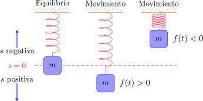{fig-align="center" width=50%}

:::

::: {.callout-tip collapse="true"}
## Solución

Recordemos que la velocidad y la aceleración son las derivadas primera y segunda de la posición, respectivamente. Entonces resulta

$$
v(t)=\frac{ds}{dt}(t)=-4\operatorname{sen} t
$$

y

$$
a(t)=\frac{d^2 s}{dt^2}(t)=\frac{dv}{dt}(t)=-4\cos t.
$$

En la siguiente figura podemos observar los gráficos de la posición, la velocidad y la aceleración. Notemos que cuando el resorte alcanza las posiciones extremas (4 $cm$ arriba o abajo de la posición de equilibrio) la velocidad es cero, ya que en ese instante la masa está cambiando el sentido de recorrido. Por otra parte, al cruzar la posición de equilibrio, correspondiente a $s=0$, la *rapidez* $|v(t)|$ resulta ser máxima. 

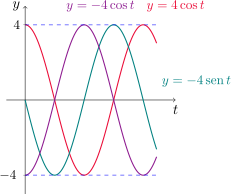{fig-align="center" width=45%}

:::

[↑ Volver al inicio de la sección](#seccion_3.2)

## 3.4. La regla de la cadena {#seccion_3.4}
 
En esta sección veremos cómo derivar funciones compuestas.
 	
:::{#teo-regla-cadena .theorem}

Regla de la cadena 

Si $g$ es derivable en $x$ y $f$ es derivable en $g(x)$, entonces la función compuesta $F=f\circ g$ dada por $F(x)=f(g(x))$ es derivable en $x$ y además
$$
F'(x)=f'(g(x))g'(x).
$$
 		
En la notación de Leibniz, si $y=f(u)$ y $u=g(x)$ son diferenciables, entonces

$$
\frac{dy}{dx}=\frac{dy}{du}\frac{du}{dx}.
$$

:::
 
::: {.example-box}

Ejemplo

Encontrar $F'(x)$ si $F(x)=\sqrt{x^2+1}$.

:::

::: {.callout-tip collapse="true"}
## Solución

Observemos que podemos escribir $F(x)=f(g(x))$, donde $f(x)=\sqrt{x}$ y $g(x)=x^2+1$. En este caso $f'(x)=\frac{1}{2\sqrt{x}}$ y $g'(x)=2x$. Luego, utilizando la [regla de la cadena](#teo-regla-cadena) obtenemos

$$
F'(x)=f'(g(x))g'(x)=\frac{1}{2\sqrt{x^2+1}} 2x =\frac{x}{\sqrt{x^2+1}}.
$$

:::

La regla de la cadena establece que la derivada de $f(g(x))$ puede calcularse derivando la función externa $f$ (evaluada en $g(x)$) y multiplicándola por la derivada de $g$, evaluada en $x$.
 	
::: {.example-box}

Ejemplo

Derivar $y=\operatorname{sen}(x^2)$ e $y=\operatorname{sen}^2x$.

:::
 	
::: {.callout-tip collapse="true"}
## Solución

Para la primer función tenemos que $y=f(g(x))$, donde $f(x)=\operatorname{sen} x$ y $g(x)=x^2$. Entonces

$$
y'=f'(g(x))g'(x)=\cos(x^2)2x=2x\cos(x^2).
$$

La segunda función puede expresarse como $y=g(f(x))$. En este caso resulta

$$
y'=g'(f(x))f'(x)=2\operatorname{sen} x \cos x.
$$

:::
 	
Veamos un caso especial de aplicación de la regla de la cadena.
 	

:::{#form-potencia-general .formula-box}
Regla de la potencia combinada con regla de la cadena

Si $n\in\mathbb{R}$ y $u=g(x)$ es derivable, entonces
$$
\frac{d}{dx}\left(u^n\right)=nu^{n-1}\frac{du}{dx}\quad \text{ o bien} \quad \frac{d}{dx}\left(g(x)\right)^n=ng(x)^{n-1}g'(x).
$$
 		
:::

::: {.example-box}

Ejemplo

Derivar $y=(x^3-1)^{100}$.

:::

::: {.callout-tip collapse="true"}
## Solución

Aplicando la [formula anterior](#form-potencia-general) resulta

$$
y'=100(x^3-1)^{99}(x^3-1)'=300(x^3-1)^{99}x^2.
$$

:::

::: {.example-box}

Ejemplo

Encontrar $f'(x)$ si $\displaystyle f(x)=\frac{1}{\sqrt[3]{x^2+x+1}}$.

:::

::: {.callout-tip collapse="true"}
## Solución

Escribimos $f(x)=(x^2+x+1)^{-1/3}$, con lo cual

$$
\frac{df}{dx}(x)=-\frac{1}{3}(x^2+x+1)^{-4/3}\frac{d}{dx}(x^2+x+1)=-\frac{1}{3}(2x+1)(x^2+x+1)^{-4/3}.
$$

:::
 	
::: {.example-box}

Ejemplo

Calcular la derivada de $\displaystyle g(t)=\left(\frac{t-2}{2t+1}\right)^9$.

:::

::: {.callout-tip collapse="true"}
## Solución

Aplicando nuevamente la [formula de la potencia](#form-potencia-general) resulta

$$
g'(t)=9\left(\frac{t-2}{2t+1}\right)^8\left(\frac{t-2}{2t+1}\right)'=9\left(\frac{t-2}{2t+1}\right)^8\left(\frac{2t+1-(t-2)2}{(2t+1)^2}\right)=45\frac{(t-2)^8}{(2t+1)^{10}}.
$$

:::

::: {.example-box}

Ejemplo

Derivar $y=(2x+1)^5(x^3-x+1)^4$.

:::

::: {.callout-tip collapse="true"}
## Solución

Combinando la [regla del producto](#regla-producto) con la [formula de la potencia](#form-potencia-general) resulta

$$
\begin{aligned}
y'&=5(2x+1)^4\, 2(x^3-x+1)^4+(2x+1)^5\, 4(x^3-x+1)^3(3x^2-1)\\
\\
&=2(2x+1)^4(x^3-x+1)^3(5(x^3-x+1)+2(2x+1)(3x^2-1))\\
\\
&=2(2x+1)^4(x^3-x+1)^3(17x^3+6x^2-9x+3).
\end{aligned}
$$

:::

::: {.example-box}

Ejemplo

Derivar $y=e^{\operatorname{sen} x}$.

:::

::: {.callout-tip collapse="true"}
## Solución

En este caso tenemos que

$$
\frac{dy}{dx}(x)=e^{\operatorname{sen}x}\cos x.
$$

:::
 
### Derivadas de funciones exponenciales generales 	

La regla de la cadena nos permite ahora encontrar la derivada de $y=a^x$, para cualquier $a>0$, $a\neq 1$. Recordando que $a=e^{\ln a}$, tenemos que

$$
a^x=\left(e^{\ln a}\right)^x=e^{(\ln a) x }.
$$
 

Aplicando la regla de la cadena y la derivada de la función $f(x)=e^x$ obtenemos

$$
\frac{d}{dx}(a^x)=\frac{d}{dx}\left(e^{(\ln a) x }\right)=e^{(\ln a) x }\frac{d}{dx}\left((\ln a)x\right)=a^x\ln a.
$$
 	
En conclusión

::: {.formula-box}

$$
\frac{d}{dx}(a^x)=a^x\ln a.
$$

:::
 
La regla de la cadena puede extenderse a composiciones con más funciones:  si $y=f(u)$, $u=g(x)$ y $x=h(t)$ son funciones tales que $f$ es derivable en $g(h(t))$, $g$ es derivable en $h(t)$ y $h$ es derivable en $t$, entonces

$$
\frac{dy}{dt}=\frac{dy}{du}\frac{du}{dx}\frac{dx}{dt}=f'(g(h(t)))\,g'(h(t))\,h'(t).
$$

::: {.example-box}

Ejemplo

Si $f(x)=\operatorname{sen}(\cos(\tan x))$, calcular $f'(x)$.

:::

::: {.callout-tip collapse="true"}
## Solución

Aplicamos la regla de la cadena dos veces

$$
\begin{aligned}
f'(x)=\cos(\cos(\tan x))(\cos(\tan x))'&=\cos(\cos(\tan x))(-\operatorname{sen}(\tan x))(\tan x)'\\
\\
&=-\cos(\cos(\tan x))\operatorname{sen}(\tan x)\sec^2 x.
\end{aligned}
$$

:::

::: {.example-box}

Ejemplo

Derivar $y=e^{\sec(3\theta)}$.

:::

::: {.callout-tip collapse="true"}
## Solución

Aplicando dos veces la regla de la cadena resulta

$$
\frac{dy}{d\theta}(\theta)=e^{\sec(3\theta)}\frac{d}{d\theta}(\sec(3\theta))=e^{\sec(3\theta)}\sec(3\theta)\tan(3\theta)(3\theta)'=3\sec(3\theta)\tan(3\theta)e^{\sec(3\theta)}.
$$

:::

[↑ Volver al inicio de la sección](#seccion_3.4)

## 3.5. Derivación implícita {#seccion_3.5}
 
Hasta ahora hemos visto funciones de la forma $y=f(x)$, donde $y$ se expresa explícitamente en términos de $x$. Sin embargo, muchas veces $x$ e $y$ se relacionan de forma implícita, tal como en las expresiones 

$$
x^2+y^2=25\quad \text{o también }\quad x^3+y^3=6xy.
$$

En algunos casos es posible despejar $y$ en términos de $x$, obteniendo una (o varias) funciones de $x$. Por ejemplo, la ecuación

$$
x^2+y^2=25
$$

describe una circunferencia de radio 5 y centrada en el origen de coordenadas.  

Despejando $y$ obtenemos $y^2=25-x^2$, con lo cual

$$
|y|=\sqrt{25-x^2} \quad \text{ o bien }\quad y=\pm\sqrt{25-x^2},
$$

que se corresponden con la mitad superior e inferior de la circunferencia.
	
		
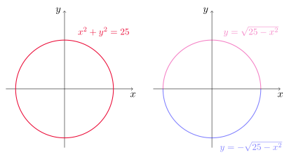{fig-align="center" width=60%}
	
En general, no es necesario despejar $y$ en términos de $x$ para hallar la derivada de $y$. En su lugar, podemos aplicar el **método de derivación implícita**, que consiste en derivar ambos miembros de una ecuación con respecto a $x$ y luego resolver para $y'$.
	
::: {.example-box}

Ejemplo

Considerar la ecuación $x^2+y^2=25$.

- Calcular $\displaystyle\frac{dy}{dx}$.
- Encontrar la ecuación de la recta tangente a la circunferencia en el punto $(3,4)$.

:::

::: {.callout-tip collapse="true"}
## Solución

Si derivamos miembro a miembro la ecuación $x^2+y^2=25$, recordando que $y$ es implícitamente una función de $x$, por la regla de la cadena obtenemos

$$
2x+2y\frac{dy}{dx}=0,
$$

y despejando la derivada de $y$

$$
\frac{dy}{dx}=-\frac{x}{y},
$$

para todo $(x,y)$ tal que $y\neq 0$. En particular, en el punto $(3,4)$ obtenemos

$$
\frac{dy}{dx}=-\frac{3}{4}.
$$

La recta tangente tiene pendiente $m=-3/4$ y pasa por $(3,4)$, con lo que su ecuación es

$$
y-4=-\frac{3}{4}(x-3) \quad \text{ o, equivalentemente, } \quad y=-\frac{3}{4}x+\frac{25}{4}.
$$

:::

::: {.example-box}

Ejemplo

Considerar la curva $x^3+y^3=6xy$, conocida como **folio de Descartes**.
	
- Encontrar $y'$.
- Hallar la recta tangente al folio de Descartes en $(3,3)$.
	
		
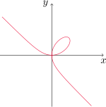{fig-align="center" width=35%}

:::

::: {.callout-tip collapse="true"}
## Solución

Primero calculamos $y'$ derivando implícitamente

$$
3x^2+3y^2y'=6y+6xy'
$$

con lo cual

$$
y'=\frac{2y-x^2}{y^2-2x}.
$$

Al evaluar en el punto $(3,3)$, la pendiente de la recta tangente es 

$$
m=\frac{2\cdot 3-3^2}{3^2-2\cdot 3}=-1
$$

y la ecuación de la recta es

$$
y-3=-1(x-3) \quad \text{ o también }\quad y=-x+6.
$$

:::

::: {.example-box}

Ejemplo

Encontrar $y'$ si $\operatorname{sen}(x+y)=y^2\cos x$.
:::

::: {.callout-tip collapse="true"}
## Solución

Derivando implícitamente resulta

$$
\cos(x+y)(1+y')=2yy'\cos x-y^2\operatorname{sen}x.
$$

Reacomodando términos y despejando $y'$ obtenemos

$$
y'=\frac{y^2\operatorname{sen} x+\cos(x+y)}{2y\cos x-\cos(x+y)}.
$$

:::

::: {.example-box}

Ejemplo

 Hallar $y''$ si $x^4+y^4=16$.

:::

::: {.callout-tip collapse="true"}
## Solución

Primero calculamos $y'$

$$
4x^3+4y^3y'=0 \quad \text{ o también } \quad y'=-\left(\frac{x}{y}\right)^3.
$$

Luego

$$
y''=-3\left(\frac{x}{y}\right)^{2}\left(\frac{y-xy'}{y^2}\right)=-3\frac{x^2}{y^4}\left(y+\frac{x^4}{y^3}\right)=-3\frac{x^2}{y^4}\frac{16}{y^3}=-48 \frac{x^2}{y^7}.
$$

:::

### Derivadas de funciones trigonométricas inversas

Investigaremos las derivadas de las funciones trigonométricas inversas. Es razonable suponer que éstas son derivables, pues sus funciones inversas son derivables (de hecho, si $f$ es una función derivable y uno a uno, puede mostrarse que su inversa $f^{-1}$ es derivable en todo punto excepto donde sus tangentes son verticales).
	
Consideremos primero la función arcoseno. Tenemos que

$$
y=\text{arcsen } x \quad\Longleftrightarrow\quad \operatorname{sen} y=x,\quad -\frac{\pi}{2}\leq y\leq \frac{\pi}{2}.
$$

Derivando implícitamente, obtenemos

$$
(\cos y)\, y'=1\quad \text{ o bien }\quad y'=\frac{1}{\cos y}.
$$

Como $\cos^2y+\operatorname{sen}^2y=1$, obtenemos $|\cos y|=\sqrt{1-\operatorname{sen}^2 y}$. Luego, como $y\in[-\pi/2,\pi/2]$, tenemos que $\cos y\geq 0$ y entonces

$$
y'=\frac{1}{\cos y}=\frac{1}{\sqrt{1-\operatorname{sen}^2 y}}=\frac{1}{\sqrt{1-x^2 }}.
$$
	
Como conclusión obtenemos la fórmula para la derivada del arcoseno

::: {#form-derivada-arcoseno .formula-box}		

$$
\frac{d}{dx}(\text{arcsen }x)=\frac{1}{\sqrt{1-x^2}}.
$$

:::

Para las demás funciones trigonométricas inversas podemos proceder de manera similar. En el caso de la función arcocoseno tenemos

$$
y=\arccos x \quad\Longleftrightarrow\quad \cos y=x,\quad 0\leq y\leq \pi.
$$

Derivando implícitamente obtenemos

$$
(-\operatorname{sen} y)y'=1.
$$

En consecuencia, como $\operatorname{sen} y\geq 0$ en el intervalo $[0,\pi]$

$$
y'=-\frac{1}{\operatorname{sen} y}=-\frac{1}{\sqrt{1-\cos^2 y}}=-\frac{1}{\sqrt{1-x^2}}.
$$	
	
Obtenemos así la fórmula para la derivada del arcocoseno
	
::: {#form-derivada-arcocoseno .formula-box}		

$$
\frac{d}{dx}(\arccos x)=-\frac{1}{\sqrt{1-x^2}}.
$$

:::	

Para el caso de la función arcotangente, recordemos que

$$
y=\arctan x \quad \Longleftrightarrow\quad \tan y=x,\quad -\frac{\pi}{2}<y<\frac{\pi}{2}.
$$
	
Derivando implícitamente resulta $(\sec^2 y)y'=1$, o bien

$$
y'=-\frac{1}{\sec^2 y}=\frac{1}{1+\tan^2y}=\frac{1}{1+x^2}.
$$

En conclusión
		
>[Gráfico tikz omitido]	

::: {#form-derivada-arcotangente .formula-box}		

$$
\frac{d}{dx}(\arctan x)=\frac{1}{1+x^2}.
$$

:::		
	
::: {.example-box}

Ejemplo

Derivar las funciones:
	
- $y=\displaystyle (\operatorname{arcsen} x)^{-1}$
- $f(x)=x\,\arctan(\sqrt{x})$

:::

::: {.callout-tip collapse="true"}
## Solución

Para la primera función utilizamos la [derivada del arcoseno](#form-derivada-arcoseno)

$$
y'=(-1)(\operatorname{arcsen} x)^{-2} (\operatorname{arcsen} x)'=-\frac{1}{(\operatorname{arcsen} x)^{2}}\frac{1}{\sqrt{1-x^2}}.
$$

En el segundo caso aplicamos la  [derivada del arcotangente](#form-derivada-arcotangente)

$$
f'(x)=\arctan(\sqrt{x})+x\frac{1}{1+(\sqrt{x})^2}\frac{1}{2\sqrt{x}}=\arctan(\sqrt{x})+\frac{\sqrt{x}}{2(1+x)}.
$$

:::

Las derivadas de las funciones trigonométricas inversas restantes pueden deducirse de forma similar. 

::: {.formula-box}

$$
\frac{d}{dx}(\text{arccsc } x)=-\frac{1}{x\sqrt{x^2-1}}.			
$$

$$
\frac{d}{dx}(\text{arcsec } x)=\frac{1}{x\sqrt{x^2-1}}.
$$

$$
\frac{d}{dx}(\text{arccot } x)=-\frac{1}{1+x^2}.
$$

:::

[↑ Volver al inicio de la sección](#seccion_3.5)
	
## 3.6. Derivadas de funciones logarítmicas {#seccion_3.6}

En esta sección utilizaremos el método de derivación implícita para deducir la derivada de funciones logarítmicas. El hecho de que estas funciones resultan derivables es razonable por la forma que presentan sus gráficas.
	
Dado $a>0$, $a\neq 1$ consideramos $y=\log_a x$. Por definición de función inversa tenemos que

$$
y=\log_a x\quad\Longleftrightarrow\quad a^y=x.
$$

Derivando implícitamente, obtenemos $a^y\,(\ln a)\, y'=1$, de donde

$$
y'=\frac{1}{\ln a}\frac{1}{a^y}=\frac{1}{(\ln a)x}.
$$

En conclusión

::: {#form-derivada-log .formula-box}

$$
\frac{d}{dx}(\log_a x)=\frac{1}{x\,\ln a}.
$$

:::
		
En particular, si $a=e$ tenemos que $\ln e=1$ y $\log_a x=\ln x$, con lo cual

::: {#form-derivada-ln .formula-box}

$$
\frac{d}{dx}(\ln x)=\frac{1}{x}.
$$

:::	

::: {.example-box}

Ejemplo

Derivar la función $y=\ln(x^3+1)$.

:::

::: {.callout-tip collapse="true"}
## Solución

Aplicamos la [fórmula de la derivada del logaritmo](#form-derivada-ln) junto a la regla de la cadena para obtener

$$
y'=\frac{1}{x^3+1}(x^3+1)'=\frac{3x^2}{x^3+1}.
$$

:::

::: {.example-box}

Ejemplo

Encontrar $\displaystyle\frac{d}{dx}\big(\ln(\operatorname{sen} x)\big)$.

:::

::: {.callout-tip collapse="true"}
## Solución

Aplicamos nuevamente la [fórmula de la derivada del logaritmo](#form-derivada-ln) combinada con la regla de la cadena 

$$
\frac{d}{dx}\big(\ln(\operatorname{sen} x)\big)=\frac{1}{\operatorname{sen} x}\frac{d}{dx}(\operatorname{sen} x)=\frac{\cos x}{\operatorname{sen} x}=\cot x.
$$

:::
	
::: {.example-box}

Ejemplo

Derivar $f(x)=\sqrt{\ln x}$.

:::

::: {.callout-tip collapse="true"}
## Solución

$$
f'(x)=\frac{1}{2\sqrt{\ln x}}\frac{1}{x}=\frac{1}{2x\sqrt{\ln x}}.
$$

:::

::: {.example-box}

Ejemplo

Calcular la derivada de $f(x)=\log_{10} (2+\operatorname{sen} x)$.

:::

::: {.callout-tip collapse="true"}
## Solución

Utilizando la [fórmula de la derivada del logaritmo](#form-derivada-log) junto a la regla de la cadena resulta

$$
\frac{df}{dx}(x)=\frac{1}{(2+\operatorname{sen} x)\ln 10}\frac{d}{dx}(2+\operatorname{sen}x)=\frac{\cos x}{(2+\operatorname{sen} x)\ln 10}.
$$

:::	

::: {.example-box}

Ejemplo

Hallar $\displaystyle \frac{d}{dx}\ln\left(\frac{x+1}{\sqrt{x-2}}\right)$.

:::

::: {.callout-tip collapse="true"}
## Solución

En este caso resulta de utilidad aplicar primero las propiedades del logaritmo para reescribir a la función como sigue

$$
f(x)=\ln\left(\frac{x+1}{\sqrt{x-2}}\right)=\ln(x+1)-\ln(\sqrt{x-2})=\ln(x+1)-\frac{1}{2}\ln(x-2).
$$

Ahora derivamos utilizando la [fórmula de la derivada del logaritmo](#form-derivada-ln)

$$
f'(x)=\frac{1}{x+1}(x+1)'-\frac{1}{2}\frac{1}{(x-2)}(x-2)'=\frac{1}{x+1}-\frac{1}{2(x-2)}=\frac{x-5}{2(x+1)(x-2)}.
$$

:::

::: {.example-box}

Ejemplo

Encontrar $f'(x)$ si $f(x)=\ln|x|$.

:::

::: {.callout-tip collapse="true"}
## Solución

Primero observemos que $f$ no está definida en $x=0$, con lo cual $f'(0)$ no existe. Si $x>0$, entonces $f(x)=\ln x$ y en consecuencia $\displaystyle f'(x)=\frac{1}{x}$.

Si $x<0$, $f(x)=\ln(-x)$ y por la regla de la cadena obtenemos $\displaystyle f'(x)=\frac{1}{-x}(-x)'=\frac{1}{x}$.

Por lo tanto

$$
\frac{d}{dx}\left(\ln |x|\right)=\frac{1}{x}, \quad \text{ para todo }\quad x\neq 0. 
$$
:::

[↑ Volver al inicio de la sección](#seccion_3.6)

## 3.7. Razones de cambio en las ciencias {#seccion_3.7}

Si $y$ depende de $x$ mediante la relación $y=f(x)$, entonces la derivada $\displaystyle \frac{dy}{dx}$ representa la razón de cambio instantánea de $y$ con respecto a $x$.
	
Recordando lo estudiado en la [Sección 2.7](#seccion_2.7), si $x$ cambia de $x_1$ a $x_2$, el incremento en $x$ es 

$$
\Delta x=x_2-x_1,
$$

mientras que el correspondiente incremento en $y$ es

$$
\Delta y=f(x_2)-f(x_1).
$$

El cociente de diferencias

$$
\frac{\Delta y}{\Delta x}=\frac{f(x_2)-f(x_1)}{x_2-x_1}
$$

es la razón de cambio promedio de $y$ con respecto a $x$ en el intervalo $[x_1,x_2]$.
Esta razón de cambio promedio puede interpretarse como la pendiente de la recta secante $PQ$ del siguiente gráfico
		
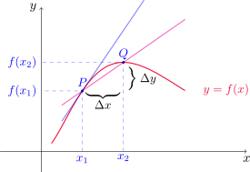{fig-align="center" width=50%}
	
El límite de estas razones de cambio promedio (si existe) es la razón de cambio instantánea de $y$ con respecto a $x$ en $x=x_1$, y puede interpretarse como la pendiente de la recta tangente a la curva en el punto $P$. 
		
Utilizando la notación de Leibniz, podemos escribir
		
$$
\frac{dy}{dx}= \lim_{\Delta x\to 0} \frac{\Delta y}{\Delta x}.
$$
		
Si $y=f(x)$ tiene alguna interpretación específica modelando una situación particular de alguna ciencia, su derivada tendrá la correspondiente interpretación como razón de cambio. Veamos algunos ejemplos concretos.

### Razones de cambio en física

::: {.example-box}

Ejemplo

Una partícula se desplaza en línea recta. Su posición en función del tiempo transcurrido está dada por la expresión

$$
s=f(t)=t^3-6t^2+9t,
$$

donde $t$ se mide en segundos y $s$ en metros.
	

1. Encontrar la velocidad de la partícula en el instante $t$.

2. ¿Cuál es la velocidad luego de 2 y de 4 segundos?

3. ¿Cuándo está en reposo la partícula?

4. ¿Cuándo se mueve hacia adelante, es decir, en la dirección positiva?

5. Dibujar un diagrama que represente el movimiento de la partícula.

6. Encontrar la distancia total recorrida por la partícula durante los primero cinco segundos.

7. Hallar la aceleración a tiempo $t$ y luego de cuatro segundos.

8. Graficar las funciones posición, velocidad y aceleración para $0\leq t\leq 5$.

9. ¿Cuándo incrementa su rapidez la partícula? ¿Cuándo la disminuye?
		
:::

::: {.callout-tip collapse="true"}
## Solución

1. La velocidad de la partícula es la derivada de la posición. Entonces

$$
v(t)=\frac{ds}{dt}(t)=3t^2-12t+9,
$$

para cada instante de tiempo $t$.

2. Simplemente evaluamos $v$ para $t=2$ y $t=4$. Es decir

$$
v(2)=3\cdot 2^2-12\cdot 2+9=-3 \quad \text{ y }\quad v(4)=3\cdot 4^2-12\cdot 4+9=9.
$$

La velocidad a los dos segundos es de $-3$ m/seg  y a los cuatro segundos es de $9$ m/seg.

3. La partícula estará en reposo en los instantes $t$ tales que $v(t)=0$. Dado que 

$$
3t^2-12t+9=0 \quad \text{ si y sólo si }\quad t=1 \text{ o }  t=3 
$$

la partícula estará en reposo al transcurrir uno o tres segundos del inicio de su movimiento.

4. Se mueve hacia adelante cuando el cambio en la posición respecto del tiempo es positivo, esto es, cuando $f'(t)>0$. Notar que  

$$
3t^2-12t+9=3(t-1)(t-3) > 0 \quad \text{ si y sólo si }\quad t\in [0,1)\cup(3,+\infty).
$$

Es decir, la partícula se mueve hacia adelante durante el primer segundo, y luego a partir de los tres segundos de recorrido.

5. En la siguiente figura representamos el movimiento de la partícula. El movimiento hacia adelante o hacia atrás se simboliza con la dirección de las flechas.

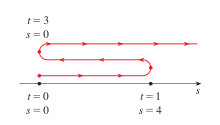{fig-align="center" width=40%}

6. Para calcular la distancia total es preciso tener en cuenta si el movimiento es hacia adelante (derecha) o hacia atrás (izquierda). Como los cambios de sentido de recorrido se dan cuando $t=1$ y $t=3$, podemos calcular la distancia total de la siguiente manera

$$
d=|s(1)-s(0)|+|s(3)-s(1)|+|s(5)-s(3)|=|4-0|+|0-4|+|20-0|=4+4+20=28.
$$

Durante los primeros cinco segundos la partícula recorre 28 m.

7. La aceleración es la derivada de la velocidad, con lo cual

$$
a(t)=\frac{dv}{dt}(t)=\frac{d^2s}{dt^2}(t)=6t-12.
$$

Después de cuatro segundos, la aceleración es de $a(4)=6\cdot 4-12=12$ m/seg2.

8. Las gráficas de la posición, velocidad y aceleración se muestran a continuación

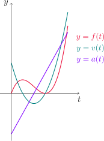{fig-align="center" width=35%}

9. Recordemos que la rapidez es el módulo de la velocidad, esto es $|v(t)|$. Si partimos de la igualdad trivial

$$
|v(t)|^2=v^2(t)
$$

y derivamos implícitamente, resulta

$$
2|v(t)|\frac{d}{dt}\left(|v(t)|\right)=2v(t)v'(t)
$$

de donde 

$$
\frac{d}{dt}\left(|v(t)|\right) = \frac{v(t)v'(t)}{|v(t)|}=\frac{v(t)\,a(t)}{|v(t)|},
$$

siempre que $|v(t)|\neq 0$.

Ahora bien, la rapidez se incrementa cuando su derivada es positiva, es decir, cuando $v$ y $a$ tienen el mismo signo. Esto nos dice también que la rapidez disminuye cuando $v$ y $a$ tienen signos opuestos.
 
:::

### Razones de cambio en química

Consideremos una reacción química donde se forman una o más sustancias (llamadas **productos**) a partir de otras sustancias (llamadas **reactivos**). Esta reacción puede representarse con la ecuación química

$$
A+B \rightarrow C
$$

donde $A$ y $B$ son los reactivos y $C$ es el producto. 
		
La **concentración** de una sustancia $S$ es la cantidad de moles (donde 1 mol equivale aproximadamente a $6\text{.}022\times 10^{23}$ moléculas) por cada litro y la denotaremos como $[S]$.

Como la concentración de los elementos varía durante la reacción, tenemos que $[A], [B]$ y $[C]$ son funciones del tiempo de reacción.

La **velocidad de reacción promedio** del producto $C$ en un intervalo $[t_1,t_2]$ está dada por

$$
\frac{\Delta[C]}{\Delta t}=\frac{[C](t_2)-[C](t_1)}{t_2-t_1}.
$$
	
Es de mayor interés conocer la **velocidad de reacción instantánea**, que se obtiene como el límite de las velocidades de reacción promedio sobre intervalos cuya amplitud $\Delta t$ tiende a cero, es decir

$$
\text{velocidad de reacción}=\lim_{\Delta t\to 0}\frac{\Delta [C]}{\Delta t}=\frac{d[C]}{dt}.
$$

En una reacción, la concentración del producto aumenta conforme la de los reactivos disminuye. Entonces tenemos que $d[C]/dt$ es positiva mientras que $d[A]/dt$ y $d[B]/dt$ son negativas. Además, $A$ y $B$ disminuyen su concentración a la misma velocidad que $C$ aumenta la suya, con lo cual

$$
\frac{d[C]}{dt}=-\frac{d[A]}{dt}=-\frac{d[B]}{dt}.
$$

::: {.example-box}

Ejemplo

En este modelo, supongamos que la concentración del producto $C$ viene dada por la fórmula

$$
[C](t)=\frac{a^2kt}{akt+1},
$$
	
donde $k$ es una constante positiva, $a$ es la concentración inicial de los reactivos $A$ y $B$, y $t$ es el tiempo de reacción medido en segundos.
	
1. Hallar la velocidad de reacción en cada instante $t$.

2. Mostrar que $\displaystyle \frac{d[C]}{dt}=k(a-[C])^2$.

3. ¿Qué sucede con la concentración cuando el tiempo tiende a infinito?

4. ¿Qué ocurre con la velocidad de reacción cuando el tiempo tiende a infinito?

:::

::: {.callout-tip collapse="true"}
## Solución

1. Calculamos la derivada de $[C]$ utilizando la regla del cociente

$$
\frac{d[C]}{dt}(t)=\frac{a^2k(akt+1)-a^2kt(ak)}{(akt+1)^2}=\frac{a^2k}{(akt+1)^2}.
$$

2. Notemos que

$$
k(a-[C](t))^2=k\left(a-\frac{a^2kt}{akt+1}\right)^2=k\left(\frac{a^2kt+a-a^2kt}{akt+1}\right)=\frac{a^2k}{(akt+1)^2}=\frac{d[C]}{dt}(t).
$$

3. Calculamos 

$$
\lim_{t\to \infty} [C](t)=\lim_{t\to \infty} \frac{a^2k}{ak+\frac{1}{t}}=\frac{a^2k}{ak}=a.
$$

Es decir, la concentración del producto tiende a ser la concentración inicial de los reactivos.

4. En este caso debemos hallar el límite de $d[C]/dt$ para $t\to\infty$. En efecto,

$$
\lim_{t\to \infty} \frac{d[C]}{dt}(t)=\lim_{t\to \infty} \frac{a^2k}{(akt+1)^2}=\lim_{t\to \infty} \frac{a^2k}{t^2(ak+\frac{1}{t})^2}=\lim_{t\to \infty} \frac{1}{t^2}\,\frac{a^2k}{(ak+\frac{1}{t})^2}=0\cdot a=0.
$$ 

:::

[↑ Volver al inicio de la sección](#seccion_3.7)

## 3.9. Relaciones afines {#seccion_3.9}

En esta sección estudiaremos problemas en los que tenemos ciertas cantidades relacionadas entre sí y que varían con el tiempo. La idea es determinar la rapidez de cambio (o razón de cambio) de alguna de estas cantidades conociendo la de otras que se relacionan con ésta. Veremos diferentes ejemplos para ilustrar este tipo de situaciones.

::: {.example-box}

Ejemplo

Se infla un globo esférico y su volumen se incrementa a razón de 100 cm3/seg. ¿Qué tan rápido aumenta el radio del globo cuando el diámetro es de 50 cm?
		
:::

::: {.callout-tip collapse="true"}
## Solución

El globo tiene forma esférica, con lo cual el volumen $V$ a tiempo $t$ viene dado por la  fórmula

$$
V(t)=\frac{4}{3}\pi (r(t))^3,
$$

siendo $r(t)$ el radio del globo a tiempo $t$. Si derivamos a ambos miembros con respecto a $t$ y utilizamos la regla de la cadena (recordar que tanto $V$ como $r$ son funciones de $t$) obtenemos

$$
\frac{dV}{dt}(t)=\frac{4}{3}\pi\,\, 3(r(t))^2\,\frac{dr}{dt}(t)=4\pi\,\, (r(t))^2\,\frac{dr}{dt}(t).
$$

Queremos conocer $\displaystyle \frac{dr}{dt}(t_0)$, siendo $t_0$ un instante de tiempo para el cual se cumple que 

$$
\frac{dV}{dt}(t_0)=100\, \mathrm{cm^3/seg} \quad \text{ y } \quad r(t_0)=25\, \mathrm{cm}.
$$

Reemplazando estos datos en la fórmula anterior resulta

$$
100\, \mathrm{cm^3/seg}=\frac{4}{3}\pi\,\, 3(25 \mathrm{cm})^2\,\frac{dr}{dt}(t_0),
$$

de donde despejando obtenemos

$$
\frac{dr}{dt}(t_0)=\frac{1}{25 \pi}\, \mathrm{cm/seg} \approx 0.0127\, \mathrm{cm/seg}.
$$

:::

::: {.example-box}

Ejemplo

Una escalera de 10 pies de largo está apoyada contra un muro vertical. Si
la parte inferior de la escalera se desliza alejándose de la pared en una proporción de 1 pie/seg, ¿qué tan rápido la parte superior de la escalera resbala hacia abajo por la pared cuando la parte inferior de la escalera está a 6 pies del muro?
	
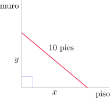{fig-align="center" width=35%}
	
:::

::: {.callout-tip collapse="true"}
## Solución

Sean $y(t)$ y $x(t)$ la altura del extremo de la escalera apoyado sobre el muro y la distancia desde la pared al pie de la escalera expresada en pies, respectivamente. Como la escalera mide 10 pies, para todo instante de tiempo $t$ se verifica que

$$
(x(t))^2+(y(t))^2=100
$$ {#eq-ejemplo-escalera1}

y derivando implícitamente resulta

$$
2 x(t) \frac{dx}{dt}(t) + 2y(t)\frac{dy}{dt}(t)=0 \quad \text{o también} \quad   x(t) \frac{dx}{dt}(t) + y(t)\frac{dy}{dt}(t)=0.
$$ {#eq-ejemplo-escalera2}

Ahora nos interesa encontrar $\displaystyle \frac{dy}{dt}(t_0)$, siendo $t_0$ un instante de tiempo en el cual 

$$
x(t_0)= 6\, \mathrm{pies} \quad \text{ y } \quad \frac{dx}{dt}(t_0)= 1 \, \mathrm{pie/seg}.
$$

Para calcular $y(t_0)$ utilizamos la fórmula (-@eq-ejemplo-escalera1), obteniendo

$$
y(t_0)=\sqrt{100-(x(t_0))^2}=8\, \mathrm{pies}. 
$$

Ahora despejamos $\displaystyle \frac{dy}{dt}$ de (-@eq-ejemplo-escalera2), con lo cual

$$
\frac{dy}{dt}(t_0)=-\frac{x(t_0)}{y(t_0)}\frac{dx}{dt}(t_0)=-\frac{6\,\mathrm{pies}}{8\,\mathrm{pies}} \cdot 1 \,\mathrm{pies/seg} = -\frac{3}{4}\,\mathrm{pies/seg}.
$$

La parte superior de la escalera está descendiendo a $0.75$ pies/seg.
:::

::: {.example-box}

Ejemplo

Un depósito para agua tiene la forma de un cono circular invertido. El radio
de la base es de 2 m y la altura es de 4 m. Si el agua se bombea hacia el depósito a una razón de 2 m3/min, determine la rapidez a la cual el nivel del agua sube cuando el agua tiene 3 m de profundidad.
	
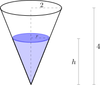{fig-align="center" width=35%}
	
:::

::: {.callout-tip collapse="true"}
## Solución

Si denotamos con $r(t)$ y $h(t)$ al radio de la base y la altura de la columna de líquido en el tanque a tiempo $t$ y expresados en metros, respectivamente, entonces el volumen de agua dentro del recipiente a tiempo $t$ es

$$
V(t)= \frac{\pi}{3}(r(t))^2h(t).
$${#eq-ejemplo-tanque1}

Por semejanza de triángulos, podemos observar también que

$$
\frac{r(t)}{h(t)}=\frac{2}{4}=\frac{1}{2},
$$

de donde resulta que $\displaystyle r(t)=\frac{h(t)}{2}$. Sustituyendo en (-@eq-ejemplo-tanque1) obtenemos

$$
V(t)=\frac{\pi}{12}(h(t))^3.
$$

Derivando con respecto a $t$

$$
\frac{dV}{dt}(t)=\frac{\pi}{4}(h(t))^2 \frac{dh}{dt}(t).
$$

Ahora determinamos $\displaystyle \frac{dh}{dt}(t_0)$, sabiendo que $h(t_0)=3\, \mathrm{m}$ y $\displaystyle \frac{dV}{dt}(t_0)=2\, \mathrm {m^3/min}$. En efecto,

$$
\frac{dh}{dt}(t_0)=\frac{4}{\pi} \frac{2\, \mathrm {m^3/min}}{(3\, \mathrm{m})^2}=\frac{8}{9\pi}\, \mathrm{m/min} \approx 0.283\, \mathrm{m/min}.
$$
:::

::: {.example-box}

Ejemplo

Dos automóviles se dirigen de forma perpendicular a la intersección de dos caminos.
El automóvil $A$ se dirige hacia el oeste a 50 millas/h y el vehículo $B$ viaja
hacia el norte a 60 millas/h. ¿Con qué rapidez se aproximan los vehículos entre sí cuando el automóvil $A$ está a 0.3 millas y el vehículo $B$ está a 0.4 millas de la intersección?
	
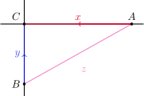{fig-align="center" width=35%}
	
:::

::: {.callout-tip collapse="true"}
## Solución

Sean $x(t)$ e $y(t)$ las distancias de los vehículos $A$ y $B$ al punto de intersección de los caminos expresadas en millas, respectivamente. Sea también $z(t)$ la distancia en millas entre ambos vehículos. En todo instante de tiempo $t$ tenemos que   

$$
x^2(t)+y^2(t)=z^2(t),
$${#eq-ejemplo-automoviles1}

y al derivar de forma implícita

$$
2x(t)x'(t)+2y(t)y'(t)=2z(t)z'(t) \quad \text{ o bien } \quad x(t)x'(t)+y(t)y'(t)=z(t)z'(t).
$${#eq-ejemplo-automoviles2}

Queremos encontrar $z'(t_0)$, sabiendo que $x(t_0)=0.3$, $y(t_0)=0.4$, $x'(t_0)=-50$ e $y'(t_0)=-60$. Para determinar $z(t_0)$ usamos la ecuación (-@eq-ejemplo-automoviles1)

$$
z(t_0)=\sqrt{x^2(t_0)+y^2(t_0)}=\sqrt{(0.3\, \mathrm{millas})^2+(0.4\, \mathrm{millas})^2}=0.5\, \mathrm{millas}.
$$

Despejando de (-@eq-ejemplo-automoviles2) obtenemos

$$
\begin{aligned}
z'(t_0)=\frac{x(t_0)x'(t_0)+y(t_0)y'(t_0)}{z(t_0)}&=\frac{0.3\, \mathrm{millas} \cdot (-50 \, \mathrm{millas/h})+0.4\, \mathrm{millas} \cdot (-60 \, \mathrm{millas/h})}{0.5\, \mathrm{millas}}\\
\\
&=-78\, \mathrm{millas/h}.
\end{aligned}
$$

Es decir, los vehículos se están acercando con una rapidez de 78 millas/h. 

:::

::: {.example-box}

Ejemplo

Un hombre camina a lo largo de una trayectoria recta a una rapidez de
4 pies/seg. Un faro está situado sobre el nivel de la tierra a 20 pies de la trayectoria y se mantiene enfocado hacia el hombre. ¿Con qué rapidez el faro gira cuando el hombre está a 15 pies del punto sobre la trayectoria más cercana a la fuente de luz?
	
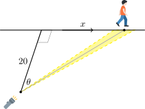{fig-align="center" width=35%}

:::

::: {.callout-tip collapse="true"}
## Solución

Sea $x(t)$ la distancia en pies desde el hombre al punto de la trayectoria más cercano a la fuente de luz a tiempo $t$, expresado en segundos. Sea también $\theta(t)$ el ángulo en radianes que se forma entre la perpendicular a la trayectoria desde el faro y el rayo que apunta al hombre, a tiempo $t$. Observando el triángulo rectángulo que se forma, podemos inferir que

$$
\tan(\theta(t))=\frac{x(t)}{20}.
$$

Derivando respecto del tiempo obtenemos

$$
\sec^2(\theta(t))\frac{d\theta}{dt}(t)=\frac{1}{20}\frac{dx}{dt}(t).
$${#eq-ejemplo-faro}

Si $x(t_0)=15$, la distancia del faro al hombre es de 25 pies, con lo cual

$$
\cos(\theta(t_0))=\frac{4}{5}
$$

y despejando de (-@eq-ejemplo-faro) resulta

$$
\frac{d\theta}{dt}(t_0)=\frac{1}{20}\cos^2(\theta(t_0))\frac{dx}{dt}(t_0)=\frac{1}{20}\left(\frac{4}{5}\right)^2\cdot 4\, \mathrm{ rad/seg}=0.128\, \mathrm{ rad/seg}.
$$
:::

[↑ Volver al inicio de la sección](#seccion_3.9)