## 4.1. Valores máximos y mínimos {#seccion_4.1}

::: {.callout-note title="Definición (Valores máximos y mínimos)"}

Una función $f$ tiene un **máximo absoluto** (o **máximo global**) en $c$ si 

$$
f(x)\leq f(c) \quad \text{ para todo } \quad x\in D,
$$

siendo $D$ el dominio de $f$. Al número $f(c)$ se lo llama **valor máximo** de $f$ en $D$.

Análogamente, $f$ tiene un **mínimo absoluto** (o **mínimo global**) en $c$ si

$$
f(x)\geq f(c) \quad \text{ para todo } \quad x\in D.
$$

En este caso, a $f(c)$ se lo llama **valor mínimo** de $f$ en $D$.

Los valores máximos y mínimos de $f$ se conocen como **valores extremos** de $f$.

:::

En la siguiente gráfica vemos una función con máximo absoluto en $d$ y mínimo absoluto en $a$. Esto significa que el punto $(d,f(d))$ es el más alto de la gráfica y $(a,f(a))$ el más bajo.
		
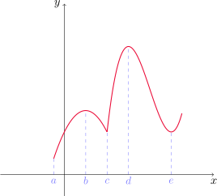{fig-align="center" width=40%}
	
Si solamente restringimos la atención al intervalo $(a,c)$, entonces $f(b)$ es el valor más grande de $f$ en esa región. En este caso, decimos que $f(b)$ es un valor máximo local de $f$. De manera similar, $f(c)$ y $f(e)$ son valores mínimos locales de $f$.
	
::: {.callout-note title="Definición (Valores máximos y mínimos)"}

Una función $f$ tiene un **máximo local** (o **máximo relativo**) en $c$ si $f(x)\leq f(c)$ para $x$ \emph{cercano} a $c$ (es decir, si existe $r>0$ tal que la desigualdad anterior se cumple para todo $x\in (c-r,c+r)$ que esté en el dominio de $f$).

De manera similar, $f$ tiene un **mínimo local** en $c$ si $f(x)\geq  f(c)$ para todo $x$ cercano a $c$.

:::
	
::: {.example-box}

Ejemplo

Encontrar extremos locales y absolutos de la función $f(x)=\cos x$.
	
:::

::: {.callout-tip collapse="true"}
## Solución

Recordemos que $-1\leq \cos x\leq 1$ para todo $x\in\mathbb{R}$. Por lo tanto, $1$ es el valor máximo absoluto de $f$ (y, en consecuencia, también local) y $f$ toma este valor una cantidad infinita de veces, en todo $x=2n\pi$, con $n\in \mathbb{Z}$.

Por otro lado, $-1$ es el valor mínimo absoluto (y local) de $f$, que se alcanza siempre que $x=(2n+1)\pi$, con $n\in \mathbb{Z}$.

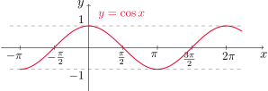{fig-align="center" width=50%}

:::

::: {.example-box}

Ejemplo

Analizar extremos locales y absolutos de $f(x)=x^2$.

:::

::: {.callout-tip collapse="true"}
## Solución

Observemos primero que $f(0)=0\leq x^2=f(x)$, es decir, $f(0)\leq f(x)$ para cualquier $x\in\mathbb{R}$. Esto nos dice que $0$ es el valor mínimo absoluto (y local) de la función $f$, y se alcanza cuando $x=0$.

Sin embargo, $f$ no tiene máximo absoluto, ya que 

$$
\lim_{x\to \infty} x^2 =\infty \quad \text{ y } \quad \lim_{x\to -\infty} x^2=\infty.
$$

Inspeccionando el gráfico de $f$ podemos ver que tampoco hay máximos locales.

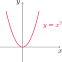{fig-align="center" width=25%}

:::
	
::: {.example-box}

Ejemplo

Analizar extremos para la función $f(x)=x^3$.

:::

::: {.callout-tip collapse="true"}
## Solución

Notemos que $f$ no tiene valor extremos absolutos, puesto que 

$$
\lim_{x\to \infty} x^3 =\infty \quad \text{ y } \quad \lim_{x\to -\infty} x^3=-\infty.
$$

Observando el gráfico de $f$ podemos comprobar que tampoco existen extremos locales.

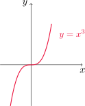{fig-align="center" width=25%}

:::

::: {.example-box}

Ejemplo

Analizar los extremos de la función

$$
f(x)=3x^4-16x^3+18x^2, \quad\text{ para }\quad  -1\leq x\leq 4.
$$

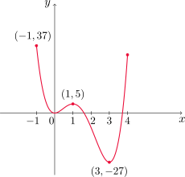{fig-align="center" width=40%}

:::

::: {.callout-tip collapse="true"}
## Solución

Observando el gráfico podemos ver que $f(1)=5$ es un valor máximo local y $f(-1)=37$ es el valor máximo absoluto de $f$ sobre el intervalo (éste no se considera máximo local por encontrarse en un extremo del intervalo dado).

Por otra parte, $f(0)=0$ es un mínimo local y $f(3)=-27$ es el valor mínimo absoluto, y también resulta local.

:::

El siguiente teorema será una herramienta importante para encontrar extremos de funciones continuas sobre intervalos cerrados.

::: {#teo-valores-ext .theorem}

Teorema del valor extremo

Si $f$ es continua sobre el intervalo cerrado $[a,b]$, entonces $f$ alcanza un valor máximo absoluto $f(c)$ y un valor mínimo absoluto $f(d)$ en algunos números $c,d$ en $[a,b]$.

:::

Este teorema nos asegura existencia de los puntos $c$ y $d$, pero como vemos en la siguiente figura éstos podrían no ser únicos.

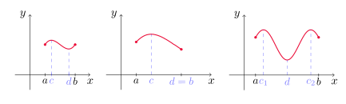{fig-align="center" width=70%}
			
En general, si $f$ no es continua o el intervalo no es cerrado, el resultado anterior podría no valer. Aquí vemos algunos ejemplos donde esto ocurre.
		
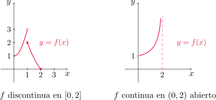{fig-align="center" width=60%}
			
A la izquierda, vemos que $f$ tiene un valor mínimo $f(2)=0$, pero no hay valor máximo. A la derecha no hay valor mínimo ni máximo.
	
El [teorema anterior](#teo-valores-ext) nos da condiciones para asegurar la existencia de extremos de una función en un intervalo, pero no dice cómo encontrarlos. Para responder a esta pregunta, veamos el siguiente resultado.
		
::: {#teo-fermat .theorem}

Teorema de Fermat

Si $f$ tiene un extremo local en $c$ y $f'(c)$ existe, entonces $f'(c)=0$.

:::
		
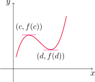{fig-align="center" width=35%}

::: {.callout-caution title="Importante"}
  El recíproco del [teorema de Fermat](#teo-fermat) es **falso**, como veremos en el siguiente ejemplo.  	
:::	
		
::: {.example-box}

Ejemplo

Mostrar que $f(x)=x^3$ satisface $f'(0)=0$ pero que $f$ no alcanza extremos locales en $x=0$.

:::

::: {.callout-tip collapse="true"}
## Solución

Dado que $f'(x)=3x^2$, es inmediato comprobar que $f'(0)=0$. Por otro lado, si consideramos el intervalo $(0-r,0+r)=(-r,r)$ para cualquier $r>0$, tenemos que 

$$
f(x)<f(0) \quad \text{ para } -r<x<0
$$

y

$$
f(x)>f(0) \quad \text{ para } 0<x<r.
$$

En consecuencia, en $x=0$ no puede haber ni un mínimo ni un máximo local.

:::

::: {.example-box}

Ejemplo

Mostrar que $f(x)=|x|$ presenta un extremo (local y global) en $x=0$ pero  $f'(0)$ no existe.

:::

::: {.callout-tip collapse="true"}
## Solución

Dado que $f(0)=0\leq |x|=f(x)$ para todo $x$, $f$ presenta un mínimo local y global en $x=0$, de valor 0. Sin embargo, según vimos en el Ejemplo 44 de la [Sección 2.8](#seccion_2.8), $f$ no es derivable en $x=0$.

:::

El teorema de Fermat establece que si $f$ presenta algún extremo local, éste debe ocurrir en un punto $c$ tal que $f'(c)=0$ o bien que cumpla que $f'(c)$ no exista. Introduciremos una definición que será de utilidad en adelante.

::: {.callout-note title="Definición (Número crítico)"}

Si $c$ es un número en el dominio de $f$ tal que $f'(c)=0$ o bien $f'(c)$ no existe, entonces $c$ se llama **número crítico** o **número estacionario** de $f$.

:::

::: {.example-box}

Ejemplo

Encontrar los números críticos de $f(x)=x^{3/5}(4-x)$.

:::
	
::: {.callout-tip collapse="true"}
## Solución

La derivada de $f$ es

$$
f'(x)=\frac{3}{5}x^{3/5-1}(4-x)+x^{3/5}(-1)=\frac{12-3x-5x}{5x^{2/5}}=\frac{12-8x}{5x^{2/5}}.
$$

Luego, $f'(x)=0$ si y sólo si $12-8x=0$, o bien $x=3/2$. Por otro lado, $f'(x)$ no existe si $x=0$. Por lo tanto, los números críticos de $f$ son $x=0$ y $x=3/2$.

:::
		
Con la definición de número crítico, el teorema de Fermat puede refrasearse como sigue:

:::{.formula-box}

Si $f$ tiene un máximo o un mínimo local en $c$, entonces $c$ es un número crítico de $f$.

:::
		
Es decir, todos los extremos locales tienen lugar en números críticos. Sin embargo, no todo número crítico da lugar a un extremo, por lo que será necesario clasificarlos de alguna manera, como veremos luego.
	
::: {.callout-question}

### ¿Cómo encontrar los extremos de una función continua $f$ en un intervalo cerrado $[a,b]$?

Para ello podemos seguir los siguientes pasos:

1. Hallar los valores de $f$ en cada número crítico de $f$ en $(a,b)$.
2. Calcular $f(a)$ y $f(b)$.
3. Comparar todos estos valores. El más grande de todos es el valor máximo absoluto y el más chico el valor mínimo absoluto.

:::
		
::: {.example-box}

Ejemplo

Calcular los valores máximos y mínimos absolutos de $f(x)=x^3-3x^2+1$ en el itervalo $[-1/2, 4]$.

:::

::: {.callout-tip collapse="true"}
## Solución

Antes de comenzar, notemos que $f$ es continua en el intervalo cerrado $[-1/2,4]$ por tratarse de un polinomio. El [teorema del valor extremo](#teo-valores-ext) nos asegura entonces que existen el máximo y el mínimo absolutos de $f$ en el intervalo.

Primero buscamos los números críticos de $f$. Tenemos que $f'(x)=3x^2-6x=3x(x-2)$, por lo que $f'(x)=0$ si y sólo si $x=0$ o $x=2$. Estos son los únicos puntos críticos de $f$ ya que no hay valores de $x$ para los que $f'(x)$ no exista.

Siguiendo los pasos de la lista anterior, hallamos 

$$
f(0)=0^3-3\cdot 0^2+1=1 \quad \text{ y } \quad f(2)=2^3-3\cdot 2^2+1=-3.
$$

Ahora calculamos la imagen por $f$ de los extremos del intervalo

$$
f\left(-\frac{1}{2}\right)=\left(-\frac{1}{2}\right)^3-3\cdot \left(-\frac{1}{2}\right)^2+1=\frac{1}{8} \quad \text{ y } \quad f(4)=4^3-3\cdot 4^2+1=17.
$$

El valor máximo absoluto de $f$ es 17 y se alcanza en $x=4$, y el valor mínimo absoluto es $-3$, cuando $x=2$. 

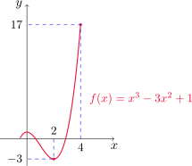{fig-align="center" width=40%}

:::
		
::: {.example-box}

Ejemplo

Hallar los valores máximos y mínimos  de $f(x)=x-2\operatorname{sen} x$ en  $I=[0, 2\pi]$.

:::

::: {.callout-tip collapse="true"}
## Solución

Primero observemos que $y=x$ e $y=2\operatorname{sen} x$ son funciones continuas en $I$, con lo cual $f$ es continua en $I$. El [teorema del valor extremo](#teo-valores-ext) asegura la existencia de extremos absolutos.

Notar que $f'(x)=1-2\cos x$, con lo cual $f'(x)=0$ si y sólo si $\cos x=\frac{1}{2}$. Los puntos de $I$ que satisfacen esta ecuación son $x=\pi/3$ y $x=5\pi/3$.

Evaluamos $f$ en estos puntos

$$
f\left(\frac{\pi}{3}\right)=\frac{\pi}{3}-2\operatorname{sen}\left(\frac{\pi}{3}\right)=\frac{\pi}{3}-\sqrt{3}\approx -0.68 \quad \text{ y }\quad f\left(\frac{5\pi}{3}\right)=\frac{5\pi}{3}-2\operatorname{sen}\left(\frac{5\pi}{3}\right)=\frac{5\pi}{3}+\sqrt{3}\approx 6.97 
$$

y luego en los extremos de $I$

$$
f(0)=0-2\operatorname{sen} 0=0 \quad \text{ y } \quad f(2\pi)=2\pi-2\operatorname{sen}(2\pi)=2\pi \approx 6.28,
$$

con lo que el valor máximo absoluto de $f$ en $I$ es $5\pi/3+\sqrt{3}$ cuando $x=5\pi/3$ y el valor mínimo absoluto es $\pi/3-\sqrt{3}$ cuando $x=\pi/3$. 

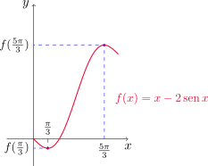{fig-align="center" width=40%}

:::

[↑ Volver al inicio de la sección](#seccion_4.1)

## 4.3. ¿Cómo afectan las derivadas la forma de una gráfica? {#seccion_4.3}
	
### ¿Qué dice $f'$ con respecto a $f$?
	
En la siguiente figura podemos ver que entre los puntos $A$ y $B$ las rectas tangentes tienen pendiente positiva, con lo cual $f'(x)>0$. Esto mismo ocurre entre $C$ y $D$. Por otro lado, entre $B$ y $C$ las pendientes son negativas, con lo que $f'(x)<0$.
		
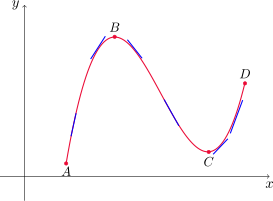{fig-align="center" width=50%}
		
::: {#teo-prueba-cd .theorem}

Prueba creciente/decreciente

- Si $f'(x)>0$ sobre un intervalo, entonces $f$ es creciente en ese intervalo.

- Si $f'(x)<0$ sobre un intervalo,  $f$ es decreciente en ese intervalo.

:::

::: {.example-box}

Ejemplo

 Encontrar dónde cree la función $f(x)=3x^4-4x^3-12x^2+5$ y dónde decrece.

:::

::: {.callout-tip collapse="true"}
## Solución

Tenemos que $f'(x)=12x^3-12x^2-24x=12x(x^2-x-2)=12x(x-2)(x+1)$. Con esto, vemos que $f'$ se anula en $x=-1$, $x=0$ y $x=2$. Para determinar el signo de $f'$ en cada uno de los intervalos que resultan de dividir la recta en los puntos críticos de $f$ realizamos la siguiente tabla

::: {.math-table}

| Intervalo | $(x+1)$ | $12x$ | $(x-2)$ | $f'(x)$ |
| --- | --- | --- | --- | --- |
| $(-\infty,-1)$ | $-$ | $-$ | $-$ | $-$ |
| $(-1,0)$ | $+$ | $-$ | $-$ | $+$ |
| $(0,2)$ | $+$ | $+$ | $-$ | $-$ |
| $(2,+\infty)$ | $+$ | $+$ | $+$ | $+$ |
:::	

Observando la última columna de la tabla y utilizando [la prueba creciente/decreciente](#teo-prueba-cd), obtenemos que $f$ es creciente en $(-1,0)$ y en $(2,+\infty)$, y decrece en $(-\infty,-1)$ y en $(0,2)$.

:::

::: {.callout-caution title="Importante"}
  Notar que en el ejemplo anterior hemos escrito: $f$ es creciente en $(-1,0)$ y en $(2,+\infty)$, y **no escribimos** $f$ es creciente en $(-1,0)\cup (2,+\infty)$. Ésta última expresión es incorrecta, pues de acuerdo con la definición de función creciente, debería ocurrir que $f(x_1)<f(x_2)$ siempre que $x_1<x_2$. Al considerar el conjunto $(-1,0)\cup (2,+\infty)$ ésto no se cumpliría pues, por ejemplo, $x_1=0.5$ y $x_2=2.5$ están en este conjunto, y $x_1<x_2$, sin embargo $f(x_1)=1.6875$ y $f(x_2)=-15.3125$.	

  Una observación similar puede hacerse para el caso decreciente.

:::	

El siguiente resultado nos permitirá clasificar los números críticos de una función para saber si corresponden a extremos locales.

::: {#teo-prueba-primerader .theorem}

Prueba de la primera derivada

Sea $f$ continua, $c$ un número crítico de $f$ y supongamos que $f'(x)$ existe cerca de $c$ (excepto quizás en $c$). Luego:

- si $f'(x)>0$ para $x<c$ y $f'(x)<0$ para $x>c$, entonces $f$ tiene un máximo local en $x=c$. 
- si $f'(x)<0$ para $x<c$ y $f'(x)>0$ para $x>c$, entonces $f$ tiene un mínimo local en $x=c$.
- si $f'$ es positiva (o negativa) a ambos lados de $c$, entonces $f$ no tiene máximo ni mínimo local en $x=c$.

:::
			
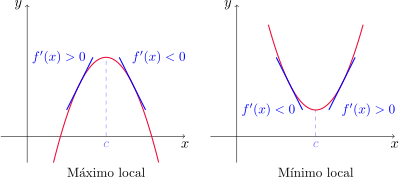{fig-align="center" width=60%}
	

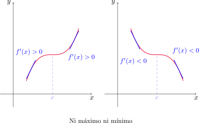{fig-align="center" width=60%}

::: {.example-box}

Ejemplo

Encontrar los valores máximos y mínimos locales de la función $f$ del Ejemplo 10.
	
:::

::: {.callout-tip collapse="true"}
## Solución

Ya sabemos que los números críticos de $f$ son $-1$, $0$ y $2$. En $x=-1$ el signo de $f'$ pasa de negativo a positivo, con lo que la  [prueba de la primera derivada](#teo-prueba-primerader) nos dice que $f$ tiene un mínimo local en $x=-1$, cuyo valor es $f(-1)=0$.

De manera similar, $f'$ pasa de positiva a negativa en $x=0$, con lo que en este punto $f$ presenta un máximo local de valor $f(0)=5$. 

Por último, $f'$ cambia de negativa a positiva en $x=2$, con lo que aquí $f$ tiene un mínimo local, cuyo valor es $f(2)=-27$.

:::

La siguiente propiedad será de utilidad en diversas ocasiones.
	
::: {#teo-propiedad-signoconst .theorem}

Propiedad del signo constante

Supongamos que $f$ es continua en $(a,b)$ y además $f(x)\neq 0$ para todo $x\in (a,b)$. Entonces $f$ tiene signo constante sobre el intervalo, es decir, o bien se cumple que

$$f(x)>0 \quad \text{ para todo }x\in (a,b)$$

o bien

$$f(x)<0 \quad \text{ para todo }x\in (a,b).$$

:::

::: {.example-box}

Ejemplo

Determinar los valores máximo y mínimo de la función $g(x)=x+2\operatorname{sen} x$ en el intervalo $[0,2\pi]$.

:::

::: {.callout-tip collapse="true"}
## Solución

El [teorema del valor extremo](#teo-valor-ext) asegura la existencia de valor máximo y mínimo absoluto, ya que $g$ es continua en el intervalo cerrado $[0, 2\pi]$.

La derivada de $g$ es $g'(x)=1+2\cos x$, y $g'(x)=0$ si y sólo si $x=2\pi/3$ o $x=4\pi/3$.

Ahora bien, $g'$ es continua en $(0,2\pi/3)$, $(2\pi/3,4\pi/3)$ y en $(4\pi/3,2\pi)$ y además es no nula en cada uno de estos intervalos. 

Por la [propiedad del signo constante](#teo-propiedad-signoconst), $g'$ tiene signo constante en cada uno de estos intervalos. Por lo tanto, para analizar el signo de $g'$ en cada intervalo basta con evaluar el signo de $g'$ en cualquier punto de los mismos. La siguiente tabla muestra estos cálculos, en la cual el crecimiento o decrecimiento en cada caso es consecuencia de la [prueba creciente/decreciente](#teo-prueba-cd).

::: {.math-table}

| Intervalo | $x_0$ | $g'(x_0)$ | $g$ |
| --- | --- | --- | --- | 
| $(0,2\pi/3)$ | 1 | $+$ | crece | 
| $(2\pi/3,4\pi/3)$ | 3 | $-$ | decrece | 
| $(4\pi/3,2\pi)$ | 5 | $+$ | crece | 

:::	

Utilizando ahora la [prueba de la primera derivada](#teo-prueba-primerader) podemos concluir que $g$ presenta un máximo local en $x=2\pi/3$, de valor

$$
g\left(\frac{2\pi}{3}\right)=\frac{2\pi}{3}+\sqrt{3}\approx 3.83
$$

y en $x=4\pi/3$ presenta un mínimo local cuyo valor es

$$
g\left(\frac{4\pi}{3}\right)=\frac{4\pi}{3}-\sqrt{3}\approx 2.46.
$$

Ahora analizamos los extremos del intervalo

$$
g(0)=0+2\operatorname{sen} 0=0 \quad \text{ y } \quad g(2\pi)=2\pi+2\operatorname{sen}(2\pi)=2\pi \approx 6.28,
$$

con lo que $g$ alcanza sus valores mínimo y máximo absoluto en los extremos izquierdo y derecho del intervalo, respectivamente.

:::

###	¿Qué dice $f''$ con respecto a $f$?
	
En la siguiente figura vemos el gráfico de dos funciones crecientes que unen el punto $A$ con el punto $B$,  pero se flexionan en direcciones distintas.

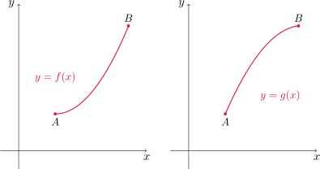{fig-align="center" width=60%}
	
Si dibujamos algunas rectas tangentes en distintos puntos, vemos que la gráfica de la izquierda queda por arriba de estas rectas, y la de la derecha por debajo.
	
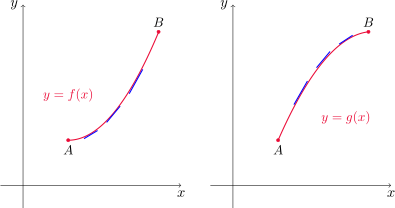{fig-align="center" width=60%}
		
::: {.callout-note title="Definición (Concavidad)"}

Si la gráfica de $f$ queda por arriba de todas sus tangentes en un intervalo $I$, entonces $f$ se dice **cóncava hacia arriba** o **convexa** en $I$. 
		
Si en cambio la gráfica de $f$ queda por debajo de sus tangentes en $I$, $f$ se dice **cóncava hacia abajo** o **cóncava** en $I$. 

:::

En la primera gráfica vemos que la pendiente se incrementa de izquierda a derecha. Esto quiere decir que $f'$ es creciente y, por lo tanto, su derivada $f''$ es positiva. De manera similar, en la segunda gráfica la pendiente disminuye de izquierda a derecha, con lo que $f'$ es decreciente y su derivada $f''$ resulta negativa. Esta idea nos ayuda a establecer el siguiente criterio de concavidad.

::: {#teo-prueba-concavidad .theorem}

Prueba de la concavidad

- Si $f''(x)>0$ para todo $x$ en  $I=(a,b)$, entonces la gráfica de $f$ es cóncava hacia arriba en $I$.

- Si $f''(x)<0$ para todo $x\in I$, entonces la gráfica de $f$ es cóncava hacia abajo sobre $I$. 
			
:::

::: {.callout-note title="Definición (Punto de inflexión)"}

Un punto $P$ en la curva $y=f(x)$ recibe el nombre de **punto de inflexión** si $f$ es continua allí y además la curva cambia de cóncava hacia abajo a cóncava hacia arriba, o bien de cóncava hacia arriba a cóncava hacia abajo en $P$.
	
:::

En virtud de la prueba de concavidad, habrá puntos de inflexión donde la derivada segunda cambie de signo.

::: {.example-box}

Ejemplo

Trazar una posible gráfica de una función $f$ que cumpla las siguientes condiciones:
	
- $f'(x)>0$ en $(-\infty,1)$, $f'(x)<0$ en $(1,\infty)$,

- $f''(x)>0$ en $(-\infty,-2) \cup (2,\infty)$, $f''(x)<0$ en $(-2,2)$,

- $\displaystyle \lim_{x\to -\infty} f(x)=-2$, $\displaystyle \lim_{x\to \infty} f(x)=0$.

:::

::: {.callout-tip collapse="true"}
## Solución

En virtud de la [prueba creciente/decreciente](#teo-prueba-cd), la primera condición establece que $f$ es creciente en $(-\infty,1)$ y decreciente en $(1,\infty)$.

De la segunda condición, aplicando la [prueba de la concavidad](#teo-prueba-concavidad) concluimos que la gráfica de $f$ debe ser cóncava hacia arriba en $(-\infty,-2)\cup (2,\infty)$ y cóncava hacia abajo en $(-2,2)$.

Por último, la tercera condición establece que $y=-2$ e $y=0$ son las ecuaciones de las asíntotas horizontales de $f$.

Con esta información trazamos un posible gráfico aproximado.

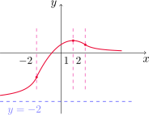{fig-align="center" width=40%}

:::

Como otra aplicación de la derivada segunda, podemos dar una forma alternativa de determinar la naturaleza de un punto crítico.

::: {#teo-prueba-segundader .theorem}

Prueba de la segunda derivada
			
Supongamos que $f''$ es continua cerca de $c$. 
			
- Si $f'(c)=0$ y $f''(c)>0$, entonces $f$ tiene un mínimo relativo en $x=c$. 

- Si $f'(c)=0$ y $f''(c)<0$, entonces $f$ tiene un máximo relativo en $x=c$.

:::

::: {.example-box}

Ejemplo

Analizar la curva $y=x^4-4x^3$ con respecto a la concavidad, puntos de inflexión y extremos locales. Dibujar la curva.

:::

::: {.callout-tip collapse="true"}
## Solución

Primero calculamos la derivada primera $y'(x)=4x^3-12x^2=4x^2(x-3)$. Entonces $y'(x)=0$ si y sólo si $x=0$ o $x=3$. Éstos son los números críticos de la función. 

Ahora calculamos la derivada segunda $y''(x)=12x^2-24x=12x(x-2)$. Observemos ahora que
 
$$
f''(3)=36>0,
$$

con lo que $y$ presenta un mínimo local en $x=3$ cuyo valor es $y(3)=-27$, en virtud de la [prueba de la segunda derivada](#teo-prueba-segundader). Sin embargo, 

$$
y''(0)=0
$$

con lo cual no podemos utilizar este mismo argumento para conocer la naturaleza del punto $x=0$. Como $y'$ no cambia de signo en $x=0$, en este punto no tenemos extremo.

Para determinar la concavidad y puntos de inflexión hacemos la siguiente tabla (recordar la [propiedad del signo constante](#teo-propiedad-signoconst), que aplicamos a $y''$) y luego la [prueba de concavidad](#teo-prueba-concavidad).

::: {.math-table}

| Intervalo | $x_0$ | $y''(x_0)$ | $y$ |
| --- | --- | --- | --- | 
| $(-\infty,0)$ | $-1$ | $+$ | convexa | 
| $(0,2)$ | 1 | $-$ | cóncava | 
| $(2,+\infty)$ | 3 | $+$ | convexa | 

:::	

Luego la curva $y=x^4-4x^3$ es convexa en los intervalos $(-\infty,0)$ y $(2,+\infty)$, y cóncava en $(0,2)$.

Como $y$ cambia de convexidad en $x=0$ y en $x=2$, y además resulta continua allí, los puntos $P_1=(0,y(0))=(0,0)$ y $P_2=(2,y(2))=(2,-16)$ son puntos de inflexión de $y$.

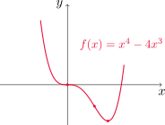{fig-align="center" width=40%}

:::

::: {.example-box}

Ejemplo

Trazar la gráfica de $f(x)=x^{2/3}(6-x)^{1/3}$, sabiendo que
	
$$
f'(x)=\frac{4-x}{x^{1/3}(6-x)^{2/3}} \quad\text{ y }\quad f''(x)=-\frac{8}{x^{4/3}(6-x)^{5/3}}.
$$

:::

::: {.callout-tip collapse="true"}
## Solución

Podemos ver que $f'(x)=0$ si y sólo si $x=4$. Además, $f'$ no existe cuando $x=0$ o cuando $x=6$. Entonces $0$, $4$ y $6$ son los tres números críticos de $f$. Utilizando la [propiedad del signo constante](#teo-propiedad-signoconst) y luego la  
[prueba de la primera derivada](#teo-prueba-primerader) armamos la siguiente tabla.

::: {.math-table}

| Intervalo | $x_0$ | $f'(x_0)$ | $f$ |
| --- | --- | --- | --- | 
| $(-\infty,0)$ | $-1$ | $-$ | decrece | 
| $(0,4)$ | 1 | $+$ | crece | 
| $(4,6)$ | 5 | $-$ | decrece | 
| $(6,+\infty)$ | 7 | $-$ | decrece |

:::	

Por otro lado, observando $f''$ vemos que nunca se anula, y no existe cuando $x=0$ o $x=6$. La siguiente tabla nos da el signo de $f''$ y la convexidad, utilizando la  [prueba de la concavidad](#teo-prueba-concavidad).

::: {.math-table}

| Intervalo | $x_0$ | $f''(x_0)$ | $f$ |
| --- | --- | --- | --- | 
| $(-\infty,0)$ | $-1$ | $-$ | cóncava | 
| $(0,6)$ | $1$ | $-$ | cóncava | 
| $(6,+\infty)$ | $7$ | $7$ | convexa |

:::	

La curva cambia de convexidad en $x=6$ y resulta continua allí, con lo cual $P=(6,f(6))=(6,0)$ es el único punto de inflexión de la curva. El gráfico se muestra a continuación.

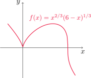{fig-align="center" width=40%}

:::

[↑ Volver al inicio de la sección](#seccion_4.3)

## 4.4. Formas indeterminadas y la regla de L'Hospital {#seccion_4.4}
	
Si tenemos un límite de la forma
$$
\lim_{x\to a} \frac{f(x)}{g(x)},
$$

donde $f(x)\to 0$ y $g(x)\to 0$ cuando $x\to a$, éste puede existir o no, y se conoce como **forma indeterminada de tipo $\displaystyle \frac{0}{0}$**.
		
Si en cambio $f(x)\to \pm\infty$ y $g(x)\to \pm\infty$ el límite del cociente puede existir o no, y se conoce como **forma indeterminada de tipo $\displaystyle \frac{\infty}{\infty}$**.
	
		
En esta sección veremos una forma de calcular estos límites utilizando derivadas.

::: {#teo-regla-LH .theorem}

Regla de L'Hospital

Sean $f$ y $g$ dos funciones derivables, de manera que $g'(x)\neq 0$ en un intervalo abierto $I$ que contiene a $a$ (excepto quizás en $a$). Supongamos además que

$$
\lim_{x\to a}f(x)=0\quad \text{ y }\quad \lim_{x\to a}g(x)=0,
$$

o bien que

$$
\lim_{x\to a}f(x)=\pm \infty\quad \text{ y }\quad \lim_{x\to a}g(x)=\pm\infty.
$$

En otras palabras, tenemos una forma indeterminada del tipo $0/0$ o $\infty/\infty$. Entonces

$$
\lim_{x\to a}\frac{f(x)}{g(x)}=\lim_{x\to a}\frac{f'(x)}{g'(x)},
$$

si este último límite existe (o si es $\infty$ o $-\infty$).

:::

Esta regla también es válida para límites laterales y límites en el infinito. Es decir, sigue siendo válida si reemplazamos $x\to a$ por $x\to a^+$, $x\to a^-$, $x\to\infty$ o $x\to -\infty$.
	
::: {.example-box}

Ejemplo

Encontrar $\displaystyle \lim_{x\to 1} \frac{\ln x}{x-1}$.
	
:::

::: {.callout-tip collapse="true"}
## Solución

Si escribimos $f(x)=\ln x$ y $g(x)=x-1$, entonces tenemos que

$$
\lim_{x\to 1} f(x)=0 \quad \text{ y } \quad \lim_{x\to 1} g(x)=1.
$$

Además, $g'(x)=1\neq 0$ para todo $x$. Estudiamos el límite

$$
\lim_{x\to 1} \frac{f'(x)}{g'(x)}=\lim_{x\to 1} \frac{\frac{1}{x}}{1}=\lim_{x\to 1} \frac{1}{x}=1.
$$

Como el límite de $f'/g'$ existe, la [regla de L'Hospital](#teo-regla-LH) establece que

$$
\lim_{x\to 1} \frac{f(x)}{g(x)}=\lim_{x\to 1} \frac{f'(x)}{g'(x)}=1.
$$

:::

::: {.example-box}

Ejemplo

Calcular $\displaystyle \lim_{x\to \infty} \frac{e^x}{x^2}$.

:::

::: {.callout-tip collapse="true"}
## Solución

Escribiendo $f(x)=e^x$ y $g(x)=x^2$, es inmediato que 

$$
\lim_{x\to \infty} f(x)=\infty \quad \text{ y } \quad \lim_{x\to \infty} g(x)=\infty,
$$

por lo que se trata de una indeterminación del tipo $\infty/\infty$. Calculamos

$$
\lim_{x\to \infty} \frac{f'(x)}{g'(x)}=\lim_{x\to \infty} \frac{e^x}{2x},
$$

que vuelve a resultar una indeterminación del tipo $\infty/\infty$. Repitiendo el proceso una vez más

$$
\lim_{x\to \infty} \frac{f''(x)}{g''(x)}=\lim_{x\to \infty} \frac{e^x}{2}=\infty.
$$

Utilizando la [regla de L'Hospital](#teo-regla-LH) concluimos que

$$
\lim_{x\to \infty} \frac{f(x)}{g(x)}=\lim_{x\to \infty} \frac{f'(x)}{g'(x)}=\lim_{x\to \infty} \frac{f''(x)}{g''(x)}=\infty.
$$

:::

::: {.example-box}

Ejemplo

Calcular $\displaystyle \lim_{x\to \infty} \frac{\ln x}{\sqrt[3]{x}}$.

:::

::: {.callout-tip collapse="true"}
## Solución

Sean $f(x)=\ln x$ y $g(x)=\sqrt[3]{x}$. Dado que

$$
\lim_{x\to \infty} f(x)=\infty \quad \text{ y } \quad \lim_{x\to \infty} g(x)=\infty,
$$

tenemos una indeterminación de tipo $\infty/\infty$. Calculamos

$$
\lim_{x\to \infty} \frac{f'(x)}{g'(x)}=\lim_{x\to \infty} \frac{\frac{1}{x}}{\frac{1}{3x^{2/3}}}=\lim_{x\to \infty} \frac{3x^{2/3}}{x}=\lim_{x\to \infty} \frac{3}{x^{1/3}}=0.
$$

Como el límite de $f'/g'$ existe, por la [regla de L'Hospital](#teo-regla-LH) concluimos que

$$
\lim_{x\to \infty} \frac{f(x)}{g(x)}=\lim_{x\to \infty} \frac{f'(x)}{g'(x)}=0.
$$

:::

::: {.example-box}

Ejemplo

Encontrar $\displaystyle \lim_{x\to 0} \frac{\tan x-x}{x^3}$.

:::

::: {.callout-tip collapse="true"}
## Solución

Escribimos $f(x)=\tan x-x$ y $g(x)=x^3$. Es fácil comprobar que

$$
\lim_{x\to 0} f(x)=0 \quad \text{ y que } \quad \lim_{x\to 0} g(x)=0,
$$

con lo cual tenemos una indeterminación del tipo $0/0$. Además, $g'(x)=3x^2$ con lo que $g'(x)\neq 0$ para todo $x\neq 0$. Calculamos el límite del cociente de derivadas

$$
\lim_{x\to 0} \frac{f'(x)}{g'(x)}=\lim_{x\to 0} \frac{\sec^2 x-1}{3x^2},
$$

que resulta nuevamente indeterminado del tipo $0/0$. Si calculamos el límite del cociente de las derivadas segundas

$$
\lim_{x\to 0} \frac{f''(x)}{g''(x)}=\lim_{x\to 0} \frac{2\sec x\,\tan x}{6x}=\lim_{x\to 0} \frac{1}{3}\frac{\operatorname{sen} x}{x}\frac{1}{\cos^2 x}=\frac{1}{3},
$$
en virtud de la [fórmula](-@eq-limite-seno) obtenida en la [Sección 3.3](#seccion_3.3). 

Finalmente, por la [regla de L'Hospital](#teo-regla-LH) tenemos 

$$
\lim_{x\to 0} \frac{f(x)}{g(x)}=\lim_{x\to 0} \frac{f'(x)}{g'(x)}=\lim_{x\to 0} \frac{f''(x)}{g''(x)}=\frac{1}{3}.
$$

:::

::: {.example-box}

Ejemplo

Hallar $\displaystyle \lim_{x\to \pi^-} \frac{\operatorname{sen} x}{1-\cos x}$.

:::

::: {.callout-tip collapse="true"}
## Solución

Notar que la función dada es continua en $x=\pi$, por lo que una sustitución directa nos da

$$
 \lim_{x\to \pi^-} \frac{\operatorname{sen} x}{1-\cos x}=\frac{\operatorname{sen} \pi}{1-\cos \pi}=\frac{0}{2}=0.
$$

:::

::: {.callout-caution title="Importante"}

 Si intentamos aplicar la regla de L'Hospital sin advertir que no se trata de una indeterminación del tipo 0/0, obtendríamos

$$
\lim_{x\to \pi^-} \frac{\operatorname{sen} x}{1-\cos x}=\lim_{x\to \pi^-}\frac{\cos x}{\operatorname{sen} x}=+\infty,
$$

lo que nos da una respuesta equivocada.

:::	

### Productos indeterminados

Si tenemos $\displaystyle \lim_{x\to a}f(x)=0$ y $\lim_{x\to a}g(x)=\pm \infty$, entonces el límite

$$
\lim_{x\to a}f(x)g(x)
$$

se llama **forma indeterminada de tipo $0\cdot \infty$**. Para resolverlo, se convierte el producto en un cociente de la siguiente manera

$$f\cdot g =\frac{f}{1/g}\quad \text{ o bien} \quad f\cdot g=\frac{g}{1/f},$$

y de esta forma se lo lleva a una indeterminación del tipo $0/0$ o $\infty/\infty$.

	
::: {.example-box}

Ejemplo

Evaluar $\lim_{x\to 0^+}x\ln x$.

:::

::: {.callout-tip collapse="true"}
## Solución

Si $f(x)=x$ y $g(x)=\ln x$, entonces es claro que 

$$
\lim_{x\to 0^+} f(x)=0 \quad \text{ y } \quad \lim_{x\to 0^+} g(x)=-\infty, 
$$

por lo que se trata de un producto indeterminado. Si reescribimos el producto como un cociente obtenemos 

$$
\lim_{x\to 0^+} \frac{\ln x}{\frac{1}{x}},
$$

que es una indeterminación de tipo $\infty/\infty$. Planteamos entonces 

$$
\lim_{x\to 0^+} \frac{\frac{d}{dx}(\ln x)}{\frac{d}{dx}\left(\frac{1}{x}\right)}=\lim_{x\to 0^+} \frac{\frac{1}{x}}{-\frac{1}{x^2}}=\lim_{x\to 0^+} -\frac{x^2}{x}=0.
$$

Como éste último límite existe, podemos concluir por la [regla de L'Hospital](#teo-regla-LH) que 

$$
\lim_{x\to 0^+}x\ln x = 0.
$$

:::

### Diferencias indeterminadas
 
Si $\displaystyle \lim_{x\to a}f(x)=\infty$ y $\lim_{x\to a}g(x)= \infty$, entonces el límite

$$
\lim_{x\to a}\left(f(x)-g(x)\right)
$$

se llama **forma indeterminada de tipo $\infty - \infty$**. 

En este caso se intenta convertir la diferencia en un cociente (por ejemplo, buscando un denominador común o haciendo una racionalización) para obtener 
una indeterminación del tipo $0/0$ o $\infty/\infty$.

::: {.example-box}

Ejemplo

Calcular $\lim_{x\to (\pi/2)^-}\left(\sec x-\tan x\right)$.
 
:::

::: {.callout-tip collapse="true"}
## Solución

Tanto el minuendo como el sustraendo tienen límite $\infty$, con lo cual reescribimos la expresión como

$$
\sec x-\tan x=\frac{1}{\cos x}-\frac{\operatorname{sen} x}{\cos x}=\frac{1-\operatorname{sen} x}{\cos x}.
$$

Llamando $f(x)=1-\operatorname{sen} x$ y $g(x)=\cos x$ tenemos que 

$$
\lim_{x\to (\pi/2)^-} f(x)=0 \quad \text{ y } \quad  \lim_{x\to (\pi/2)^-}g(x)= 0,
$$

por lo que resulta una indeterminación del tipo $0/0$. Notemos que $g'(x)=-\operatorname{sen} x$, y es no nula cerca de $\pi/2$. Calculamos entonces

$$
\lim_{x\to (\pi/2)^-}\frac{f'(x)}{g'(x)}=\lim_{x\to (\pi/2)^-}\frac{-\cos x}{-\operatorname{sen} x}=0,
$$

y por la [regla de L'Hospital](#teo-regla-LH) concluimos que

$$
\lim_{x\to (\pi/2)^-}\frac{f(x)}{g(x)}=\lim_{x\to (\pi/2)^-}\frac{f'(x)}{g'(x)}=0.
$$

:::

### Potencias indeterminadas
	
Consideremos el límite $\displaystyle \lim_{x\to a} f(x)^{g(x)}$. 

- Cuando
	
$$
\lim_{x\to a}f(x)=0\quad\text{ y }\quad \lim_{x\to a}g(x)=0
$$

se llama **forma indeterminada de tipo $0^0$**. 
	
- Si ocurre que
	
$$
\lim_{x\to a}f(x)=\infty\quad\text{ y }\quad \lim_{x\to a}g(x)=0,
$$

se dice  **forma indeterminada de tipo $\infty^0$**.

- Si
	
$$
\lim_{x\to a}f(x)=1\quad\text{ y }\quad \lim_{x\to a}g(x)=\pm \infty
$$

el límite se conoce como **forma indeterminada de tipo $1^\infty$**.

Para resolver este tipo de indeterminaciones, podemos utilizar el logaritmo natural. Si
$$
y=f(x)^{g(x)}
$$

entonces

$$
\ln y=g(x)\ln(f(x)).
$$

O bien, si usamos la exponencial

$$
f(x)^{g(x)}=e^{g(x)\ln(f(x))}.
$$

En ambos casos se obtiene el producto indeterminado $g(x)\ln(f(x))$, que es de la forma $0\cdot \infty$. 

::: {.example-box}

Ejemplo

Calcular $\lim_{x\to 0^+}(1+\operatorname{sen}(4x))^{\cot x}$.
	
:::

::: {.callout-tip collapse="true"}
## Solución

Observemos que la función en la base tiene límite $1$ y la del exponente $\infty$, por lo que tenemos una indeterminación del tipo $1^\infty$.

Si llamamos $F(x)=(1+\operatorname{sen}(4x))^{\cot x}$, aplicando logaritmo natural resulta

$$
\ln F(x) =\ln\left((1+\operatorname{sen}(4x))^{\cot x}\right)=\cot x \ln((1+\operatorname{sen}(4x)))=\frac{\ln((1+\operatorname{sen}(4x)))}{\tan x}=\frac{f(x)}{g(x)}.
$$

Dado que ahora tanto $f$ como $g$ tienen límite $0$ para $x\to 0^+$, y como $(\tan x)'=\sec^2 x$ es no nula cerca de $0$, calculamos

$$
\lim_{x\to 0^+}\frac{f'(x)}{g'(x)}=\lim_{x\to 0^+}\frac{\frac{4\cos(4x)}{1+\operatorname{sen}(4x)}}{\sec^2x}=\lim_{x\to 0^+} \frac{4\cos(4x)\cos^2 x}{1+\operatorname{sen}(4x)}=4.
$$

Utilizando la [regla de L'Hospital](#teo-regla-LH), concluimos que 

$$
\lim_{x\to 0^+}\ln F(x)=\lim_{x\to 0^+}\frac{f(x)}{g(x)}=\lim_{x\to 0^+}\frac{f'(x)}{g'(x)}=4.
$$

Finalmente

$$
\lim_{x\to 0^+} F(x)=\lim_{x\to 0^+} e^{\ln F(x)}=e^{\lim_{x\to 0^+} \ln F(x)}=e^4,
$$

dado que $y=e^x$ es una función continua.

:::

::: {.example-box}

Ejemplo

Encontrar $\lim_{x\to 0^+}x^x$.
	
:::

::: {.callout-tip collapse="true"}
## Solución

En este caso tenemos una forma indeterminada del tipo $0^0$. Si $F(x)=x^x$, aplicamos logaritmo natural como antes

$$
\ln F(x)=\ln x^x=x\ln x.
$$

En consecuencia,

$$
\lim_{x\to 0^+} \ln F(x)=\lim_{x\to 0^+} x\ln x=0,
$$

según vimos en el Ejemplo 21. Por lo tanto

$$
\lim_{x\to 0^+} F(x)=\lim_{x\to 0^+} e^{\ln F(x)}=e^{\lim_{x\to 0^+} \ln F(x)}=1,
$$

ya que $y=e^x$ es una función continua.

:::

[↑ Volver al inicio de la sección](#seccion_4.4)

## 4.5. Resumen de trazo de curvas {#seccion_4.5}
	
En esta sección reuniremos todo lo aprendido hasta el momento para realizar el estudio completo de una función dada. Para ello seguiremos una serie de pasos que nos ayudarán a visualizar el gráfico de la función, además de obtener los elementos más distintivos de la misma. 
	
::: {.theorem}

Pasos a seguir en el estudio de una función

**(A) Dominio** 
Recordemos que el dominio $D_f$ de $f$ consiste en todos los valores de $x$ para los cuales $f$ está definida.

**(B) Intersecciones**
La gráfica de $y=f(x)$ corta al eje $y$ en $f(0)$. Por otra parte, los valores de $x$ donde el gráfico corta al eje de abscisas se encuentran resolviendo la ecuación $f(x)=0$. (Este paso puede omitirse si la ecuación es difícil de resolver).

**(C) Simetría y periodicidad**
En este paso podemos investigar si la función resulta par o impar. 

Recordemos que $f$ es par si se cumple que

$$
f(-x)=f(x) \quad \text{ para todo }\quad x\in D_f.
$$

Por otro lado, $f$ es impar si se cumple que

$$
f(-x)=-f(x) \quad \text{ para todo }\quad x\in D_f.
$$

Por otro lado, para estudiar la periodicidad debemos analizar si existe un número $p>0$ tal que

$$
f(x+p)=f(x) \quad \text{ para todo }\quad x\in D_f.
$$

Si esto pasa, entonces $f$ es periódica. El número $p$ más pequeño que satisface esta igualdad se llama **período** de $f$.

**(D) Asíntotas** La recta $x=a$ es una asíntota vertical de $f$ si se cumple al menos una de las siguientes condiciones

::: {.columns}

::: {.column width="40%"}
- $\displaystyle \lim_{x\to a^+}f(x)=\infty$, 
- $\displaystyle \lim_{x\to a^+}f(x)=-\infty$,
:::

::: {.column width="40%"}
- $\displaystyle \lim_{x\to a^-}f(x)=\infty$,
- $\displaystyle \lim_{x\to a^-}f(x)=-\infty$.
:::

:::

La recta $y=L$ es una asíntota horizontal de la curva $y=f(x)$ si se cumple que
	
$$
\lim_{x\to \infty}f(x)=L\quad\text{ o bien }\quad \lim_{x\to -\infty}f(x)=L.
$$

**(E) Intervalos de crecimiento y decrecimiento**
Calculamos $f'(x)$ y determinamos en qué intervalos es positiva y en cuáles negativa. La [prueba creciente/decreciente](#teo-prueba-cd) nos dará los intervalos donde $f$ crece y donde decrece.

**(F) Valores extremos locales** Calculamos los números críticos de $f$, es decir, aquellos valores $c$ para los que $f'(c)=0$ o $f'(c)$ no existe. Para clasificarlos podemos utilizar la [prueba de la primera derivada](#teo-prueba-primerader) o la de la [segunda derivada](#teo-prueba-segundader).

**(G) Concavidad y puntos de inflexión**
Calculamos $f''(x)$ y aplicamos la [prueba de concavidad](#teo-prueba-concavidad). La función resultará cóncava hacia arriba donde $f''(x)>0$ y cóncava hacia abajo donde $f''(x)<0$. Los puntos de inflexión serán aquellos donde $f$ sea continua y cambie la concavidad de la curva.
			
**(H) Trazar la gráfica** 
Con toda la información obtenida hasta ahora podemos hacer un esbozo aproximado de la curva, indicando los elementos más distintivos.

:::
		
::: {.example-box}

Ejemplo

Graficar la función $\displaystyle f(x)=\frac{2x^2}{x^2-1}$.

::: 

::: {.callout-tip collapse="true"}
## Solución

Seguiremos los pasos indicados en el cuadro anterior. 

**(A) Dominio** Al ser una función racional, sabemos que el dominio consiste en todos los valores de $x$ tales que el denominador es no nulo. Como $x^2-1=0$ si y sólo si $x=\pm 1$, tenemos que $D_f =\mathbb{R}\setminus \{-1,1\}$.

**(B) Intersecciones**

- Para saber dónde la gráfica corta al eje $x$ planteamos

$$
f(x)=0, \quad \text{ es decir,} \quad \frac{2x^2}{x^2-1}=0,
$$

de donde resulta $x=0$. 

- Para conocer la intersección con el eje $y$ evaluamos

$$
f(0)=\frac{2\cdot 0^2}{0^2-1}=0.
$$

Entonces la gráfica interseca al eje $y$ en $y=0$.

En conclusión, la única intersección de la curva con los ejes se da en el origen de coordenadas.

**(C) Simetría y periodicidad** 

Para estudiar la simetría calculamos $f(-x)$

$$
f(-x)=\frac{2(-x)^2}{(-x)^2-1}=\frac{2x^2}{x^2-1}=f(x).
$$

Como $f(-x)=f(x)$ para todo $x$ en el dominio, $f$ es una función par.

Además $f$ no resulta periódica.

**(D) Asíntotas**

- Comencemos buscando las asíntotas verticales. Como $f$ es racional, es continua en su dominio, por lo tanto los valores de $x$ candidatos a dar asíntotas verticales son $x=-1$ y $x=1$. Vamos a comprobarlo

$$
\lim_{x\to -1^+} f(x)=\lim_{x\to -1^+} \frac{2x^2}{(x-1)(x+1)}=-\infty,
$$

dado que el denominador tiende a cero con valores negativos y el numerador se aproxima a $2>0$. Haciendo un análisis similar, también podemos ver que

$$
\lim_{x\to -1^-} f(x)=\infty, \quad \lim_{x\to 1^-} f(x)=-\infty \quad \text{ y } \quad \lim_{x\to 1^+} f(x)=\infty.
$$

Con esto, comprobamos que $x=-1$ y $x=1$ son ambas asíntotas verticales de $f$.

- Para las asíntotas horizontales, calculamos 

$$
\lim_{x\to\infty} f(x)=\lim_{x\to \infty} \frac{2x^2}{x^2-1}=\lim_{x\to \infty} \frac{2x^2}{x^2\left(1-\frac{1}{x^2}\right)}=\lim_{x\to \infty} \frac{2}{1-\frac{1}{x^2}}=2,
$$

y también 

$$
\lim_{x\to-\infty} f(x)=\lim_{x\to -\infty} \frac{2x^2}{x^2-1}==\lim_{x\to -\infty} \frac{2}{1-\frac{1}{x^2}}=2.
$$

Esto nos dice que $y=2$ es asíntota horizontal del gráfico de $f$.

**(E) Intervalos de crecimiento y decrecimiento**

Calculamos $f'$ con la regla del cociente

$$
f'(x)=\frac{4x(x^2-1)-2x^2(2x)}{(x^2-1)^2}=-\frac{4x}{(x^2-1)^2}.
$$

Observemos que $f'(x)=0$ si y sólo si $x=0$. También vemos que $f'$ no existe en $x=\pm 1$, sin embargo éstos puntos no son críticos pues no están en el dominio de $f$. Por lo tanto $f$ tiene un único punto crítico, $x=0$. Recordando la [propiedad del signo constante](#teo-propiedad-signoconst), $f'$ tendrá signo constante en los intervalos $(-\infty, -1)$, $(-1,0)$, $(0,1)$ y $(1,+\infty)$. En la siguiente tabla determinamos el signo de $f'$ en cada uno de ellos.

::: {.math-table}

| Intervalo | $x_0$ | $f'(x_0)$ | $f$ |
| --- | --- | --- | --- | 
| $(-\infty,-1)$ | $-2$ | $+$ | crece | 
| $(-1,0)$ | -0.5 | $+$ | crece | 
| $(0,1)$ | 0.5 | $-$ | decrece | 
| $(1,+\infty)$ | 2 | $-$ | decrece |

:::	

Mediante la [prueba creciente/decreciente](#teo-prueba-cd)
podemos concluir que $f$ crece en $(-\infty,-1)$ y en $(-1,0)$ y decrece en $(0,1)$ y en $(0,+\infty)$.

**(F) Valores extremos locales**

Observando la tabla anterior, $f'$ cambia de positiva a negativa en $x=0$, por lo que $f$ presenta un máximo local en este punto (en virtud de la [prueba de la primera derivada](#teo-prueba-primerader)) de valor $f(0)=0$.

**(G) Concavidad y puntos de inflexión**

Calculamos la derivada segunda de $f$, nuevamente utilizando la regla del cociente

$$
f''(x)=-\frac{4(x^2-1)^2-4x\cdot 2(x^2-1)2x}{(x^2-1)^4}=-\frac{4(x^2-1)-16x^2}{(x^2-1)^3}=\frac{12x^2+4}{(x^2-1)^3}.
$$

Observemos que $f''$ nunca se anula, y es continua en $(-\infty,-1)$, $(-1,1)$ y en $(1,+\infty)$. Entonces la [propiedad del signo constante](#teo-propiedad-signoconst) nos dice que tendrá signo constante en cada uno de estos intervalos, los cuales calculamos en la siguiente tabla.

::: {.math-table}

| Intervalo | $x_0$ | $f''(x_0)$ | $f$ |
| --- | --- | --- | --- | 
| $(-\infty,-1)$ | $-2$ | $+$ | convexa | 
| $(-1,1)$ | 0 | $-$ | cóncava | 
| $(1,+\infty)$ | 2 | $+$ | convexa |

:::	

Entonces $f$ resulta convexa en los intervalos $(-\infty,-1)$ y en $(1,+\infty)$, y cóncava en $(-1,1)$, en virtud de la [prueba de la concavidad](#teo-prueba-concavidad). El signo de $f''$ cambia en $x=-1$ y en $x=1$, pero estos puntos no están en el dominio de $f$, por lo que la gráfica no presenta puntos de inflexión.

**(H) Trazar la gráfica** Con todo lo calculado trazamos la gráfica aproximada de $f$.

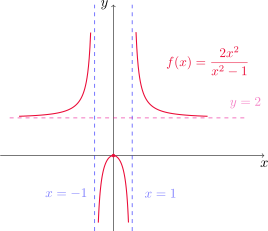{fig-align="center" width=45%}

:::

::: {.example-box}

Ejemplo

Trazar la gráfica de $\displaystyle f(x)=\frac{x^2}{\sqrt{x+1}}$.

:::

::: {.callout-tip collapse="true"}
## Solución

Procedemos siguiendo los mismos pasos que antes. 

**(A) Dominio** Por un lado, $\sqrt{x+1}$ está bien definido siempre que $x+1\geq 0$. Sin embargo, al aparecer en el denominador el valor cero no está permitido. Luego $x+1>0$, o bien $x>-1$ con lo que $D_f =(-1,+\infty)$.

**(B) Intersecciones**

- Para encontrar intersecciones con el eje $x$ planteamos

$$
f(x)=0, \quad \text{ es decir,} \quad \frac{x^2}{\sqrt{x+1}}=0,
$$

de donde resulta $x=0$. 

- Para conocer la intersección con el eje $y$ evaluamos

$$
f(0)=\frac{0^2}{\sqrt{0+1}}=0.
$$

Entonces la gráfica corta al eje $y$ en $y=0$.

Al igual que en el ejemplo anterior, la única intersección de la curva con los ejes ocurre en el origen.

**(C) Simetría y periodicidad** 

Notemos que 

$$
f(-x)=\frac{(-x)^2}{\sqrt{-x+1}}=\frac{x^2}{\sqrt{1-x}},
$$

que no coincide con $f(x)$ ni con $-f(x)$, por lo que $f$ no es par ni impar. También observamos que $f$ no es periódica.

**(D) Asíntotas**

- Calculemos las asíntotas verticales. Como $f$ es continua en todo su dominio por ser cociente de funciones continuas, el único punto candidato a originar una asíntota vertical es $x=-1$. Como $f$ sólamente está definida a la derecha de $-1$, calculamos

$$
\lim_{x\to -1^+} f(x)=\lim_{x\to -1^+} \frac{x^2}{\sqrt{x+1}}=\infty,
$$

pues el denominador tiende a cero con valores positivos y el numerador se aproxima a $1>0$. En conclusión, $x=-1$ es la única asíntota vertical del gráfico de $f$.

- Recordando nuevamente que $f$ existe sólo para $x>-1$, calculamos el límite 

$$
\lim_{x\to\infty} f(x)=\lim_{x\to \infty} \frac{x^2}{\sqrt{x+1}}=\lim_{x\to \infty} \frac{x^2}{\sqrt{x}\sqrt{1+\frac{1}{x}}}=\lim_{x\to \infty} \frac{x^{3/2}}{\sqrt{1+\frac{1}{x}}}=\infty.
$$

En consecuencia, $f$ no presenta asíntotas horizontales.

**(E) Intervalos de crecimiento y decrecimiento**

Calculamos $f'$ con la regla del cociente

$$
f'(x)=\frac{2x\sqrt{x+1}-x^2\frac{1}{2\sqrt{x+1}}}{\left(\sqrt{x+1}\right)^2}=\frac{x(3x+4)}{2(x+1)^{3/2}}.
$$

Notemos que $f'(x)=0$ cuando $x=0$ y $x-=4/3$. Como éste último valor no está en el dominio de $f$, el único punto crítico de $f$ es $x=0$. Aplicando la [propiedad del signo constante](#teo-propiedad-signoconst), $f'$ tendrá signo constante en los intervalos $(-1, 0)$ y $(0,+\infty)$. En la siguiente tabla determinamos el signo de $f'$ en cada uno de ellos.

::: {.math-table}

| Intervalo | $x_0$ | $f'(x_0)$ | $f$ |
| --- | --- | --- | --- | 
| $(-1,0)$ | $-0.5$ | $-$ | decrece | 
| $(0,+\infty)$ | 1 | $+$ | crece |

:::	

Mediante la [prueba creciente/decreciente](#teo-prueba-cd)
podemos concluir que $f$ crece en $(0,+\infty)$ y decrece en $(-1,0)$.

**(F) Valores extremos locales**

En la tabla anterior podemos ver que $f'$ cambia de negativa a positiva en $x=0$, por lo que $f$ presenta un mínimo local en este punto de valor $f(0)=0$, en virtud de la [prueba de la primera derivada](#teo-prueba-primerader).

**(G) Concavidad y puntos de inflexión**

Calculamos la derivada segunda de $f$, nuevamente utilizando la regla del cociente

$$
\begin{aligned}
f''(x)=-\frac{(6x+4)2(x+1)^{3/2}-(3x^2+4x)2\frac{3}{2}(x+1)^{1/2}}{4(x+1)^3}&=\frac{(12x+8)(x+1)-3(3x^2+4x)}{4(x+1)^{5/2}}\\
\\
&=\frac{3x^2+8x+8}{4(x+1)^{5/2}}.
\end{aligned}
$$

Dado que $f''>0$ en $(-1,+\infty)$, $f$ resulta convexa en todo su dominio por la [prueba de la concavidad](#teo-prueba-concavidad). De esta manera, el gráfico de $f$ no presenta puntos de inflexión.

**(H) Trazar la gráfica** Trazamos la gráfica aproximada de $f$.

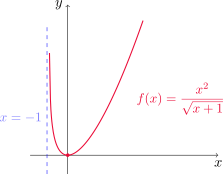{fig-align="center" width=45%}

:::

::: {.example-box}

Ejemplo

Graficar $\displaystyle f(x)=xe^x$.

::: 

::: {.callout-tip collapse="true"}
## Solución

Procedemos como en los ejemplos anteriores. 

**(A) Dominio** La función es el producto de un polinomio por una exponencial, con lo cual $D_f=\mathbb{R}$.

**(B) Intersecciones**

- Para encontrar intersecciones con el eje $x$ escribimos

$$
f(x)=0, \quad \text{ es decir,} \quad x\,e^x=0,
$$

y como $e^x>0$ para todo $x$, obtenemos que $x=0$. 

- Para calcular la intersección con el eje $y$ evaluamos

$$
f(0)=0\,e^0=0.
$$

Entonces la gráfica interseca al eje $y$ en $y=0$.

En conclusión, el única corte con los ejes se da en el origen de coordenadas.

**(C) Simetría y periodicidad** 

Comenzamos calculando $f(-x)$

$$
f(-x)=(-x)e^{-x}=-xe^{-x},
$$

que no coincide con $f(x)$ ni con $f(-x)$, por lo que la función no es par ni impar. Vemos que $f$ tampoco resulta periódica.

**(D) Asíntotas**

- La gráfica no presenta asíntotas verticales, ya que se trata de una función continua en todo $\mathbb{R}$.

- Para las asíntotas horizontales, calculamos 

$$
\lim_{x\to\infty} f(x)=\lim_{x\to \infty} xe^x=\infty,
$$

ya que se trata de un producto donde cada factor se hace arbitrariamente grande. Por otro lado, llamando $y=-x$

$$
\lim_{x\to-\infty} f(x)=\lim_{x\to -\infty} xe^x=\lim_{y\to \infty} (-y)e^{-y}=\lim_{y\to \infty} -\frac{y}{e^y}=0,
$$

utilizando la [regla de L'Hospital](#teo-regla-LH). Esto nos dice que $y=0$ es asíntota horizontal del gráfico de $f$.

**(E) Intervalos de crecimiento y decrecimiento**

Calculamos $f'$ con la regla del producto

$$
f'(x)=e^x+xe^x=e^x(x+1),
$$

de donde podemos ver que $f'(x)=0$ si y sólo si $x=-1$. Por lo tanto $f$ tiene un único punto crítico, $x=-1$. Utilizando la [propiedad del signo constante](#teo-propiedad-signoconst), $f'$ tendrá signo constante en los intervalos $(-\infty, -1)$ y en $(-1,+\infty)$. En la siguiente tabla determinamos el signo de $f'$ en cada uno de ellos.

::: {.math-table}

| Intervalo | $x_0$ | $f'(x_0)$ | $f$ |
| --- | --- | --- | --- | 
| $(-\infty,-1)$ | $-2$ | $-$ | decrece | 
| $(-1,+\infty)$ | 0 | $+$ | crece |

:::	

Con la [prueba creciente/decreciente](#teo-prueba-cd)
podemos concluir que $f$ crece en $(-1,+\infty)$ y que decrece en $(-\infty,-1)$.

**(F) Valores extremos locales**

En la tabla anterior vemos que $f'$ cambia de negativa a positiva en $x=-1$, por lo que $f$ presenta un mínimo local en este punto (por la [prueba de la primera derivada](#teo-prueba-primerader)) y su valor es $f(-1)=-1\,e^{-1}=-1/e\approx -0.37$.

**(G) Concavidad y puntos de inflexión**

Calculamos la derivada segunda de $f$, nuevamente con la regla del producto

$$
f''(x)=e^x(x+1)+e^x=e^x(x+2).
$$

Así, $f''(x)=0$ si y sólo si $x=-2$. Por la [propiedad del signo constante](#teo-propiedad-signoconst),  $f''$ tendrá signo constante en $(-\infty,-2)$ y en $(-2,+\infty)$. En la siguiente tabla calculamos estos signos.

::: {.math-table}

| Intervalo | $x_0$ | $f''(x_0)$ | $f$ |
| --- | --- | --- | --- | 
| $(-\infty,-2)$ | $-3$ | $-$ | cóncava | 
| $(-2,+\infty)$ | -1 | $+$ | convexa |

:::	

Entonces $f$ resulta convexa en $(-2,+\infty)$ y cóncava en $(-\infty,-2)$ como consecuencia de la [prueba de la concavidad](#teo-prueba-concavidad). El signo de $f''$ cambia en $x=-2$, que resulta un punto de continuidad de $f$, por lo que $P=(-2,f(-2))=(-2,-2/e^2)$ es el único punto de inflexión de la gráfica.

**(H) Trazar la gráfica** Con lo calculado anteriormente trazamos la gráfica aproximada de $f$.

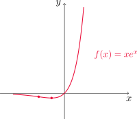{fig-align="center" width=40%}

:::

::: {.example-box}

Ejemplo

Realizar el gráfico de la función  $\displaystyle f(x)=\frac{\cos x}{2+\operatorname{sen} x}$.

::: 

::: {.callout-tip collapse="true"}
## Solución

**(A) Dominio** Observemos que $-1\leq \operatorname{sen} x\leq 1$, con lo que $2+\operatorname{sen}x\geq 1$ para todo $x$, es decir, el denominador nunca se anula. En consecuencia, $D_f=\mathbb{R}$.

**(B) Intersecciones**

- Para encontrar intersecciones con el eje $x$ escribimos

$$
f(x)=0, \quad \text{ es decir,} \quad\frac{\cos x}{2+\operatorname{sen} x}=0,
$$

que se cumple cuando $\cos x=0$, es decir, si $x=(2n+1)\pi/2$, $n\in\mathbb{Z}$. 

- Para calcular la intersección con el eje $y$ evaluamos

$$
f(0)=\frac{\cos 0}{2+\operatorname{sen} 0}=\frac{1}{2}.
$$

Entonces la gráfica interseca al eje $y$ en $y=1/2$.

**(C) Simetría y periodicidad** 

Comenzamos calculando $f(-x)$

$$
f(-x)=\frac{\cos(-x)}{2+\operatorname{sen}(-x)}=\frac{\cos x}{2-\operatorname{sen}x},
$$

ya que $y=\cos x$ es una función par e $y=\operatorname{sen} x$ es impar. Esta expresión no coincide con $f(x)$ ni con $f(-x)$, por lo que la función no es par ni impar. 

Para la periodicidad, como las funciones trigonométricas son periódicas, esperamos obtener una función periódica. Para determinar el período, si $p>0$ está fijo planteamos la condición $f(x+p)=f(x)$ e intentaremos determinar $p$.

Esta condición resulta 

$$
\frac{\cos(x+p)}{2+\operatorname{sen}(x+p)}=\frac{\cos x}{2+\operatorname{sen} x}.
$$

Utilizando las fórmulas para el seno y el coseno de una suma de ángulos

$$
\operatorname{sen}(\alpha+\beta)=\operatorname{sen} \alpha \cos \beta +\cos\alpha \operatorname{sen} \beta \quad \text{ y } \quad \cos(\alpha+\beta)=\cos\alpha\cos\beta-\operatorname{sen} \alpha\operatorname{sen} \beta
$$

obtenemos

$$
\frac{\cos x\cos p-\operatorname{sen} x\operatorname{sen} p}{2+\operatorname{sen} x\cos p+\cos x\operatorname{sen} p}=\frac{\cos x}{2+\operatorname{sen} x}.
$$

Esta igualdad implica que

$$
(\cos x\cos p-\operatorname{sen} x\operatorname{sen} p)(2+\operatorname{sen} x)=(2+\operatorname{sen} x\cos p+\cos x\operatorname{sen} p)\cos x
$$

o de manera equivalente

$$
2\cos x\cos p+\cos x\operatorname{sen} x\cos p-2\operatorname{sen} x\operatorname{sen} p-\operatorname{sen}^2 x\operatorname{sen} p=2\cos x+\cos x\operatorname{sen} x\cos p+\cos^2x\operatorname{sen} p,
$$

que puede ser reducida a

$$
2\cos x(\cos p-1)=\operatorname{sen} p(1+2\operatorname{sen} x).
$${#eq-periodicidad}

Ahora bien, si $\operatorname{sen} p\neq 0$, entonces obtenemos

$$
\frac{\cos p-1}{\operatorname{sen} p}=\frac{1+2\operatorname{sen} x}{2\cos x},
$$

pero como esta igualdad debe cumplirse para todo $x$ tal que $\cos x\neq 0$, es un absurdo. Entonces debe ser $\operatorname{sen} p=0$, y sustituyendo esto en (-@eq-periodicidad) resulta

$$
2\cos x(\cos p-1)=0,
$$

de donde concluimos que $\cos p=1$. El valor positivo $p$ más pequeño que verifica $\operatorname{sen} p=0$ y $\cos p=1$ es $p=2\pi$, con lo cual $f$ es periódica de período $2\pi$. Así, basta analizarla ahora en $[0,2\pi]$ y luego extender su gráfico a todo $\mathbb{R}$ de forma periódica.

**(D) Asíntotas**

- La gráfica no presenta asíntotas verticales, ya que se trata de una función continua en todo $\mathbb{R}$.

- No presenta asíntotas horizontales, ya que se trata de una función periódica de período $2\pi$.

**(E) Intervalos de crecimiento y decrecimiento**

Como $f$ es periódica de período $2\pi$, 
Calculamos $f'$ usando la regla del cociente

$$
f'(x)=\frac{-\operatorname{sen} x(2+\operatorname{sen} x)-\cos x\cos x}{(2+\operatorname{sen} x)^2}=-\frac{1+2\operatorname{sen} x}{(2+\operatorname{sen} x)^2}.
$$

Luego $f'(x)=0$ si y sólo si $1+2\operatorname{sen} x=0$, o de forma equivalente $\operatorname{sen} x=-1/2$. Esto significa que los puntos críticos de $f$ son $x=7\pi/6$ y $11\pi/6$. Por la [propiedad del signo constante](#teo-propiedad-signoconst), $f'$ tendrá signo constante en los intervalos $(0, 7\pi/6)$, $(7\pi/6,11\pi/6)$ y $(11\pi/6,2\pi)$. En la siguiente tabla determinamos el signo de $f'$ en cada uno de ellos.

::: {.math-table}

| Intervalo | $x_0$ | $f'(x_0)$ | $f$ |
| --- | --- | --- | --- | 
| $\displaystyle \left(0, \frac{7\pi}{6}\right)$ | $\pi$ | $-$ | decrece | 
| $\displaystyle \left(\frac{7\pi}{6}, \frac{11\pi}{6}\right)$ | $\displaystyle\frac{3\pi}{2}$ | $+$ | crece |
| $\displaystyle \left(\frac{11\pi}{6}, 2\pi\right)$ | $\displaystyle\frac{23\pi}{12}$ | $-$ | decrece |

:::	

Con la [prueba creciente/decreciente](#teo-prueba-cd)
podemos concluir que $f$ crece en $(7\pi/6, 11\pi/6)$ y que decrece en $(0, 7\pi/6)$ y en $(11\pi/6, 2\pi)$.

**(F) Valores extremos locales**

En la tabla anterior vemos que $f'$ cambia de negativa a positiva en $x=7\pi/6$, por lo que $f$ presenta un mínimo local en este punto (por la [prueba de la primera derivada](#teo-prueba-primerader)) y su valor es $f(7\pi/6)=-\sqrt{3}/2\approx -0.577$. También vemos que $f'$ cambia de positiva a negativa en $x=11\pi/6$, con lo cual $f$ presenta un máximo local en este punto de valor $f(11\pi/6)=\sqrt{3}/2\approx 0.577$.

**(G) Concavidad y puntos de inflexión**

Calculamos la derivada segunda de $f$, nuevamente con la regla del cociente

$$
f''(x)=-\frac{2\cos x(2+\operatorname{sen} x)^2-(1+2\operatorname{sen} x)2(2+\operatorname{sen} x)\cos x}{(2+\operatorname{sen} x)^4}=-\frac{2\cos x(1-\operatorname{sen} x)}{(2+\operatorname{sen} x)^3}.
$$

Así, $f''(x)=0$ cuando $\cos x=0$ o cuando $\operatorname{sen} x=1$. Los puntos son $x=\pi/2$ y $x=3\pi/2$ para que se cumpla la primera, y $x=\pi/2$ para la segunda.  Por la [propiedad del signo constante](#teo-propiedad-signoconst)  $f''$ tendrá signo constante en $(0,\pi/2)$, en $(\pi/2,3\pi/2)$ y en $(3\pi/2, 2\pi)$. En la siguiente tabla calculamos estos signos.

::: {.math-table}

| Intervalo | $x_0$ | $f'(x_0)$ | $f$ |
| --- | --- | --- | --- | 
| $\displaystyle \left(0, \frac{\pi}{2}\right)$ | $\displaystyle\frac{\pi}{4}$ | $-$ | cóncava | 
| $\displaystyle \left(\frac{\pi}{2}, \frac{3\pi}{2}\right)$ | $\pi$ | $+$ | convexa |
| $\displaystyle \left(\frac{3\pi}{2}, 2\pi\right)$ | $\displaystyle\frac{7\pi}{4}$ | $-$ | cóncava |

Entonces $f$ resulta convexa en $(\pi/2,3\pi/2)$ y cóncava en $(0,\pi/2)$ y en $(3\pi/2,2\pi)$ como consecuencia de la [prueba de la concavidad](#teo-prueba-concavidad). El signo de $f''$ cambia en $x=\pi/2$ y en $x=3\pi/2$, ambos puntos de continuidad de $f$, por lo que $P=(\pi/2,f(\pi/2))=(\pi/2,0)$ y $Q=(3\pi/2, f(3\pi/2))=(3\pi/2,0)$ son los dos puntos de inflexión de la gráfica.

**(H) Trazar la gráfica** Con lo calculado anteriormente trazamos la gráfica aproximada de $f$.

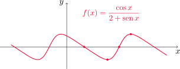{fig-align="center" width=50%}

:::

:::

::: {.example-box}

Ejemplo

Graficar $y=\ln(4-x^2)$.

::: 

::: {.callout-tip collapse="true"}
## Solución

**(A) Dominio** Debido a que el logaritmo de cero y de números negativos no existe, planteamos que $4-x^2>0$, lo que nos lleva a $|x|<2$, o también $-2<x<2$. En consecuencia, $D_f=(-2,2)$.

**(B) Intersecciones**

- Para encontrar intersecciones con el eje $x$ hacemos

$$
f(x)=0, \quad \text{ es decir,} \quad \ln(4-x^2)=0,
$$

que nos conduce a $x^2=3$ y entonces $x=\pm \sqrt{3}$. 

- Para calcular la intersección con el eje $y$ evaluamos

$$
f(0)=\ln(4-0^2)=\ln 4\approx 1.386.
$$

Entonces la gráfica interseca al eje $y$ en $y=\ln 4$.

**(C) Simetría y periodicidad** 

Comenzamos calculando $f(-x)$

$$
f(-x)=\ln(4-(-x)^2)=\ln(4-x^2)=f(x),
$$

para todo $x$ en el dominio de $f$, de donde resulta que $f$ es par.

En este caso $f$ no resulta periódica.

**(D) Asíntotas**

- Dado que $f$ es continua en su dominio, analizamos los puntos extremos del intervalo.

Observar que tanto cuando $x\to 2^-$ como cuando $x\to -2^+$, $4-x^2\to 0$ con valores positivos. Como $\lim_{t\to 0^+} ln(t)=-\infty$, concluimos que

$$
\lim_{x\to -2^+} f(x)=-\infty \quad \text{ y también } \quad \lim_{x\to 2^-} f(x)=-\infty.
$$

Es decir, $x=-2$ y $x=2$ son asíntotas verticales de la gráfica de $f$.

- La función no presenta asíntotas horizontales, ya que $f$ sólamente está definida en $(-2,2)$.

**(E) Intervalos de crecimiento y decrecimiento**

Calculamos $f'$ utilizando la derivada del logaritmo natural y la regla de la cadena

$$
f'(x)=-\frac{2x}{4-x^2},
$$

de donde podemos ver que $f'(x)=0$ si y sólo si $x=0$. Por lo tanto $f$ tiene un único punto crítico, $x=0$. Utilizando la [propiedad del signo constante](#teo-propiedad-signoconst), $f'$ tendrá signo constante en los intervalos $(-2, 0)$ y en $(0,2)$. La siguiente tabla muestra el signo de $f'$ en cada uno.

::: {.math-table}

| Intervalo | $x_0$ | $f'(x_0)$ | $f$ |
| --- | --- | --- | --- | 
| $(-2,0)$ | $-1$ | $+$ | crece | 
| $(0,2)$ | 1 | $-$ | decrece |

:::	

Utilizando la [prueba creciente/decreciente](#teo-prueba-cd) concluimos que $f$ crece en $(-2,0)$ y decrece en $(0,2)$.

**(F) Valores extremos locales**

En la tabla anterior vemos que $f'$ cambia de positiva a negativa en $x=0$, por lo que $f$ presenta un máximo local en este punto (por la [prueba de la primera derivada](#teo-prueba-primerader)) y su valor es $f(0)=\ln 4$.

**(G) Concavidad y puntos de inflexión**

Calculamos la derivada segunda de $f$ usando la regla del cociente

$$
f''(x)=-\frac{2(4-x^2)-2x(-2x)}{(4-x^2)^2}=-\frac{2x^2+8}{(4-x^2)^2}.
$$

Podemos observar que $f''(x)<0$ en todo su dominio, es decir, en todo el intervalo $(-2,2)$. Por la [prueba de la concavidad](#teo-prueba-concavidad) $f$ resulta cóncava en todo su dominio, y en consecuencia no hay puntos de inflexión. 

**(H) Trazar la gráfica** Con todo lo calculado anteriormente trazamos la gráfica aproximada de $f$.

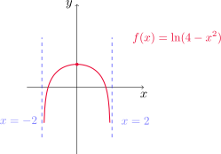{fig-align="center" width=45%}

:::

[↑ Volver al inicio de la sección](#seccion_4.5)

## 4.7. Problemas de optimización {#seccion_4.7}
			
En esta sección aplicaremos los métodos aprendidos para hallar extremos de una función a problemas concretos. La idea es optimizar cierta cantidad, estableciendo una función que debe maximizarse (como utilidades o ganancias) o minimizarse (como un costo, una distancia o un tiempo de recorrido). Veamos algunos ejemplos.
		
::: {.example-box}

Ejemplo

Un granjero tiene 2400 pies de cerca y desea cercar un campo rectangular que
limita con un río recto. No necesita cercar a lo largo del río. ¿Cuáles son las dimensiones del campo que tiene el área más grande?

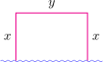{fig-align="center" width=30%}

::: 

::: {.callout-tip collapse="true"}
## Solución

El primer paso es definir adecuadamente la función a optimizar, especificando las unidades de medida y el intervalo al que pertenece la variable independiente. Si llamamos $x$ e $y$ a las longitudes medidas en pies de los laterales del campo y del fondo, respectivamente, entonces el área encerrada es 
$$
A=xy.
$$

Sin embargo, sabemos que el perímetro de la región resultante debe sewr de 2400 pies, con lo cual 

$$
2x+y=2400, \quad \text{ o bien} \quad y=2400-2x.
$$

Ahora podemos expresar el área como una función de $x$

$$
A(x)=x(2400-2x)=2400x-2x^2,
$$

donde $0\leq x\leq 1200$. Esta restricción aparece al imponer las condiciones de que tanto $x$ como $A(x)$ sean no negativas. 

Como $A$ es una función continua en el intervalo $[0,1200]$, el [teorema de los valores extremos](#teo-valores-extremos) asegura que alcanza tanto un máximo como un mínimo absoluto en el intervalo.

Buscamos entonces los puntos críticos de $A$. Tenemos que 

$$
A'(x)=2400-4x,
$$

y $A'(x)=0$ si y sólo si $x=600$. Ahora evaluamos $A$ en este punto, y en los extremos del intervalo 

$$
A(600)=2400\cdot 600-2(600)^2=720000
$$

$$
 A(0)=2400\cdot 0 - 2\cdot 0^2=0, \quad A(1200)=2400\cdot 1200- 2(1200)^2=0.
$$

De esta manera, el máximo valor posible para el área es $720000$ pies2, y se logra cuando $x=600$ pies. Luego, $y=2400-2\cdot 600=1200$ pies. Por lo que el sector que encierra área máxima debe tener $600$ pies en los laterales y $1200$ pies en el fondo.

:::

::: {.example-box}

Ejemplo

Se va a fabricar una lata para que contenga 1 litro de aceite. Hallar las dimensiones que minimizarán el costo del metal para fabricar la lata.
	
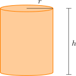{fig-align="center" width=25%}
::: 

::: {.callout-tip collapse="true"}
## Solución

Como queremos minimizar el costo de fabricación, debemos minimizar el área de la superficie de la lata. Si llamamos $r$ y $h$ al radio de la base y la altura, respectivamente, medidas en cm, el área de la superficie es

$$
A=A_\ell+A_b=2\pi rh+2\pi r^2.
$$

La condición sobre la capacidad de la lata nos da

$$
1000 =\pi r^2 h,
$$

y despejando $h$ en términos de $r$ 

$$
h=\frac{1000}{\pi r^2}.
$$

Usando esta relación en la fórmula para el área resulta

$$
A(r)=2\pi r\frac{1000}{\pi r^2}+2\pi r^2=\frac{2000}{r}+2\pi r^2
$$

con $r\in(0,+\infty)$.

Buscamos los puntos críticos de $A$, calculando la derivada.

$$
A'(r)=-\frac{2000}{r^2}+4\pi r
$$

con lo cual $A'(r)=0$ si y sólo si $r=\sqrt[3]{500/\pi}=r_0$. Para determinar la naturaleza de este punto crítico, podemos emplear la [prueba de la segunda derivada](#teo-prueba-segundader).

$$
A''(r)=\frac{4000}{r^3}+4\pi,
$$

de donde $A''(r_0)>0$ y entonces la función $A$ alcanza un mínimo local en $r_0$, cuyo valor es 

$$
A(r_0)=\frac{2000}{r_0}+2\pi r_0^2=\frac{2000}{\sqrt[3]{500/\pi}}+2\pi (500/\pi)^{2/3}=\frac{3000}{\sqrt[3]{500/\pi}}\, \mathrm{cm}^2 \approx 553.58 \mathrm{cm}^2.
$$

Para asegurarnos de que este valor mínimo local es también absoluto, estudiamos los límites de $A$ cuando $r$ se aproxima a cero o a infinito 

$$
\lim_{r\to 0^+} A(r)=\lim_{r\to 0^+} \frac{2000}{r}+2\pi r^2=\infty
$$

y

$$
\lim_{r\to \infty} A(r)=\lim_{r\to \infty} \frac{2000}{r}+2\pi r^2=\infty,
$$

con lo cual el mínimo encontrado es absoluto. Las dimensiones de la lata que minimizan el área de la superficien (y, por lo tanto, el costo de fabricación) son 

$$
r=r_0=\sqrt[3](500/pi)\approx 5.419 \,\mathrm{cm} \quad \text{ y } \quad h=\frac{1000}{\pi r_0^2}=2r_0=2\sqrt[3](500/pi)\approx 10.838 \,\mathrm{cm}.
$$
	
:::

::: {.callout-caution title="Importante"}
Podemos utilizar otro método para determinar la naturaleza del punto crítico hallado. Como $A'$ es continua en $(0,+\infty)$ y se anula en $r_0$, la [propiedad del signo constante](#teo-prueba-signoconst) establece que tendrá signo constante en $(0,r_0)$ y en $(r_0,+\infty)$. En la siguiente tabla tenemos el signo de $A'$ en cada uno.

::: {.math-table}

| Intervalo | $r$ | $A'(r)$ | $A$ |
| --- | --- | --- | --- | 
| $(0,r_0)$ | $1$ | $-$ | decrece | 
| $(r_0,+\infty)$ | $6$ | $+$ | crece |

:::	

Por la [prueba creciente/decreciente](#teo-prueba-cd) sabemos que $A$ decrece en $(0,r_0)$ y crece en $(r_0,+\infty)$, por lo que en $r_0$ alcanza su único mínimo local, que también es absoluto. 

:::

Podemos dar una versión de la [prueba de la primera derivada](#teo-prueba-primerader) para extremos absolutos.

::: {#teo-primerader-global .theorem}

Prueba de la primera derivada para valores extremos absolutos
			
Supongamos que $c$ es un punto crítico de una función continua definida sobre un intervalo $I$.
			
- Si $f'(x)>0$ para todo $x<c$ con $x\in I$ y $f'(x)<0$ para todo $x>c$, $x\in I$ entonces $f(c)$ es el valor máximo absoluto de $f$ en $I$.

- Si $f'(x)<0$ para todo $x<c$ con $x\in I$ y $f'(x)>0$ para $x>c$, $x\in I$ entonces $f(c)$ es el valor mínimo absoluto de $f$ en $I$.

:::

::: {.example-box}

Ejemplo

Encontrar el punto sobre la parábola $y^2=2x$ más cercano al punto $(1,4)$.
	
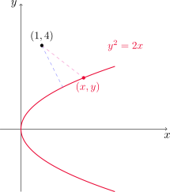{fig-align="center" width=35%}
	
:::

::: {.callout-tip collapse="true"}
## Solución

Si $(x,y)$ es cualquier punto sobre la parábola, entonces queremos que la distancia desde $(x,y)$ a $(1,4)$, es decir

$$
d=\sqrt{(x-1)^2+(y-4)^2}
$$

sea lo más chica posible. Como $y^2=2x$ por estar el punto en la parábola, también podemos escribir $x=y^2/2$. Con esta relación expresamos a la distancia en términos de $y$

$$
d(y)=\sqrt{\left(\frac{1}{2}y^2-1\right)^2+(y-4)^2}.
$$

Dado que $d(y)\geq 0$ para todo $y$, $d$ es mínima si y sólo si $d^2$ es mínima. Para evitar trabajar con la raíz cuadrada, consideramos

$$
f(y)=d^2(y)=\left(\frac{1}{2}y^2-1\right)^2+(y-4)^2,
$$

para $y\in \mathbb{R}$. Buscamos los puntos críticos, hallando $f'$.

$$
f'(y)=2\left(\frac{1}{2}y^2-1\right)y+2(y-4)=y^3-8,
$$

con lo que $f'(y)=0$ si y sólo si $y=2$. Como $f$ presenta un único punto crítico en $\mathbb{R}$, hacemos la tabla

::: {.math-table}

| Intervalo | $y_0$ | $f'(y_0)$ | $f$ |
| --- | --- | --- | --- | 
| $(-\infty,2)$ | $0$ | $-$ | decrece | 
| $(2,+\infty)$ | $3$ | $+$ | crece |

:::	

Utilizando la [prueba de la primera derivada para valores extremos absolutos](#teo-primerader-global) concluimos que $f$ presenta un mínimo absoluto en $y=2$,
cuyo valor es

$$
f(2)=\left(\frac{1}{2}2^2-1\right)^2+(2-4)^2=5,
$$

con lo que la distancia mínima es $d=\sqrt{5}$ (recordar que minimizamos $d^2$). El punto sobre la parábola donde se alcanza esta distancia mínima es $(2^2/2,2)=(2,2)$.

:::

::: {.example-box}

Ejemplo

Un hombre está en un punto $A$ sobre una de las riberas de un río recto que tiene 3 km de ancho y desea llegar hasta el punto $B$, 8 km corriente abajo en la ribera opuesta, tan rápido como le sea posible. Podría remar en su bote, cruzar directamente el río hasta el punto $C$ y correr hasta $B$, o podría remar hasta $B$ o, en última instancia, remar hasta algún punto $D$, entre $C$ y $B$, y luego correr hasta $B$. Si
puede remar a 6 km/h y correr a 8 km/h, ¿dónde debe desembarcar para llegar a $B$ tan
pronto como sea posible? (Suponer que la rapidez del agua es insignificante comparada
con la rapidez a la que rema el hombre.)
	
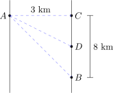{fig-align="center" width=40%}
	
:::

::: {.callout-tip collapse="true"}
## Solución

Supongamos que el hombre rema desde $A$ hasta un punto $D$ ubicado entre $C$ y $B$ (pudiendo, tal vez, coincidir con alguno de éstos). Sea $x$ la distancia en km desde el punto $C$ al punto $D$. Si $d_1(x)$ es la distancia en km desde $A$ hasta $D$, utilizando el teorema de Pitágoras resulta

$$
d_1^2(x)=x^2+3^2, \quad \text{ o bien }\quad d_1(x)=\sqrt{9+x^2}.
$$

Entonces el hombre rema $d_1(x)$ km desde $A$ hasta $D$, y luego corre $d_2(x)=8-x$ kilómetros desde $D$ hasta $B$. Podemos calcular el tiempo total dividiendo cada distancia por la velocidad correspondiente. Si llamamos $T(x)$ tal tiempo en horas, en función de $x$ obtenemos

$$
T(x)=\frac{d_1(x)}{6}+\frac{d_2(x)}{8}=\frac{\sqrt{9+x^2}}{6}+\frac{8-x}{8},
$$

donde $x\in [0,8]$.

Para llegar al punto $B$ lo más rapido posible, es preciso minimizar el tiempo de recorrido.

Como estamos en el caso de una función continua en un intervalo cerrado, buscamos los puntos críticos en $(0,8)$ y comparamos los valores de la función en estos puntos con los valores que toma en los extremos del intervalo.

$$
T'(x)=\frac{1}{6}\frac{1}{2\sqrt{9+x^2}}2x+\frac{1}{8}(-1)=\frac{x}{6\sqrt{9+x^2}}-\frac{1}{8}
$$

que se anula cuando $x=9\sqrt{7}/7\approx 3.4$ km. Dado que 

$$
T(9\sqrt{7}/7)=\frac{\sqrt{9+\frac{81\cdot 7}{49}}}{6}+\frac{8-\frac{9\sqrt{7}}{7}}{8}=1+\frac{\sqrt{7}}{8}\approx 1.33
$$

y

$$
T(0)=\frac{\sqrt{9+0^2}}{6}+\frac{8-0}{8}=\frac{1}{2}+1=1.5 \quad \text{ y }\quad T(8)=\frac{\sqrt{9+8^2}}{6}+\frac{8-8}{8}=\frac{\sqrt{73}}{6}\approx 1.42, 
$$

el mínimo tiempo posible se consigue cuando $x=9\sqrt{7}/7$ km.

:::

::: {.example-box}

Ejemplo

Encontrar el área del rectángulo más grande que puede inscribirse en una
semicircunferencia de radio $r$.
	
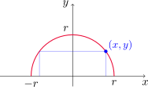{fig-align="center" width=40%}

:::

::: {.callout-tip collapse="true"}
## Solución

Por simplicidad podemos ubicar la semicircunferencia centrada en el origen, abarcando el primer y el segundo cuadrantes. Sean $x$ e $y$ las coordenadas del vértice superior derecho del rectángulo que toca a la circunferencia (es decir, $x$ e $y$ son positivos). Entonces el rectángulo tiene altura $y$ y base de longitud $2x$. Su área resulta entonces

$$
A=2xy.
$$

Como el punto $(x,y)$ también está ubicado sobre la semicircunferencia, se cumple que $x^2+y^2=r^2$, o también $y=\sqrt{r^2-x^2}$. Por lo tanto, el área como función de $x$ resulta ser

$$
A(x)=2x\sqrt{r^2-x^2},
$$

con $0\leq x\leq r$. Como $A$ es continua en el intervalo cerrado dado, sabemos que alcanza extremos absolutos. La derivada de $A$ es

$$
A'(x)=2\sqrt{r^2-x^2}+2x\frac{1}{2\sqrt{r^2-x^2}}(-2x)=\frac{2r^2-4x^2}{\sqrt{r^2-x^2}}.
$$

El único punto crítico en el intervalo $(0,r)$ es $x=r\sqrt{2}/2$. Evaluamos entonces

$$
A(r\sqrt{2}/2)=2\frac{\sqrt{2}}{2}r\sqrt{r^2-\frac{r^2}{2}}=r^2
$$

y también en los extremos del intervalo

$$
A(0)=2\cdot 0\sqrt{r^2-0^2}=0 \quad \text{ y }\quad A(r)=2r\sqrt{r^2-r^2}=0.
$$

Con lo cual, el área máxima es $r^2$ y se alcanza cuando $x=r\sqrt{2}/2$ e $y=\sqrt{r^2-\frac{r^2}{2}}=r\sqrt{2}/2$. Es decir, el rectángulo tiene altura igual a la mitad de su base.

:::

[↑ Volver al inicio de la sección](#seccion_4.7)