## 5.1. Áreas y distancias {#seccion_5.1}

Comenzaremos este capítulo motivando la definición del concepto de integral. Con la derivada, le dábamos sentido al cociente de cantidades infinitesimales, y para ello calculábamos el límite de cocientes incrementales. Con la integral daremos sentido formal a "sumar" cantidades infinitesimales.

### Área bajo la curva

Supongamos que queremos calcular el área de una región plana. Muchas veces disponemos de una fórmula para el cálculo en
término de sus dimensiones, sobre todo cuando la región es de una forma sencilla.

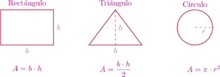{fig-align="center" width=65%}

Ahora quisiéramos calcular el área de una figura plana un poco más general. Supongamos que dicha región $S$  está comprendida entre el eje $x$ y el gráfico de una función no negativa y continua $y = f(x)$, entre $x = a$ y $x = b$. 

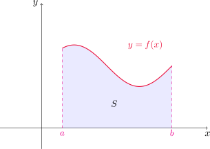{fig-align="center" width=50%}

$$
S=\{x\in\mathbb{R}^2: 0\leq y\leq f(x), \quad a\leq x\leq b\}.
$${#eq-regionS}

Sin embargo, como no tenemos definido qué es el área de una región de este tipo, comenzaremos obteniendo una aproximación del área de $S$ utilizando rectángulos, cuyas áreas conocemos y podemos calcular con facilidad.

::: {.example-box}

Ejemplo

Utilizar rectángulos para estimar el área debajo de la parábola $y = x^2$, desde $x=0$ hasta $x=1$.

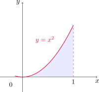{fig-align="center" width=45%}

:::

::: {.callout-tip collapse="true"}
## Solución

Si $A$ denota el área de $S$, entonces es claro que $0<A<1$, dado que la región $S$ puede encerrarse en un cuadrado de lados de longitud $1$ cuya área es, por supuesto, $1$. Ahora dividimos $S$ en cuatro franjas $S_1$, $S_2$, $S_3$ y $S_4$, trazando cuatro líneas verticales en $x=1/4$, $x=1/2$ y $x=3/4$, respectivamente.

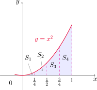{fig-align="center" width=45%}

Ahora bien, podemos aproximar el área de cada franja por la del rectángulo que tiene la misma base que la franja, y la altura es la misma que la del lado derecho de la correspondiente franja.
Es decir, las alturas de los rectángulos son los valores que toma la función en los extremos derechos de cada subintervalo en los que quedó dividido el $[0,1]$. Si denotamos con $R_4$ a la suma de las áreas de estos rectángulos, resulta

$$
R_4=\frac{1}{4} \left(\frac{1}{4}\right)^2 + \frac{1}{4} \left(\frac{1}{2}\right)^2 + \frac{1}{4} \left(\frac{3}{4}\right)^2 + \frac{1}{4} 1^2= \frac{15}{32} = 0.46875.
$$

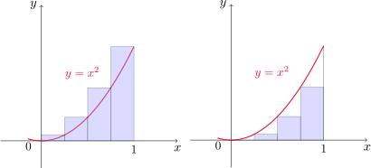{fig-align="center" width=60%}

Como vemos en el dibujo, ésto nos da una aproximación de $A$ por exceso. Otra manera posible para aproximar $A$ es sumar las áreas de los rectángulos que tienen la misma base que cada franja, pero la altura igual a la del lado izquierdo de cada una. En este caso las alturas corresponden a los valores de $f$ en los extremos izquierdos de cada subintervalo en los que dividimos a $[0,1]$. SI denotamos con $L_4$ a la suma de éstas áreas, entonces

$$
L_4=\frac{1}{4} 0^2 + \frac{1}{4} \left(\frac{1}{4}\right)^2 + \frac{1}{4} \left(\frac{1}{2}\right)^2 + \frac{1}{4} \left(\frac{3}{4}\right)^2 = \frac{7}{32} = 0.21875,
$$

resultando en este caso una aproximación por defecto. Es decir

$$
0.21875<A<0.46875.
$$

Este procedimiento puede repetirse considerando una mayor cantidad de franjas. En la siguiente tabla se muestran los valores calculados en distintos casos.

::: {.math-table}

| $n$ franjas | $L_n$ | $R_n$ | 
| --- | --- | --- | 
| 10 |0.2850000 | 0.3850000 |
| 20 | 0.3087500 | 0.3587500 |
| 30 | 0.3168519 | 0.3501852 |
| 50 | 0.3234000 | 0.3434000 |
| 100 | 0.3283500 | 0.3383500 |
| 1000 | 0.3328335| 0.3338335 |
:::	

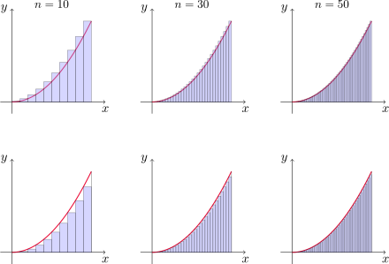{fig-align="center" width=70%}

Todo parece indicar que los valores de $L_n$ y $R_n$ se aproximan a $1/3$ cuando $n$ crece.

:::

::: {.example-box}

Ejemplo

Para la región $S$ del ejemplo anterior, demostrar que la suma de las áreas de los rectángulos superiores de aproximación tiende a $1/3$. Es decir, comprobar que $\displaystyle \lim_{n\to \infty} R_n=\frac{1}{3}$.
:::

::: {.callout-tip collapse="true"}
## Solución

Fijado un número $n\in \mathbb{N}$, dividimos el intervalo $[0,1]$ en $n$ subintervalos de longitud $\frac{1}{n}$. Cada rectángulo de aproximación tiene entonces base $1/n$ y altura $f(k/n)$, donde $1\leq k\leq n$. De esta manera

$$
\begin{aligned}
R_n
&= \frac{1}{n}\!\left(\frac{1}{n}\right)^2
   + \frac{1}{n}\!\left(\frac{2}{n}\right)^2
   + \frac{1}{n}\!\left(\frac{3}{n}\right)^2
   + \ldots
   + \frac{1}{n}\!\left(\frac{n-1}{n}\right)^2
   + \frac{1}{n}1^2 \\
   \\
&= \sum_{k=1}^n \frac{1}{n}\!\left(\frac{k}{n}\right)^2\\
\\
&=\frac{1}{n^3}\sum_{k=1}^n k^2.
\end{aligned}
$$

Teniendo en cuenta que 

$$
\sum_{k=1}^{n} k^2 = \frac{n(n+1)(2n+1)}{6}
$$

resulta

$$
R_n = \frac{1}{n^3} \sum_{k=1}^{n} k^2 =  \frac{(n+1)(2n+1)}{6n^2}.
$$

Por lo tanto

$$
\begin{aligned}
\lim_{n\rightarrow \infty} R_n &= \lim_{n\rightarrow \infty} \frac{(n+1)(2n+1)}{6n^2}\\
&= \lim_{n\rightarrow \infty} \frac{1}{6}\frac{(n+1)}{n}\frac{(2n+1)}{n}\\
\\
&= \frac{1}{6}\cdot 1 \cdot 2 = \frac{1}{3}.
\end{aligned}
$$

Si repetimos el proceso considerando los rectángulos a la izquierda, obtenemos que

$$
\begin{aligned}
L_n &= \frac{1}{n} 0^2 + \frac{1}{n}\left(\frac{1}{n}\right)^2 + \frac{1}{n}\left(\frac{2}{n}\right)^2 + \frac{1}{n}\left(\frac{3}{n}\right)^2 + \ldots + \frac{1}{n}\left(\frac{n-1}{n}\right)^2 \\
\\
&= \sum_{k=1}^{n-1} \frac{1}{n}\!\left(\frac{k}{n}\right)^2=\frac{(n-1)n(2n-1)}{6n^3}=\frac{1}{6}\frac{n-1}{n}\frac{2n-1}{n}.
\end{aligned}
$$

Y entonces

$$
\begin{aligned}
\lim_{n\rightarrow \infty} L_n &= \lim_{n\rightarrow \infty} \frac{1}{6}\frac{n-1}{n}\frac{2n-1}{n}\\
&= \frac{1}{6}\cdot 1 \cdot 2 = \frac{1}{3}.
\end{aligned}
$$

Con lo cual $\lim_{n\to \infty} L_n=1/3$.

:::

Los ejemplos anteriores nos dan una idea de cómo definir el área de una region general como la dada en (-@eq-regionS). 

En efecto, dividimos la región $S$ en $n$ franjas de igual ancho $S_i$, $1\leq i\leq n$. Como el ancho del intervalo es $b-a$, cada franja tendrá ancho $\displaystyle\Delta x= \frac{b-a}{n}$. Estas franjas dividen al intervalos en los subintervalos 

$$
[x_0, x_1], \quad [x_1, x_2], \quad \dots \quad [x_{n-1}, x_n],
$$

donde $x_0=a$, $x_n=b$ y, en general 

$$
x_i=a+i\Delta x=a+i\frac{b-a}{n}, \quad 0\leq i\leq n.
$$

Podemos aproximar el área de cada franja $S_i$ por la del rectángulo con base $\Delta x$ y altura igual a la imagen por $f$ del extremo derecho del intervalo $[x_{i-1}, x_i]$. Sumando todas las áreas de estas figuras obtenemos la aproximación dada por rectángulos superiores como

$$
R_n=f(x_1)\Delta x+f(x_2)\Delta x+\dots+f(x_n)\Delta x=\sum_{i=1}^n f(x_i)\Delta x.
$$

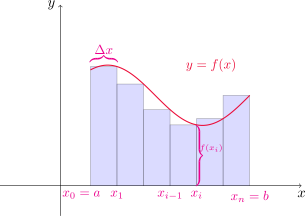{fig-align="center" width=60%}

Esta aproximación parece mejorar conforme tomamos $n$ cada vez más grande, como vemos en la siguiente figura.

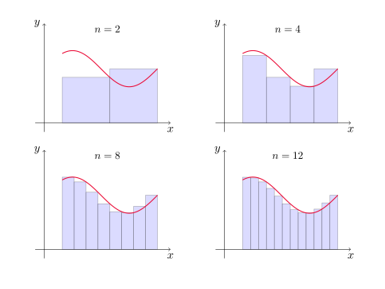{fig-align="center" width=70%}

::: {.callout-note title="Definición (Área)"}

El **área** $A$ de la región $S$ dada por la expresión

$$
S=\{x\in\mathbb{R}^2: 0\leq y\leq f(x),\quad a\leq x\leq b\},
$$

donde $f$ es continua y no negativa en $[a,b]$, se define como

$$
A=\lim_{n\to \infty} R_n=\lim_{n\to \infty} \sum_{i=1}^n f(x_i)\Delta x,
$$

siendo $\Delta x=(b-a)/n$ y $x_i=a+i\Delta x$ para $0\leq i\leq n$.

:::

Es posible demostrar que el límite de arriba siempre existe cuando $f$ es continua en $[a,b]$. Más aún, si consideramos rectángulos cuyas alturas sean las imágenes por $f$ de los extremos izquierdos de cada intervalo obtenemos el mismo resultado.  Es decir

$$
A=\lim_{n\to \infty} L_n=\lim_{n\to \infty} \sum_{i=0}^{n-1} f(x_i)\Delta x.
$$

Más aún, el valor del límite no cambia si en cada subintervalo $[x_{i-1},x_i]$ elegimos un punto cualquiera $x_i^*$ del intervalo. Estos puntos se llaman **puntos muestra** y la expresión del área en este caso se escribe

$$
A=\lim_{n\to \infty} \sum_{i=1}^{n} f(x_i^*)\Delta x.
$$

### El problema de la distancia

Supongamos que intentamos conocer la distancia recorrida por un objeto que se mueve con una velocidad $v$ dada. Por ejemplo, si un automóvil viaja a $30$ km/h durante media hora, en este período recorre

$$
30 \,\frac{\mathrm{km}}{\mathrm{h}} \cdot 0.5\, \mathrm{h}  = 15\,\mathrm{km}. 
$$

Observar que si graficamos la velocidad en función del tiempo, esto equivale a calcular el área debajo del gráfico de $v$ entre $t=0$ y $t=0.5$.

En general, supongamos que el objeto se mueve con velocidad $v=f(t)$, donde
$a\leq t\leq b$ y $f(t)\geq 0$, de modo que el objeto siempre se mueve en la dirección positiva.

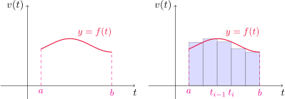{fig-align="center" width=70%}

Dado $n\in\mathbb{N}$, subdividimos el intervalo $[a,b]$ en $n$ subintervalos $[t_{i-1},t_i]$, con $1\leq i\leq n$ de igual longitud $\Delta t=(b-a)/n$ y aproximamos la distancia recorrida en cada subintervalo por el producto $f(t_{i-1})\Delta t$. La distancia total recorrida aproximada en el intervalo $[a,b]$ será

$$
f(t_0)\Delta t+f(t_1)\Delta t+\dots+f(t_{n-1})\Delta t=\sum_{i=0}^{n-1}f(t_{i})\Delta t.
$$

Si en lugar de estimar la velocidad en los extremos izquierdos de cada subintervalo lo hacemos con los derechos, obtenemos la aproximación

$$
f(t_1)\Delta t+f(t_2)\Delta t+\dots+f(t_{n})\Delta t=\sum_{i=1}^{n}f(t_{i})\Delta t.
$$

La distancia recorrida **exacta** $d$ la encontramos tomando el límite de cualquiera de las expresiones anteriores cuando $n\to\infty$, es decir

$$
d=\lim_{n\to \infty} \sum_{i=0}^{n-1}f(t_{i})\Delta t=\lim_{n\to \infty} \sum_{i=1}^{n}f(t_{i})\Delta t.
$$

Es decir, podemos interpretar la distancia total recorrida por el objeto en el intervalo de tiempo $[a,b]$ como el área debajo del gráfico de la función velocidad del mismo, entre $t=a$ y $t=b$.

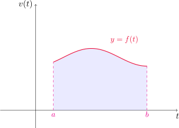{fig-align="center" width=60%}

[↑ Volver al inicio de la sección](#seccion_5.1)

## 5.2. La integral definida {#seccion_5.2}

Hemos visto que cuando intentamos calcular el área de una región como la (-@eq-regionS) o la distancia recorrida por un objeto sabiendo su función velocidad, aparece naturalmente un límite de la forma

$$
\lim_{n\to \infty} \sum_{i=1}^{n} f(x_i^*)\Delta x.
$$

::: {.callout-note title="Definición (Integral definida)"}

Si $f$ es una función continua definida para $a\leq x\leq b$, dividimos el intervalo $[a,b]$
en $n$ subintervalos de igual ancho $\Delta x=(b-a)/n$. Si $x_i=a+i\Delta x$, para $0\leq i\leq n$ y elegimos un punto muestra $x_i^*$ en cada subintervalo $[x_{i-1},x_i]$ para $1\leq i\leq n$, entonces la **integral definida de $f$ desde $a$ hasta $b$**, es

$$
\int_a^b f(x)\,dx=\lim_{n\to \infty} \sum_{i=1}^n f(x_i^*)\Delta x,
$$

siempre que este límite exista. Cuando es el caso, decimos que $f$ es **integrable** sobre $[a,b]$.

:::

Algunas observaciones:

- El símbolo $\int$ se llama **símbolo integral**, y fue introducido por Leibniz. El mismo recuerda a una "S" alargada, dado que la integral es un límite de sumas. 

- En la expresión $\displaystyle \int_a^b f(x)\,dx$, $f(x)$ se llama **integrando**, $a$ y $b$ 
son los **límites superior** e **inferior** de integración, respectivamente. El símbolo $dx$ no 
representa nada por sí mismo, sino que indica que la variable respecto a la que integramos es 
$x$.

- Si existe la integral definida $\displaystyle \int_a^b f(x)\,dx$, entonces es un número, que no depende de $x$. En este sentido, la variable de integración es "muda" y cualquiera de estas expresiones
$$
\int_a^b f(x)\,dx \qquad \int_a^b f(t)\,dt \qquad \int_a^b f(r)\,dr 
$$
puede usarse para denotar a ese número.

- La suma $\displaystyle \sum_{i=1}^n f(x_i^*)\Delta x$ se conoce como **suma de Riemann**.

Cuando $f$ es una función positiva, la suma de Riemann puede interpretarse como la suma de las áreas de los rectángulos de aproximación.

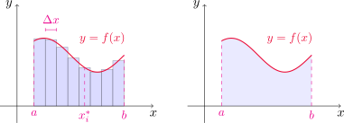{fig-align="center" width=70%}

Al comparar las definiciones de integral definida con la de área dada en la [sección](#seccion_5.1) anterior, podemos interpretar la integral definida $\displaystyle \int_a^b f(x)\,dx$ como el área debajo del gráfico de $y=f(x)$, entre $x=a$ y $x=b$.

Si $f$ toma valores tanto positivos como negativos, entonces la suma
de Riemann es la suma de las áreas de los rectángulos que se encuentran arriba del eje $x$ y
los negativos de las áreas de los rectángulos que están debajo del eje $x$. 

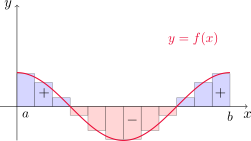{fig-align="center" width=50%}

Una integral definida puede interpretarse entonces como un **área neta**, es decir, una diferencia de áreas

$$
\int_a^b f(x)\,dx=A_1-A_2,
$$

siendo $A_1$ el área de la región arriba del eje $x$ y debajo de la gráfica de $f$, y $A_2$ corresponde a la región debajo del eje $x$ y arriba de la gráfica de $f$.

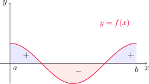{fig-align="center" width=50%}

::: {.theorem}

Teorema

Si $f$ es continua en $[a, b]$, o si $f$ tiene únicamente un número finito
de saltos discontinuos en el intervalo, entonces $f$ es integrable en $[a, b]$. Es decir, la integral definida 

$$
\int_a^b f(x)\,dx
$$
existe.

:::

Si $f$ es integrable en $[a,b]$, entonces el límite 

$$
\lim_{n\to \infty} \sum_{i=1}^n f(x_i*)\Delta x
$$

existe independientemente de la elección de los puntos muestra $x_i^*$. En muchas ocasiones solemos considerar $x_i^*=x_i$, es decir, como el extremo derecho de cada subintervalo, para simplificar los cálculos. Esto nos permite enunciar el siguiente resultado.

::: {#teo-puntosder .theorem}

Teorema

Si $f$ es integrable en $[a, b]$, entonces

$$
\int_a^b f(x)\,dx=\lim_{n\to \infty} \sum_{i=1}^n f(x_i)\Delta x,
$$

donde 

$$
\Delta x = \frac{b-a}{n} \quad \text{ y }\quad x_i=a+i\Delta x, \quad 0\leq i\leq n.
$$
:::

Las siguientes fórmulas resultan de utilidad para el cálculo de integrales por definición.

::: {#form-sumas .formula-box}
$$
\begin{aligned}
\sum_{i=1}^n i &= \frac{n(n+1)}{2} \quad \text{ (suma de números consecutivos) }\\
\\
\sum_{i=1}^n i^2 &= \frac{n(n+1)(2n+1)}{6} \quad \text{ (suma de cuadrados de números consecutivos) }\\
\\
\sum_{i=1}^n i^3 &= \left[\frac{n(n+1)}{2}\right]^2 \quad \text{ (suma de cubos de números consecutivos) }
\end{aligned}
$$

:::

::: {.example-box}

Ejemplo

Evaluar $\displaystyle \int_0^3 (x^3-6x)\,dx$ utilizando la definición de integral.
:::

::: {.callout-tip collapse="true"}
## Solución

Dado $n\in\mathbb{N}$, definimos $\Delta x=(3-0)/n=3/n$ y $x_i=0+i\Delta x=3i/n$, para $1\leq i\leq n$. 

Calculamos primero

$$
\begin{aligned}
R_n=\sum_{i=1}^n f(x_i)\Delta x=\sum_{i=1}^n \left[\left(\frac{3i}{n}\right)^3-6\frac{3i}{n}\right]\frac{3}{n}&=\frac{81}{n^4}\sum_{i=1}^n i^3-\frac{54}{n^2}\sum_{i=1}^n i\\
\\
&=\frac{81}{n^4} \left[\frac{n(n+1)}{2}\right]^2-\frac{54}{n^2}\frac{n(n+1)}{2}\\
\\
&=\frac{81}{4} \left(\frac{n+1}{n}\right)^2-27\frac{n+1}{n},
\end{aligned}
$$

donde hemos usado los resultados de la [fórmula para las sumas](#form-sumas) de arriba. Por el [teorema](#teo-puntosder) anterior, tenemos que 

$$
\int_0^3 (x^3-6x)\,dx=\lim_{n\to \infty} \sum_{i=1}^n f(x_i)\Delta x= \lim_{n\to \infty} \left[\frac{81}{4} \left(\frac{n+1}{n}\right)^2-27\frac{n+1}{n}\right]=\frac{81}{4} \cdot 1^2-27\cdot 1=-\frac{81}{12}.
$$

> [Gráfico]

:::

::: {.example-box}

Ejemplo

Evaluar las siguientes integrales, interpretándolas como un área.

1. $\displaystyle \int_0^1 \sqrt{1-x^2}\,dx$.

2. $\displaystyle \int_0^3 (x-1)\,dx$.

:::

::: {.callout-tip collapse="true"}
## Solución

Para la primera escribimos $y=\sqrt{1-x^2}$, de donde se tiene la relación $x^2+y^2=1$. Como $y\geq 0$, entonces el gráfico de $f$ es la mitad superior de la circunferencia con centro en $(0,0)$ y radio 1. Como la integral es entre 0 y 1, el área debajo del gráfico y sobre el eje $x$ corresponde al de un cuarto de la circunferencia. Por lo tanto 

$$
\int_0^1 \sqrt{1-x^2}\,dx = \frac{1}{4} \pi \cdot 1^2 =\frac{\pi}{4}.
$$

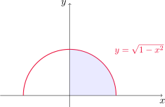{fig-align="center" width=45%}

Para la segunda función, observemos que $y(x)=x-1$ es no positiva para $0\leq x\leq 1$ y no negativa para $1\leq x\leq 3$. Entonces la integral resulta ser una diferencia de áreas, la del triángulo por arriba del eje $x$ menos la del que se encuentra por debajo. Es decir

$$
\int_0^3 (x-1)\,dx = A_1-A_2=\frac{2\cdot 2}{2}-\frac{1\cdot 1}{2}=2-\frac{1}{2}=\frac{3}{2}. 
$$

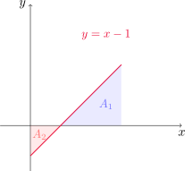{fig-align="center" width=40%}

:::

### Propiedades de la integral definida

Al definir la integral $\int_a^b f(x)\,dx$ hemos supuesto que $a<b$, pues trabajamos con el intervalo $[a,b]$. Sin embargo, las sumas de Riemann pueden calcularse aún cuando $a>b$, y en tal caso $\Delta x$ cambia de signo. Por este motivo, resulta que 

::: {.formula-box}

$$
\int_b^a f(x)\,dx=-\int_a^b f(x)\,dx.
$$

:::

Por otro lado, si $a=b$ entonces $\Delta x=0$ y en consecuencia

::: {.formula-box}

$$
\int_a^a f(x)\,dx=0.
$$

:::

En el siguiente teorema enunciamos otras propiedades adicionales de la integral.

::: {#teo-propiedades-integraldef .theorem}

Propiedades de la integral definida

Sean $f$ y $g$ funciones continuas y $c$ un número real. Entonces

1. $\displaystyle \int_a^b c\,dx =c(b-a)$.

2. $\displaystyle \int_a^b (f(x)+g(x))\,dx =\int_a^b f(x)\,dx+\int_a^b g(x)\,dx$.

3. $\displaystyle \int_a^b (cf(x))\,dx=c\int_a^b f(x)\,dx$.

4. $\displaystyle \int_a^b (f(x)-g(x))\,dx =\int_a^b f(x)\,dx-\int_a^b g(x)\,dx$.

5. $\displaystyle \int_a^b f(x)\,dx  =\int_a^c f(x)\,dx+\int_c^b f(x)\,dx$, para cualesquiera $a,b$ y $c$ en $\mathbb{R}$.

:::

::: {.example-box}

Ejemplo

Evaluar la integral $\displaystyle \int_0^1 (4+3x^2)\,dx$ utilizando propiedades.

:::

::: {.callout-tip collapse="true"}
## Solución

Utilizando las [propiedades](#teo-propiedades-integraldef) (2), (1) y (3) de la integral definida, obtenemos 

$$
\int_0^1 (4+3x^2)\,dx = \int_0^1 4\,dx+\int_0^1 (3x^2)\,dx=4(1-0)+3\int_0^1 x^2\,dx=3+3\cdot \frac{1}{3}=4, 
$$

donde hemos usado también que $\displaystyle \int_0^1 x^2\,dx=\frac{1}{3}$, resultado que obtuvimos en el Ejemplo 1 de la [Sección 5.1](#seccion_5.1).

:::

A continuación veremos algunas propiedades de comparación de integrales definidas. 

::: {#teo-comparacion-integraldef .theorem}

Propiedades de comparación de la integral definida

Sean $f$ y $g$ funciones integrables en $[a,b]$, con $a\leq b$.

1. Si $f(x)\geq 0$ en $[a,b]$, entonces $\displaystyle\int_a^b f(x)\,dx\geq 0$.

2. Si $f(x)\geq g(x)$ en $[a,b]$, entonces $\displaystyle \int_a^b f(x)\,dx \geq \int_a^b g(x)\,dx$. 

3. Si $m\leq f(x)\leq M$ en $[a,b]$, entonces $\displaystyle m(b-a)\leq \int_a^b f(x)\,dx \leq M(b-a)$.

:::

::: {.example-box}

Ejemplo

Estimar el valor de la integral $\displaystyle \int_0^1 e^{-x^2}\,dx$ utilizando propiedades de comparación.

:::

::: {.callout-tip collapse="true"}
## Solución

Observemos que $f(x)=e^{-x^2}$ es función decreciente en $[0,1]$. Por lo tanto su máximo absoluto se alcanza en el extremo izquierdo $x=0$ y su mínimo absoluto en el extremo derecho, $x=1$. De esta manera

$$
e^{-1}\leq e^{-x^2}\leq 1 \quad \text{ para todo } x\in [0,1].
$$

Utilizando la [propiedad](#teo-comparacion-integraldef) (3) de comparación resulta

$$
e^{-1}(1-0)\leq \int_0^1 e^{-x^2}\,dx\leq 1(1-0).
$$

Dado que $e^{-1}\approx 0.3679$, obtenemos la estimación 

$$
0.367\leq \int_0^1 e^{-x^2}\,dx\leq 1.
$$

:::

[↑ Volver al inicio de la sección](#seccion_5.2)

## 5.3. El teorema fundamental del cálculo {#seccion_5.3}

En esta sección veremos cómo se relacionan dos problemas en apariencia muy distintos: el de encontrar la recta tangente a una curva dada y el de calcular el área de cierta región general en el plano.

Comencemos considerando una función continua $f$ en un intervalo $[a,b]$, y definimos la función 

$$
g(x)=\int_a^x f(t)\,dt.
$$

Notemos que si $a\leq x\leq b$ está fijo, entonces $\displaystyle \int_a^x f(t)\,dt$ es un número, que depende del valor que tome $x$. Si dejamos que $x$ se mueva sobre todo el intervalo, obtenemos la función $g$. Notemos también que hemos utilizado $t$ como variable de integración, para no confundir con $x$ que es el límite superior en la integral.

En el caso particular en que $f$ sea no negativa en el intervalo $[a,b]$, $g(x)$ da el área de la región debajo del gráfico de $f$, entre $a$ y $x$.

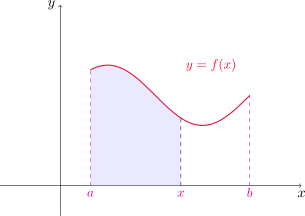{fig-align="center" width=50%}

Consideremos ahora un ejemplo concreto. Si $f(x)=x$ sobre el intervalo $[0,1]$, entonces podemos verificar usando la definición de integral que 

$$
g(x)=\int_0^x t\,dt= \frac{x^2-0^2}{2}=\frac{1}{2}x^2.
$$

Entonces notamos que $g'(x)=x=f(x)$, es decir, la función $g$ tiene como derivada a la función $f$ de la que partimos. En este caso decimos que $g$ es una **antiderivada** de $f$.

::: {.callout-note title="Definición (Antiderivada o primitiva)"}

Dada una función $f$, decimos que la función $F$ es una **antiderivada** o **primitiva** de $f$ en un intervalo $I$ si $F'(x)=f(x)$ para todo $x$ del intervalo.

:::

Notemos que si $F$ es una antiderivada de una función $f$, entonces $G(x)=F(x)+C$ también es una antiderivada de $f$ para cualquier constante $C$, pues 

$$
G'(x)=(F(x)+C)'=F'(x)+C'=f(x)+0=f(x).
$$

Si $F$ es cualquier antiderivada de $f$ en el intervalo $I$, entonces $F(x)+C$ se denomina **antiderivada general** de $f$ en $I$.

Volviendo al ejemplo anterior, ¿es una casualidad que $g'=f$? La respuesta es no, y esta importante relación forma parte del teorema fundamental del cálculo que enunciaremos a continuación.

::: {#teo-TFC1 .theorem}

Teorema fundamental del cálculo - Parte I

Si $f$ es continua en $[a,b]$, entonces la función $g$ definida por
$$
g(x) = \int_a^x f(t) \, dt \quad \text{ para } a \leq x \leq b,
$$
es continua en $[a,b]$, derivable en $(a,b)$, y además $g'(x) = f(x)$ para todo $x\in (a,b)$.

:::

Con la notación de Leibniz de los diferenciales, podemos reescribir la igualdad $g'(x)=f(x)$ como 

::: {.formula-box}

$$
\frac{d}{dx}\left(\int_a^x f(t)\,dt\right)=f(x).
$$

:::

Observar que la primera parte del teorema fundamental del cálculo puede ser reescrita de la siguiente manera: si $f$ es continua en $[a,b]$, entonces la función 

$$
g(x)=\int_a^x f(t)\,dt
$$

resulta ser una antiderivada de $f$ en $(a,b)$. Como consecuencia, inferimos que **toda función continua tiene una antiderivada**, hecho que puede resultar útil en muchas ocasiones.

En la siguiente tabla podemos encontrar las antiderivadas de algunas funciones básicas que aparecen con frecuencia en la práctica.

::: {#tabla-antiderivadas .math-table}

| Función $f$ |  Antiderivada $F$ | 
| --- | --- |
| $k$ | $kx+C$ |
| $x^n$, $n\neq -1$ | $\displaystyle\frac{x^{n+1}}{n+1}+C$
| $\displaystyle\frac{1}{x}$ | $\ln|x|+C$ | 
| $e^x$ | $e^x+C$ | 
| $a^x$, $a>0$ | $\displaystyle\frac{a^x}{\ln a} + C$ |
| $\sin x$ | $-\cos x + C$ |
| $\cos x$ | $\sin x + C$ |
|$\sec^2 x$ | $\tan x + C$ |
|$\csc^2 x$ | $-\cot x + C$ |
|$\sec x \tan x$ | $\sec x + C$ |
|$\csc x \cot x$ | $-\csc x + C$ |
|$\displaystyle \frac{1}{\sqrt{1 - x^2}}$ | $\arcsin x + C$ |
|$\displaystyle\frac{-1}{\sqrt{1 - x^2}}$ | $\arccos x + C$ |
|$\displaystyle \frac{1}{1 + x^2}$ | $\arctan x + C$ |

:::	

::: {.example-box}

Ejemplo

Calcular la derivada de la función $\displaystyle g(x)=\int_0^x \sqrt{1+t^2}\,dt$.

:::

::: {.callout-tip collapse="true"}
## Solución

Dado que $f(t)=\sqrt{1+t^2}$ es continua en $\mathbb{R}$, en particular lo es en cualquier intervalo cerrado, y utilizando la primera parte del [teorema fundamental del cálculo](#teo-TFC1) resulta 

$$
\frac{dg}{dx}(x)=\frac{d}{dx}\left(\int_0^x \sqrt{1+t^2}\,dt\right)=f(x)=\sqrt{1+x^2}.
$$

:::

::: {#teo-TFC2 .theorem}

Teorema fundamental del cálculo - Parte II

Si $f$ es continua en $[a,b]$, entonces

$$
\int_a^b f(x)\,dx=F(b)-F(a),
$$

donde $F$ es una antiderivada de $f$ en $(a,b)$, es decir, $F'(x)=f(x)$ para $x\in (a,b)$.

:::

Esta segunda parte del teorema fundamental del cálculo establece que si se conoce una antiderivada $F$ de $f$ en $(a,b)$, entonces la integral definida $\displaystyle \int_a^b f(x)\,dx$ puede calcularse simplemente calculando la diferencia de los valores de la función $F$ en los extremos del intervalo. A este teorema también se lo conoce comúnmente como **regla de Barrow**. En muchas ocasiones escribiremos 

$$
F(x)\Big{]}_a^{b}=F(x)\Big{]}_{x=a}^{x=b}
$$

para denotar a la diferencia $F(b)-F(a)$.

::: {.example-box}

Ejemplo

Evaluar la integral $\displaystyle \int_1^3 e^x\,dx$.

:::

::: {.callout-tip collapse="true"}
## Solución

Sabemos que $f(x)=e^x$ es continua en $\mathbb{R}$, con lo cual es continua en $[1,3]$. Además, como $(e^x)'=e^x$, la misma $f$ es una antiderivada de sí misma. Utilizando la segunda parte del [teorema fundamental del cálculo](#teo-TFC2) obtenemos 

$$
\int_1^3 e^x\,dx=e^x \Big{]}_{1}^{3} = e^3-e^1=e^3-e.
$$

:::

::: {.example-box}

Ejemplo

Encontrar la derivada de la función $\displaystyle \int_1^{x^4} \sec t\,dt$.

:::

::: {.callout-tip collapse="true"}
## Solución

Observar que $f(t)=\sec t$ es continua en todo $\mathbb{R}$ excepto donde $\cos t=0$, es decir, $t=(2n+1)\pi/2$, con $n\in\mathbb{Z}$. Como $1\in (-\pi/2,\pi/2)$, vamos a suponer que $x^4$ también se encuentra en este intervalo, para poder integrar una función continua. Es decir, supongamos que $x\in (-\sqrt[4]{\pi/2},\sqrt[4]{\pi/2})$. Por la primera parte del teorema fundamental del cálculo sabemos que existe $F$ una antiderivada de $f$. Aplicando la segunda parte 

$$
\int_1^{x^4} \sec t\,dt=F(t)\Big{]}_{1}^{x^4}=F(x^4)-F(1).
$$

Ahora bien, como queremos calcular la derivada de esta integral, utilizamos la regla de la cadena y el hecho de que $F'=f$ para escribir

$$
\frac{d}{dx}\left(\int_1^{x^4} \sec t\,dt\right)=\frac{d}{dx}\left(F(x^4)-F(1)\right)=F'(x^4) (x^4)'-0=4x^3 \,\sec(x^4).
$$

:::

::: {.example-box}

Ejemplo

Calcular $\displaystyle \int_3^{6} \frac{1}{x}\,dx$.

:::

::: {.callout-tip collapse="true"}
## Solución

Dado que $f(x)$ es continua en $[3,6]$, podemos aplicar la segunda parte del [teorema fundamental del cálculo](#teo-TFC2). Según vimos en la [tabla de antiderivadas](#tabla-antiderivadas), una antiderivada para $f$ es $F(x)=\ln |x|$, con lo cual 

$$
\int_3^{6} \frac{1}{x}\,dx= \ln x\Big{]}_{3}^{6}=\ln 6-\ln 3=\ln 2.
$$

:::

::: {.example-box}

Ejemplo

Calcular el área debajo de la curva $f(x)=\cos x$, desde $x=0$ hasta $x=b$, con $0\leq b\leq \pi/2$.

:::

::: {.callout-tip collapse="true"}
## Solución

Sea $0\leq b\leq \pi/2$. Dado que $f(x)\geq 0$ en $[0,\pi/2]$, el área pedida está dada por la integral definida 

$$
\int_0^b \cos x\,dx.
$$

Una [antiderivada](#tabla-antiderivadas) para $f$ es $F(x)=\operatorname{sen} x$, con lo cual 

$$
\int_0^b \cos x\,dx=\operatorname{sen} x\Big{]}_{0}^b=\operatorname{sen} b-\operatorname{sen} 0=\operatorname{sen} b.
$$

:::

::: {.example-box}

Ejemplo

¿Por qué es incorrecto el siguiente cálculo?

$$
\int_{-1}^3 \frac{1}{x^2}\,dx = \left(-\frac{1}{x}\right)\Bigg{]}_{-1}^{3}=-\frac{1}{3}-\left(-\frac{1}{-1}\right)=-\frac{4}{3}.
$$

:::

::: {.callout-tip collapse="true"}
## Solución

Es incorrecto aplicar la segunda parte del [teorema fundamental del cálculo](#teo-TFC2), puesto que la función $f(x)=\frac{1}{x^2}$ no es continua en el intervalo $[-1,3]$, ya que tiene un salto infinito en $x=0$. En este caso, la integral se llama **impropia** y este tipo de situaciones lo estudiaremos más adelante.

:::

[↑ Volver al inicio de la sección](#seccion_5.3)

## 5.4. Integrales indefinidas y el teorema del cambio total {#seccion_5.4}

### Integrales indefinidas

Recordando las dos partes del teorema fundamental del cálculo, la primera de ellas establece que toda función continua $f$ tiene una antiderivada dada por la expresión

$$
\int_a^x f(t)\,dt,
$$

mientras que la segunda asegura que el valor de la integral definida 

$$
\int_a^b f(x)\,dx
$$

puede encontrarse haciendo $F(b)-F(a)$, donde $F$ es una antiderivada de $f$. Ahora vamos a introducir una notación para las antiderivadas o primitivas de una función dada. Escribiremos 
$\displaystyle \int f(x)\,dx$ para simbolizar a una antiderivada de $f$, y la llamaremos **integral indefinida**. Es decir 

$$
\int f(x)\,dx=F(x) \quad \text{ significa que }\quad F'(x)=f(x).
$$

Por ejemplo, 

$$
\int x^2\,dx =\frac{1}{3}x^3+C
$$
siendo $C$ cualquier constante real, dado que al sumar cualquier constante a una antiderivada de $f$ obtenemos otra antiderivada (pues la derivada de las constantes es cero).

::: {.callout-caution title="Importante"}
No confundir una integral definida con una indefinida. Por un lado, tenemos que $\int_a^b f(x)\,dx$ es un número, mientras que $\int f(x)\,dx$ es una familia de funciones de la forma $F(x)+C$, siendo $F'=f$. La relación entre ambas la da la segunda parte del [teorema fundamental del cálculo](#teo-TFC2)

$$
\int_a^b f(x)\,dx =\left(\int f(x)\,dx\right)\Bigg{]}_a^b.
$$

:::	

Con esta nueva notación, podemos reescribir la tabla de antiderivadas de la sección anterior como sigue. 

::: {#form-int-indefinidas .formula-box}

1. $\displaystyle \int kf(x)\,dx=k\int f(x)\, dx$.

2. $\displaystyle \int (f(x)+g(x))\,dx=\int f(x)\, dx+\int g(x)\,dx$.

::: {.columns}

::: {.column width="50%"}

3. $\displaystyle \int k\,dx=kx+C$.

4. $\displaystyle \int x^n\,dx=\frac{x^{n+1}}{n+1}+C$, $n\neq -1$.

5. $\displaystyle \int e^x\,dx=e^x+C.$

6. $\displaystyle \int a^x\,dx=\frac{a^x}{\ln a}+C$, $a>0, a\neq 1$.

7. $\displaystyle \int \operatorname{sen} x\,dx=-\cos x+C$.

8. $\displaystyle \int \cos x\,dx=\operatorname{sen} x+C$.

9. $\displaystyle \int \sec^2 x\,dx=\tan x+C$.

:::

::: {.column width="50%"}

10. $\displaystyle \int \csc^2 x\,dx=-\cot x+C$.

11. $\displaystyle \int \sec x\tan x\,dx=\sec x+C$.

12. $\displaystyle \int \csc x\cot x\,dx=-\csc x+C$.

13. $\displaystyle \int \frac{1}{\sqrt{1-x^2}}\,dx=\operatorname{arcsen} x+C$.

14. $\displaystyle \int \frac{-1}{\sqrt{1-x^2}}\,dx=\arccos x+C$.

15. $\displaystyle \int \frac{1}{1+x^2}\,dx=\arctan x+C$.
:::

:::

:::

Cuando escribamos la expresión 

$$
\int f(x)\,dx=F(x)+C
$$

recordemos que ésta siempre es válida en algún intervalo $I$, que por lo general omitimos.

::: {.example-box}

Ejemplo

Evaluar  $\displaystyle \int \frac{\cos \theta}{\operatorname{sen}^2 \theta}\,d\theta$.

:::

::: {.callout-tip collapse="true"}
## Solución

Primero escribimos 

$$
\frac{\cos \theta}{\operatorname{sen}^2 \theta}=\frac{1}{\operatorname{sen} \theta} \frac{\cos \theta}{\operatorname{sen} \theta}=\csc \theta \cot \theta.
$$

Aplicando la [fórmula](#form-int-indefinidas) (12) de antiderivadas obtenemos 

$$
\int \csc \theta \cot \theta\,d\theta=-\csc \theta + C.
$$

:::

::: {.example-box}

Ejemplo

Calcular  $\displaystyle \int_0^3 (x^3-6x)\,dx$.

:::

::: {.callout-tip collapse="true"}
## Solución

Aplicamos la segunda parte del [teorema fundamental del cálculo](#teo-TFC2) y las fórmulas (2), (3) y (4) de la [tabla de antiderivadas](#form-int-indefinidas) para obtener 

$$
\int_0^3 (x^3-6x)\,dx= \left(\frac{x^4}{4}-6\frac{x^2}{2}\right)\Bigg{]}_0^3=\frac{3^4}{4}-3\cdot 3^2 -\left(\frac{0^4}{4}-3\cdot 0^2\right)=\frac{81}{4}-27=-\frac{81}{12}.
$$

Notar que a este mismo valor habíamos llegado utilizando la definición de integral, en el Ejemplo 3 de la [Sección 5.2](#seccion_5.2).

:::

::: {.example-box}

Ejemplo

Evaluar la integral  $\displaystyle \int_1^9 \frac{2t^2+t^2\sqrt{t}-1}{t^2}\,dt$.

:::

::: {.callout-tip collapse="true"}
## Solución

Primero notemos que 

$$
\frac{2t^2+t^2\sqrt{t}-1}{t^2}=2+t^{1/2}-t^{-2}.
$$

Aplicamos las fórmulas (1), (2), (3) y (4) de la [tabla de antiderivadas](#form-int-indefinidas) para obtener 

$$
\begin{aligned}
\int_1^9  \frac{2t^2+t^2\sqrt{t}-1}{t^2}\,dt=\int_1^9 (2+t^{1/2}-t^{-2})\,dt &=\left(2t+\frac{2}{3}t^{3/2}+\frac{1}{t}\right)\Bigg{]}_1^9\\
\\
&=\left(2\cdot 9+\frac{2}{3}9^{3/2}+\frac{1}{9}\right)-\left(2\cdot 1+\frac{2}{3}1^{3/2}+\frac{1}{1}\right)\\
\\
&=\frac{325}{9}-\frac{11}{3}=\frac{292}{9}.
\end{aligned}
$$

:::

### Aplicaciones 

Recordemos nuevamente que la segunda parte del teorema fundamental del cálculo establece que si $f$ es continua en $[a,b]$, entonces 

$$
\int_a^bf(x)\,dx=F(b)-F(a),
$$

siendo $F$ cualquier antiderivada de $f$, es decir, cualquier función tal que $F'=f$. Pero entonces la igualdad de arriba puede reescribirse como 

$$
\int_a^bF'(x)\,dx=F(b)-F(a).
$$

Sabemos que $F'$ representa la relación de cambio de $y=F(x)$ con respecto a $x$, mientras que la diferencia $F(b)-F(a)$ representa el cambio total de la función $F$ en el intervalo $[a,b]$. En definitiva, la igualdad de arriba nos está diciendo que si integramos la relación de cambio de una función sobre un intervalo $[a,b]$, obtenemos el cambio total de la misma en el intervalo. 

El siguiente teorema es una reformulación de la segunda parte del teorema fundamental del cálculo en este contexto.

::: {.theorem}

Teorema del cambio total

La integral de la relación de cambio de una función, es el cambio total de la función. Es decir, 

$$
\int_a^bF'(x)\,dx=F(b)-F(a).
$$

:::

Si un objeto se mueve en línea recta con función de posición 
$s(t)$, entonces su velocidad es $v(t)=s'(t)$ y en consecuencia 

::: {.formula-box}

$$
\int_{t_1}^{t_2} v(t)\,dt=\int_{t_1}^{t_2} s'(t)\,dt=s(t_2)-s(t_1)
$$

:::

es el **cambio de la posición** o **desplazamiento** del objeto durante el periodo
de tiempo desde $t_1$ hasta $t_2$. 

Si queremos calcular la distancia recorrida durante el intervalo $[t_1,t_2]$ hay que considerar
los intervalos donde $v(t)\geq 0$ (la partícula se mueve hacia la derecha)
y también aquellos  donde $v(t)\leq 0$ (la partícula se mueve hacia la izquierda).

En ambos casos la distancia se calcula al integrar $|v(t)|$, la magnitud
de la rapidez. Por lo tanto, la **distancia total recorrida** es  

::: {.formula-box}

$$
d=\int_{t_1}^{t_2} |v(t)|\,dt.
$$

:::

En la siguiente figura vemos cómo interpretar el desplazamiento y la distancia recorrida
en términos de las áreas debajo de una curva de velocidad.

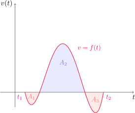{fig-align="center" width=50%}

El desplazamiento total en el intervalo $[t_1,t_2]$ viene dado por $\displaystyle\int_{t_1}^{t_2} f(t)\,dt=-A_1+A_2-A_3$, y la distancia total recorrida es $\displaystyle \int_{t_1}^{t_2} |f(t)|\,dt=A_1+A_2+A_3$.

::: {.example-box}

Ejemplo

Una partícula se mueve a lo largo de una recta de modo que su velocidad en metros por segundo
en el instante $t$ es $v(t)=t^2-t-6$.

- Encontrar el desplazamiento $\Delta$ de la partícula durante el periodo $1\leq t\leq 4$.
 
- Hallar la distancia $d$ recorrida durante este período.

:::

::: {.callout-tip collapse="true"}
## Solución

- Según vimos, el desplazamiento lo encontramos integrando la función velocidad. 

$$
\Delta=\int_1^4 v(t)\,dt=\int_1^4 (t^2-t-6)\,dt =\left(\frac{t^3}{3}-\frac{t^2}{2}-6t\right)\Bigg{]}_1^4=-\frac{9}{2}.
$$

- Para hallar la distancia total, primero factorizamos $t^2-t-6=(t-3)(t+2)$, con lo cual $v$ es negativa para $1\leq t<3$ y $v(t)\geq 0$ en el intervalo $[3,4]$. Por lo tanto 

$$
d=\int_1^4 |v(t)|\,dt=\int_1^3 (-v(t))\,dt+\int_3^4 v(t)\,dt=\int_1^3 (6+t-t^2)\,dt+\int_3^4 (t^2-t-6)\,dt=\frac{61}{6}.
$$

Por lo tanto, desde el primer al cuarto segundo de recorrido, la partícula se desplazó 4.5 m hacia la izquierda, y recorrió un total de aproximadamente 10.17 m.

:::

[↑ Volver al inicio de la sección](#seccion_5.4)

## 5.5. La regla de la sustitución {#seccion_5.5}

En esta sección veremos una forma de calcular integrales de muchas funciones que se escapan de los casos que aparecen en las tablas vistas hasta el momento. 

Si $F$ es una primitiva o antiderivada de $f$ y $g$ es una función derivable, entonces la composición $F\circ g$ es una primitiva de $f(g(x))g'(x)$. En efecto, utilizando la regla de la cadena

$$
\frac{d}{dx}\left(F(g(x))\right)=\frac{dF}{dx}(g(x))\frac{dg}{dx}(x)=F'(g(x))
g'(x)=f(g(x))g'(x).
$$

En términos de integrales indefinidas, la igualdad de arriba puede expresarse como 

$$
\int f(g(x))g'(x)\,dx=F(g(x))+C.
$$

Si llamamos $u=g(x)$ entonces tenemos que $\displaystyle \frac{du}{dx}(x)=g'(x)$ y entonces podemos reescribir lo anterior como 

$$
\int f(u)\frac{du}{dx}\,dx=F(u)+C=\int f(u)\,du.
$$

En definitiva, si tenemos una integral de la forma $\int f(g(x))g'(x)\,dx$ podemos transformarla en la integral $\int f(u)\,du$ haciendo la **sustitución** o **cambio de variable** $u=g(x)$. 

::: {#teo-regla-sustitucion .theorem}

Regla de sustitución

Si $u=g(x)$ es una función derivable con rango $I$ y $f$ es continua sobre $I$, entonces

$$
\int f(g(x))g'(x)\,dx=\int f(u)\,du
$$

:::

Por ejemplo, si queremos calcular 

$$
\int 2x \sqrt{1+x^2}\, dx
$$

escribimos $f(x)=\sqrt{x}$ y $g(x)=1+x^2$, con lo que la integral anterior resulta  

$$
\int f(g(x))g'(x)\, dx.
$$

En vistas de la [regla de sustitución](#teo-regla-sustitucion), si $u=g(x)=1+x^2$ podemos escribir 

$$
\begin{aligned}
\int 2x \sqrt{1+x^2}\, dx=\int f(g(x))g'(x)\, dx=\int f(u)\,du=\int \sqrt{u}\,du&=\frac{2}{3}u^{3/2}+C\\
\\
&=\frac{2}{3}(1+x^2)^{3/2}+C.
\end{aligned}
$$

Una manera común de denotar esta sustitución en la práctica es la siguiente: si $u=1+x^2$, entonces $du=g'(x)\,dx=2x\,dx$, entonces sustituyendo directamente en la integral definida resulta

$$
\int 2x \sqrt{1+x^2}\, dx=\int \sqrt{u}\,du.
$$

::: {.example-box}

Ejemplo

Calcular la integral indefinida
$$
\int x^3 \cos(x^4+2)\, dx.
$$

:::

::: {.callout-tip collapse="true"}
## Solución

Haciendo la sustitución  $u = x^4 + 2$ resulta que $du=4x^3\,dx$, o equivalentemente $\displaystyle  x^3\,dx = \tfrac{1}{4}\,du$. De esta manera 

$$
\int x^3 \cos(x^4+2)\, dx = \tfrac{1}{4} \int \cos(u)\,du=\operatorname{sen} u+C=\operatorname{sen}(x^4+2)+C.
$$

:::

::: {.example-box}

Ejemplo

Calcular $\displaystyle \int \frac{x}{\sqrt{1-4x^2}}\,dx$.

:::

::: {.callout-tip collapse="true"}
## Solución

En este caso parece razonable sustituir el polinomio dentro de la raíz por una nueva variable, ya que su derivada será de la forma $ax$, y aparece en el numerador. Escribiendo $u=1-4x^2$ tenemos que $du=-8x\,dx$. Esta expresión no coincide exactamente con el numerador, pero podemos hacerla aparecer multiplicando y dividiendo por $-8$. En definitiva 

$$
\begin{aligned}
\int \frac{x}{\sqrt{1-4x^2}}\,dx=-\frac{1}{8}\int \frac{-8x}{\sqrt{1-4x^2}}\,dx=-\frac{1}{8}\int \frac{du}{\sqrt{u}}=-\frac{1}{8} \int u^{-1/2}\,du& =-\frac{1}{8} 2u^{1/2}+C\\
\\
&=-\frac{1}{4}\sqrt{1-4x^2}+C.
\end{aligned}
$$

:::

::: {.example-box}

Ejemplo

Evaluar $\displaystyle \int \sqrt{1+x^2}\,x^5\,dx$.

:::

::: {.callout-tip collapse="true"}
## Solución

Si llamamos $u=1+x^2$, resulta que $du=2x\,dx$. Como el factor que acompaña a la raíz es $x^5$, reescribimos $x^5=x^4\cdot x=(x^2)^2\cdot x$, con lo cual 

$$
\begin{aligned}
\int \sqrt{1+x^2}\,x^5\,dx=\int\sqrt{1+x^2}\,(x^2)^2\cdot x \,dx
&=\frac{1}{2}\int \sqrt{u} (u-1)^2\,du\\
\\
&=\frac{1}{2}\int \sqrt{u}(u^2-2u+1)\,du\\
\\
&=\frac{1}{2}\int(u^{5/2}-2u^{3/2}+u^{1/2})\,du\\
\\
&=\frac{1}{2}\left(\frac{2}{7}u^{7/2}-\frac{4}{5}u^{5/2}+\frac{2}{3}u^{3/2}\right)+C\\
\\
&=\frac{1}{7}(1+x^2)^{7/2}-\frac{2}{5}(1+x^2)^{5/2}+\frac{1}{3}(1+x^2)^{3/2}+C.
\end{aligned}
$$

:::

::: {.example-box}

Ejemplo

Calcular $\displaystyle \int \tan x\,dx$.

:::

::: {.callout-tip collapse="true"}
## Solución

Si escribimos $\displaystyle \tan x=\frac{\operatorname{sen} x}{\cos x}$, entonces podemos hacer la sustitución $u=\cos x$, con lo cual $du=-\operatorname{sen} x\,dx$. Por lo tanto 

$$
\int \tan x\,dx=\int \frac{\operatorname{sen} x}{\cos x}\,dx =-\int \frac{du}{u}=-\ln|u|+C=-\ln|\cos x|+C=\ln|\sec x|+C.
$$

:::

### Sustitución para integrales definidas

Cuando trabajemos con integrales definidas también es posible aplicar la regla de sustitución. Por ejemplo, si quisiéramos calcular  

$$
\int_0^1 2x\sqrt{1+x^2}\,dx,
$$

hemos visto que 

$$
\int 2x\sqrt{1+x^2}\,dx=\frac{2}{3}(1+x^2)^{3/2}+C
$$

por lo que utilizando el teorema fundamental del cálculo, resultaría 

$$
\int_0^1 2x\sqrt{1+x^2}\,dx=\left(\frac{2}{3}(1+x^2)^{3/2}\right)\Bigg{]}_{0}^1=\frac{2}{3}(1+1^2)^{3/2}-\frac{2}{3}(1+0^2)^{3/2}=\frac{2}{3}(2\sqrt{2}-1).
$$

Sin embargo, si queremos hacer todo en un sólo cálculo, es preciso **cambiar** los extremos de integración en función de la sustitución hecha, como establece la siguiente regla.

::: {#teo-sustitucion-definida .theorem}

Regla de sustitución para integrales definidas

Si $g'$ es continua en $[a,b]$ y $f$ es continua sobre el rango de $g$, entonces

$$
\int_a^b f(g(x))g'(x)\,dx=\int_{g(a)}^{g(b)} f(u)\,du.
$$

:::

Si calculamos ahora $\displaystyle \int_0^1 2x\sqrt{1+x^2}\,dx$ usando esta regla, como $u=g(x)=1+x^2$, tenemos que $g(0)=1$ y $g(1)=2$ 

$$
\int_0^1 2x\sqrt{1+x^2}\,dx=\int_1^2 \sqrt{u}\,du =\frac{2}{3}u^{3/2}\Big{]}_1^2=\frac{2}{3}\left(2^{3/2}-1^{3/2}\right)=\frac{2}{3}\left(2\sqrt{2}-1\right).
$$

::: {.example-box}

Ejemplo

Evaluar $\displaystyle \int_0^4 \sqrt{2x+1}\,dx$.

:::

::: {.callout-tip collapse="true"}
## Solución

Hacemos el cambio de variable $u=2x+1$, con lo cual $du=2\,dx$. Notar también que $u=1$ cuando $x=0$ y $u=9$ cuando $x=4$. Utilizando la [regla de sustitución para integrales definidas](#teo-sustitucion-definida) obtenemos 

$$
\int_0^4 \sqrt{2x+1}\,dx=\frac{1}{2}\int_1^9\sqrt{u}\,du=\frac{1}{2}\left(\frac{2}{3}u^{3/2}\right)\Bigg{]}_1^9=\frac{1}{3}(27-1)=\frac{26}{3}. 
$$

:::

[↑ Volver al inicio de la sección](#seccion_5.5)

## 7.1. Integración por partes {#seccion_7.1}

En la sección anterior explotamos la regla de la cadena para calcular integrales utilizando un cambio de variable. En esta sección estudiaremos otro método de integración, basado en la regla del producto para la derivación. Recordar que si $f$ y $g$ son funciones derivables, entonces

$$
(f(x)g(x))' = f'(x)g(x) + f(x)g'(x).
$$

Esta última igualdad nos dice que $f(x)g(x)$ es una antiderivada para la función $f'(x)g(x) + f(x)g'(x)$ o, en término de integrales indefinidas 

$$
\int (f'(x)g(x) + f(x)g'(x))\,dx =f(x)g(x)+C.
$$

Como la integral se puede distribuir en la suma, también podemos escribir 

$$
\int f'(x)g(x)\,dx + \int f(x)g'(x)\,dx =f(x)g(x)+C, \quad \text{ o de forma equivalente } 
$$

::: {#form-partes1 .formula-box}

$$
\int f(x)g'(x)\,dx = f(x)g(x) - \int f'(x)g(x)\,dx.
$$

:::

Esta expresión se conoce como **fórmula de integración por partes**. De manera alternativa, si denotamos $u=f(x)$ y $v=g(x)$ entonces formalmente podemos escribir $du=f'(x)\,dx$, $dv=g'(x)\,dx$, y así 

::: {#form-partes2 .formula-box}

$$
\int udv = uv - \int vdu.
$$

:::

Este método de integración resulta útil cuando tenemos un producto de dos funciones, siendo una de ellas la derivada de otra función adecuada. 

::: {.example-box}

Ejemplo

Calcular $\displaystyle \int x\operatorname{sen} x\,dx$.

:::

::: {.callout-tip collapse="true"}
## Solución

- Vamos a proceder primero utilizando la [primera fórmula](#form-partes1) vista de integración por partes. Denotamos $f(x)=x$ y $g'(x)=\operatorname{sen} x$. Por lo tanto, $f'(x)=1$ y $g(x)=-\cos x$ . De hecho, $g$ será cualquier antiderivada de $g'$: podemos escribir 
$$
g(x)=\int g'(x)\,dx=\int \operatorname{sen} x\,dx=-\cos x+C,
$$
y cualquier valor fijo de $C$ servirá. Por comodidad, en general tomaremos $C=0$. 

  Aplicando la fórmula de integración por partes obtenemos 
$$
\begin{aligned}
\int x\operatorname{sen} x\,dx=\int f(x)g'(x)\,dx&=f(x)g(x)-\int f'(x)g(x)\,dx\\
\\
&=-x\cos x-\int 1\cdot (-\cos x)\,dx=-x\cos x+\int \cos x\,dx\\
&=-x\cos x+\operatorname{sen } x + C.
\end{aligned}
$$

- Utilicemos ahora la [segunda fórmula](#form-partes2) de integración por partes. Si llamamos $u=x$ y $dv=\operatorname{sen} x\,dx$, entonces tenemos que $du=dx$ y $v=-\cos x$, con lo cual 

$$
\int u\,dv=uv-\int v\,du=-x\cos x-\int (-\cos x)\,dx=-x\cos x+\operatorname{sen} x+C.
$$

:::

::: {.example-box}

Ejemplo

Encontrar $\displaystyle \int \ln x\,dx$.

:::

::: {.callout-tip collapse="true"}
## Solución

En este caso elegimos $u=\ln x$, con lo que $dv$ será simplemente $dx$. Con esta elección, $\displaystyle du=\frac{1}{x}\,dx$ y $v=x$. Por lo tanto 

$$
\int \ln x\,dx=x\ln x-\int x\frac{1}{x}\,dx=x\ln x-\int\,dx=x\ln x-x+C=x(\ln x-1)+C.
$$

:::

::: {.example-box}

Ejemplo

Hallar $\displaystyle \int t^2e^t\,dt$.

:::

::: {.callout-tip collapse="true"}
## Solución

En este caso tenemos un producto de un polinomio por una exponencial. Como las derivadas de un polinomio bajan su grado en uno y la integral lo aumenta en uno, es conveniente elegir $u=t^2$ y $dv=e^t\,dt$, ya que para el caso de la exponencial la derivada o la integral producirán como resultado la misma función. Entonces obtenemos $du=2t\,dt$ y $v=e^t$, y usando la [ fórmula de integración por partes](#form-partes2) 
$$
\int t^2e^t\,dt=t^2e^t-2\int te^t\,dt.
$${#eq-ejemplo-polexp1}

Vemos que aplicar el proceso de integrar por partes nos lleva a la integral $\int te^t\,dt$. Calculémosla antes de continuar. Volviendo a usar la fórmula con $u=t$ y $dv=e^t\,dt$, de donde $du=dt$ y $v=e^t$ resulta 

$$
\int t e^t\,dt=te^t-\int e^t\,du=te^t-e^t+C.
$$

Volviendo a (-@eq-ejemplo-polexp1) obtenemos 

$$
\int t^2e^t\,dt=t^2e^t-2\left(te^t-e^t+C\right)=t^2e^t-2te^t+2e^t-2C=e^t(t^2-2t+2)+C',
$$

donde $C'=-2C$.

:::

::: {.example-box}

Ejemplo

Evaluar la integral $\displaystyle \int e^x\operatorname{sen} x\,dx$.

:::

::: {.callout-tip collapse="true"}
## Solución

En este caso parece que no hay una elección mejor que otra, ya que tanto $e^x$ como $\operatorname{sen} x$ se pueden derivar e integrar fácilmente, produciendo funciones similares. Elijamos $u=e^x$ y $dv=\operatorname{sen} x$\,dx. Así, $du=e^x\,dx$ y $v=-\cos x$. Aplicando la fórmula de integración por partes

$$
\int e^x\operatorname{sen} x\,dx=-e^x\cos x+\int \cos x e^x\,dx.
$${#eq-ejemplo-exptrig1}

Para continuar, debemos calcular la integral $\int \cos x\, e^x\,dx$. Para ello, volvemos a aplicar la fórmula de partes con $u=e^x$ y $dv=\cos x\,dx$, resultando $du=e^x\,dx$ y $v=\operatorname{sen} x$. Entonces

$$
\int \cos x\, e^x\,dx=e^x\operatorname{sen} x-\int \operatorname{sen} x\,e^x\,dx.
$${#eq-ejemplo-exptrig2}

Pareciera ser que este procedimiento no dará resultado, pues intentando calcular la integral recaemos en  otra, que a su vez depende de la primera. Sin embargo, si llamamos $I=\int e^x\operatorname{sen} x\,dx$ reemplazando la ecuación (-@eq-ejemplo-exptrig2) en la (-@eq-ejemplo-exptrig1) obtenemos 

$$
I=-e^x\cos x+e^x \operatorname{sen} x-I,
$$

de donde 

$$
2I=-e^x\cos x+e^x \operatorname{sen} x.
$$

De esta última expresión podemos despejar $I$, y agregando la constante arbitraria $C$ resulta

$$
I=\frac{1}{2}\left(-e^x\cos x+e^x \operatorname{sen} x\right)+C.
$$

Por lo tanto 

$$
\int e^x\operatorname{sen} x\,dx=\frac{1}{2}e^x\left(\operatorname{sen} x-\cos x\right)+C.
$$

:::

### Integración por partes en integrales definidas

Si combinamos la [fórmula de integración por partes](#form-partes1) con la regla de Barrow, obtenemos una manera de calcular integrales definidas con este método.

:::{#form-partes-definida .formula-box}
$$
\int_a^b f(x)g'(x)\,dx = f(b)g(b) - f(a)g(a) - \int_a^b f'(x)g(x)\,dx.
$$

:::

::: {.example-box}

Ejemplo

Calcular el valor de la integral $\displaystyle \int_0^1 \arctan x\,dx$.

:::

::: {.callout-tip collapse="true"}
## Solución

Como es más dificil integrar la función arcotangente que derivarla, elegimos $u=\arctan x$ y $dv=dx$. De esta manera resultan 

$$
du=\frac{1}{1+x^2}\,dx \quad \text{ y }\quad v=x.
$$

Aplicando la [fórmula de integración por partes para integrales definidas](#form-partes-definida) resulta 

$$
\int_0^1 \arctan x\,dx=\left(x\arctan x\right)\Big{]}_{0}^1-\int_0^1 \frac{x}{1+x^2}\,dx.
$${#eq-ejemplo-arctan}

Antes de terminar, calculemos la integral definida resultante utilizando el método de sustitución. Si llamamos $t=1+x^2$, entonces $dt=2x\,dx$ y los nuevos extremos de integración son $1$ y $2$, respectivamente. Así 

$$
\int_0^1 \frac{x}{1+x^2}\,dx=\frac{1}{2}\int_1^2 \frac{du}{u}=\frac{1}{2}\left(\ln |u|\right)\Big{]}_1^2=\frac{1}{2}(\ln 2-\ln 1)=\frac{\ln 2}{2}. 
$$

Volviendo a la ecuación (-@eq-ejemplo-arctan) obtenemos 

$$
\int_0^1 \arctan x\,dx=1\cdot \arctan 1-0\cdot \arctan 0-\frac{\ln 2}{2}=\frac{\pi}{4}-\frac{\ln 2}{2}=\frac{\pi-\ln 4}{4}.
$$

:::

[↑ Volver al inicio de la sección](#seccion_7.1)