## 6.1. Áreas entre curvas {#seccion_6.1}

Consideremos la región $S$ del plano que se ubica entre los gráficos de dos funciones continuas $y=f(x)$ e $y=g(x)$, y entre las rectas verticales $x=a$ y $x=b$, donde $f$ y $g$ son funciones continuas tales que $0 \leq g(x)\leq f(x)$ para toda $x$ en $[a,b]$.

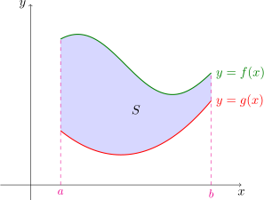{fig-align="center" width=55%}

El área deseada se puede pensar como la diferencia entre el área
debajo del gráfico de $f$ y la que está debajo del gráfico de $g$.

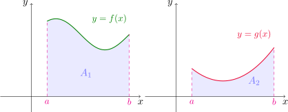{fig-align="center" width=70%}

Entonces el área de la región es 

$$
A=A_1-A_2=\int_a^b f(x)\,dx-\int_a^b g(x)\,dx=\int_a^b (f(x)-g(x))\,dx.
$$

Esta idea se puede extender fácilmente al caso más general, donde sólamente sabemos que $g \leq f$ en $[a, b]$. Podemos encontrar una constante $C$ adecuada de manera que los gráficos de $y=g(x)+C$ y de $y=f(x)+C$ estén ambos por encima del eje $x$, es decir, tal que $0\leq g(x)+C\leq f(x)+C$.

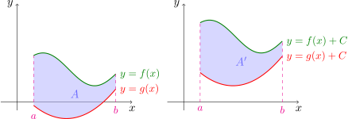{fig-align="center" width=80%}

Si llamamos $F(x)=f(x)+C$ y $G(x)=g(x)+C$, entonces en el intervalo $[a,b]$ se cumple que $0\leq G(x)\leq F(x)$. Aplicando la fórmula anterior para el área $A'$ comprendida entre los gráficos de $F$ y de $G$ resulta 

$$
A'=\int_a^b (F(x)-G(x))\,dx=\int_a^b (f(x)+C-(g(x)+C))\,dx=\int_a^b (f(x)-g(x))\,dx,
$$

y el área $A'$ entre los gráficos de $F$ y $G$, para $a\leq x\leq b$, es la misma que el área $A$ entre los gráficos de $f$ y $g$ ya que al sumar la constante $C$ sólo hemos desplazado la región $C$ unidades verticalmente hacia arriba. 

De esta manera, tenemos la siguiente fórmula para el cálculo de áreas determinadas por el gráfico de funciones continuas.

::: {.formula-box}

Si $f$ y $g$ son funciones continuas tales que $g(x)\leq f(x)$ para todo $x\in [a,b]$, entonces
el área $A$ de la región limitada por los gráficos de $f$ y $g$, y lateralmente por las rectas
$x=a$ y $x=b$ es 

$$
A=\int_a^b (f(x)-g(x))\,dx.
$$

:::

En particular, si $g(x)=0$ en todo el intervalo $[a,b]$ y $f(x)\geq g(x)=0$ en el intervalo, entonces el área es 

$$
A=\int_a^b (f(x)-g(x))\,dx=\int_a^b (f(x)-0)\,dx=\int_a^b f(x)\,dx.
$$

Es decir, como caso particular obtenemos que si $f$ es continua y no negativa en el intervalo $[a,b]$, la integral definida $\int_a^b f(x)\,dx$ nos da el área bajo la curva de $y=f(x)$ y sobre el eje $x$, entre $a$ y $b$.

::: {.example-box}

Ejemplo

Encontrar el área de la región delimitada por las parábolas $y=x^2$ e $y=2x-x^2$.

:::

::: {.callout-tip collapse="true"}
## Solución

Primero buscamos los puntos de intersección entre las curvas. Igualando las ordenadas obtenemos 

$$
x^2=2x-x^2 \quad \text{ o también } \quad 2x(x-1)=0,
$$

de donde resulta $x=0$ o $x=1$. Entonces los puntos de corte entre ambas son $(0,0)$ y $(1,1)$. Con ayuda del gráfico de las funciones podemos ver que $x^2\leq 2x-x^2$ en el intervalo $[0,1]$. 

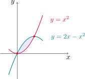{fig-align="center" width=40%}

Por lo tanto, el área de la región es 

$$ 
A=\int_0^1 \left[\left(2x-x^2\right)-x^2\right]\,dx =\int_0^1 \left(2x-2x^2\right)\,dx =\left(x^2-\frac{2}{3}x^3\right)\Bigg{]}_0^1=\frac{1}{3}.
$$

:::

### Área entre curvas (más general)

Si tenemos que calcular el área entre dos curvas correspondientes a los gráficos de dos funciones continuas $f$ y $g$, pero $f(x)\geq g(x)$ para algunos valores de $x$ y $f(x)\leq g(x)$ para otros, entonces es preciso dividir el intervalo $[a,b]$ en subintervalos de modo que en
aquellos donde ocurra que $f(x)\geq g(x)$ integraremos la diferencia $f(x)-g(x)$, y en los restantes, donde $f(x)\leq g(x)$, integraremos la expresión $g(x)-f(x)$. 

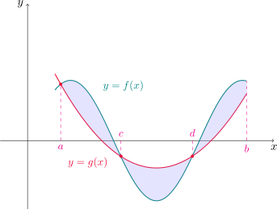{fig-align="center" width=60%}

Por ejemplo, para calcular el área entre las curvas $y=f(x)$ e $y=g(x)$ de la figura, observamos que $f(x)\geq g(x)$ en $[a,c]$ y en $[d,b]$, y $g(x)\geq f(x)$ en $[c,d]$. Por lo tanto el área $A$ entre las curvas es

$$
A=\int_{a}^c(f(x)-g(x))\,dx+\int_{c}^d (g(x)-f(x))\,dx+\int_{d}^b (f(x)-g(x))\,dx.
$$

Recordando la definición de valor absoluto, tenemos que 

$$
|f(x)-g(x)|=
\begin{cases}
f(x)-g(x) & \text{ si } f(x)\geq g(x),\\
g(x)-f(x) & \text{ si } f(x)< g(x).
\end{cases}
$$

En definitiva, podemos calcular el área entre las curvas de $f$ y $g$ utilizando la siguiente fórmula. 

:::{#form-areageneral .formula-box}

Si $f$ y $g$ son continuas en $[a,b]$, el área encerrada por las curvas $y=f(x)$ e $y=g(x)$ es

$$
A=\int_a^b |f(x)-g(x)|\,dx.
$$

:::

::: {.example-box}

Ejemplo

Calcular el área encerrada por las curvas $y=\operatorname{sen} x$, $y=\cos x$, $x=0$ y $x=\pi/2$. 

:::

::: {.callout-tip collapse="true"}
## Solución

Primero buscamos los puntos de intersección entre ambas. Tenemos que 

$$
\operatorname{sen} x=\cos x \quad \text{ equivale a } \quad \tan x=1,
$$

con lo cual $x=\pi/4$. Graficando las funciones 

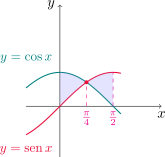{fig-align="center" width=40%}

podemos notar que $\cos x\geq \operatorname{sen} x$ en $[0,\pi/4]$ y $\cos x\leq \operatorname{sen} x$ en $[\pi/4,\pi/2]$.

Utilizando la [fórmula para el área entre curvas](#form-areageneral) anterior, el área $A$ es  

$$
\begin{aligned}
A=\int_0^{\pi/2} |\operatorname{sen} x-\cos x|\,dx&=\int_0^{\pi/4} (\cos x-\operatorname{sen} x)\,dx+\int_{\pi/4}^{\pi/2} (\operatorname{sen} x-\cos x)\,dx\\
&=(\operatorname{sen} x+\cos x)\Big{]}_0^{\pi/4}+(-\cos x-\operatorname{sen} x)\Big{]}_{\pi/4}^{\pi/2}\\
&=2\sqrt{2}-2.
\end{aligned}
$$

:::

### Áreas integrando respecto a $y$

En algunos casos es conveniente expresar a $x$ como una función de $y$. 

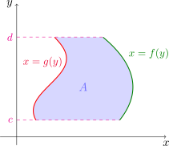{fig-align="center" width=40%}

Si la región está delimitada por los gráficos de las funciones continuas $x=f(y)$ y $x=g(y)$ en un intervalo $[c,d]$, y se cumple que $f(y)\geq g(y)$ para todo $y$ de este intervalo, entonces el área $A$ es

:::{#form-area-respectoay .formula-box}

$$
A=\int_c^d (f(y)-g(y))\,dy.
$$

:::

::: {.example-box}

Ejemplo

Hallar el área comprendida entre la recta $y=x-1$ y la parábola $y^2=2x+6$.

:::

::: {.callout-tip collapse="true"}
## Solución

Buscamos primero los puntos de intersección. Despejando $x$ en términos de $y$ en ambas funciones
e igualando resulta 

$$
y+1=\frac{y^2-6}{2}, \quad \text{ o también }\quad y^2-2y-8=0,
$$

de donde obtenemos $y=-2$ e $y=4$. Por lo tanto, los puntos de corte son $(-1,-2)$ y $(5,4)$.

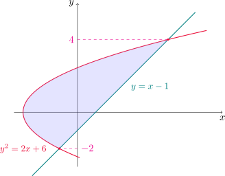{fig-align="center" width=50%}

En el gráfico podemos notar que es más conveniente integrar con respecto a $y$, para $-2\leq y\leq 4$, y este intervalo resulta $y+1\geq (y^2-6)/2$. Entonces el área es

$$
A=\int_{-2}^4 \left[(y+1)-\frac{1}{2}(y^2-6)\right]\,dy=\int_{-2}^4 \left(-\frac{1}{2}y^2+y+4\right)\,dy=\left(-\frac{y^3}{6}+\frac{y^2}{2}+4y\right)\Bigg{]}_{-2}^4=18.
$$

:::

[↑ Volver al inicio de la sección](#seccion_6.1)

## 6.2. Volúmenes {#seccion_6.2}

En esta sección veremos cómo utilizar integrales definidas para
calcular volúmenes de ciertos sólidos. Para empezar, consideremos una región plana $\Omega$. 

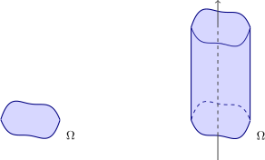{fig-align="center" width=60%}

Un **cilindro recto con sección transversal $\Omega$** es un sólido obtenido de trasladar la región $\Omega$ a lo largo de un eje perpendicular a ella.

Si $A$ es el área de $\Omega$ y el cilindro está formado por la traslación
de esta región a lo largo de una distancia $h$, entonces el
volumen del cilindro es $V=A\cdot h$.

Cuando $\Omega$ es un círculo o un rectángulo, el sólido obtenido
resulta un cilindro circular recto y un prisma de base
rectangular, respectivamente.

{fig-align="center" width=60%}

Si queremos calcular el volumen de un sólido $S$ que no es un cilindro, podemos comenzar cortando a $S$ en rebanadas, cuyos respectivos volúmenes puedan aproximarse por el volumen de un cilindro. 

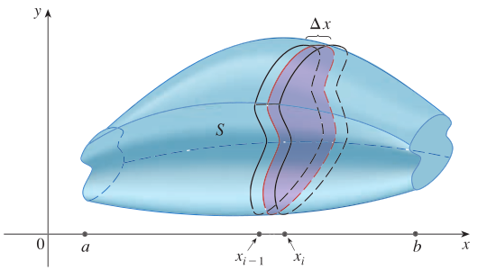{fig-align="center" width=60%}

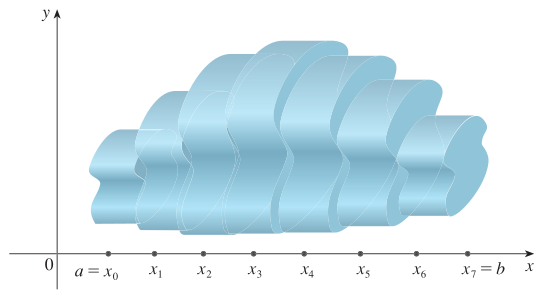{fig-align="center" width=60%}

Podemos hacer una estimación del volumen de $S$ sumando los volúmenes de
los cilindros.  El valor del volumen exacto de $S$ se obtendrá tomando límite cuando la cantidad de rebanadas en las que cortamos tiende a infinito.

Por ejemplo, si quisiéremos aproximar el volumen de una esfera tendríamos la siguiente situación

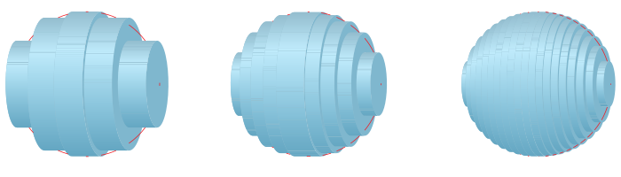{fig-align="center" width=70%}

Comenzamos cortando a $S$ con un plano perpendicular y obteniendo una región plana que se denomina **sección transversal** de $S$. Si $A(x)$ denota el área de la sección transversal de $S$ en un plano perpendicular
al eje $x$ y que pasa por el punto $x$, esta función variará cuando $x$ se incrementa desde $a$ hasta $b$.

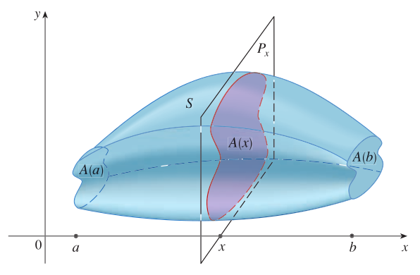{fig-align="center" width=60%}

Sea $A(x)$ el área de la sección transversal de $S$ en un plano $P_x$ perpendicular al eje $x$ y que pasa por el punto $x$, donde $a\leq x\leq b$.

Si dividimos el intervalo $[a,b]$ en en puntos con $\Delta x = \frac{b-a}{n}$ y $x_i = a + i \Delta x$, con $0\leq i\leq n$, el volúmen de la rebanada entre los planos $P_{x_i}$ y $P_{x_{i+1}}$ será aproximadamente el volúmen de un cilindro con base $A(x_{i})$ y altura $\Delta x$.

Podemos decir que el volumen $V$ es aproximadamente la suma
$$
V\approx \sum_{i=0}^n A(x_{i})\,\Delta x
$$

y el valor exacto lo obtenemos tomando límite para $n\to\infty$, es decir,

$$
V=\lim_{n\to \infty} \sum_{i=0}^n A(x_{i})\,\Delta x=\int_a^b A(x)\,dx.
$$

En particular, cuando $A(x)$ es una función continua el límite anterior existe. Esto nos motiva a dar la siguiente definición.

::: {.callout-note title="Definición (Volumen de un sólido)"}

Sea $S$ un sólido que se encuentra entre $x=a$ y $x=b$, y sea $A(x)$ el área de la sección transversal de $S$ a través de $x$ y perpendicular al eje $x$. Si $A$ es continua en $[a,b]$ entonces el volumen del sólido es 

$$
V=\int_a^b A(x)\,dx.
$$

:::

::: {.example-box}

Ejemplo

Hallar el volumen de una pirámide cuya altura es $h$ y su base es un cuadrado de lado $L$.

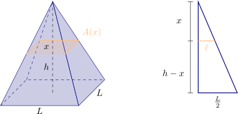{fig-align="center" width=70%}

:::

::: {.callout-tip collapse="true"}
## Solución

Ubicamos la pirámide de modo que su eje sea el eje de abscisas y su cúspide esté ubicada sobre el origen de coordenadas, de modo que debemos encontrar la función de área transversal $A(x)$ para $0\leq x\leq h$. Observando la figura del enunciado, podemos decir que $A(x)=\ell^2$, con lo cual bastará expresar a $\ell$ en términos de $x$. Para ello, por semejanza de triángulos podemos escribir 

$$
\frac{h}{\frac{L}{2}}=\frac{x}{\ell}, \quad \text{ de donde }\quad \ell=\frac{Lx}{2h}.
$$

De esta manera

$$
A(x)=(2\ell)^2=\frac{L^2x^2}{h^2}.
$$

Esta función es continua en el intervalo $[0,h]$, por lo que el volumen $V$ de la pirámide es 

$$
V=\int_0^h \frac{L^2x^2}{h^2}\,dx =\frac{L^2}{h^2} \left(\frac{x^3}{3}\right)\Bigg{]}_0^h=\frac{1}{3}L^2h.
$$

:::

### Sólidos de revolución 

Supongamos que $f$ es no negativa y continua en $[a, b]$. Si giramos el gráfico de $f$ alrededor del eje $x$ obtenemos una superficie que determina un sólido que llamaremos **sólido de revolución**.

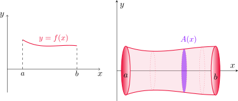{fig-align="center" width=70%}

En este caso, para cada $x$ en $[a,b]$ la sección transversal es un círculo de
radio $f(x)$. Entonces la función de área transversal es 

$$
A(x) = \pi[f(x)]^2,
$$

para $a \leq x \leq b$. Como $f$ es continua, $A$ resulta continua en $[a, b]$
y por lo visto anteriormente el volumen lo obtenemos integrando esta función

::: {.formula-box}
$$
V=\pi\int_a^b \left[f(x)\right]^2\,dx.
$$
:::

::: {.example-box}

Ejemplo

Demostrar que el volumen de una esfera de radio $r$ es $\displaystyle V=\frac{4}{3}\pi r^3$.

:::

::: {.callout-tip collapse="true"}
## Solución

La esfera es un sólido de revolución, obtenido a partir de rotar una circunferencia de radio $r$. Consideremos entonces la circunferencia con centro en el origen y radio $r$, dada por la ecuación $x^2+y^2=r^2$. 

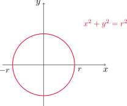{fig-align="center" width=40%}

Pero como esta curva no es el gráfico de una función, despejamos $y$ y nos quedamos con la semicircunferencia superior, cuya ecuación es $y=\sqrt{r^2-x^2}$, para $-r\leq x\leq r$.

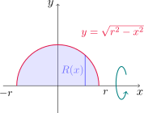{fig-align="center" width=40%}

La función de área transversal en este caso es 

$$
A(x)=\pi (y(x))^2=\pi \left(\sqrt{r^2-x^2}\right)^2=\pi (r^2-x^2).
$$

Y el volumen $V$ es 

$$
V=\pi \int_{-r}^r (r^2-x^2)\,dx=\pi \left(r^2\,x-\frac{x^3}{3}\right)\Bigg{]}_{-r}^r=\pi\left[\left(r^3-\frac{r^3}{3}\right)-\left(-r^3+\frac{r^3}{3}\right)\right]=\frac{4}{3}\pi r^3.
$$
:::

::: {.example-box}

Ejemplo

Determinar el volumen del sólido que se obtiene al girar la región bajo
la curva $y=\sqrt{x}$ con respecto al eje $x$, desde $x=0$ hasta $x=1$.

:::

::: {.callout-tip collapse="true"}
## Solución

La función de área transversal es 
$$
A(x)=\pi(\sqrt{x})^2=\pi x.
$$

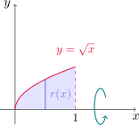{fig-align="center" width=35%}

Entonces el volumen resulta 

$$
V=\pi \int_0^1 x\,dx =\pi \left(\frac{x^2}{2}\right)\Bigg{]}_0^1=\frac{\pi}{2}.
$$

:::

::: {.example-box}

Ejemplo

Calcular el volumen del sólido generado al rotar la región definida por $y=x^3$, $y=8$ y $x=0$
con respecto al eje $y$.

:::

::: {.callout-tip collapse="true"}
## Solución

En este caso rotamos alrededor del eje $y$, con lo que debemos expresar $x$ en términos de $y$. 

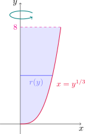{fig-align="center" width=30%}

Como $y=x^3$, resulta $x=y^{1/3}$ y en consecuencia la función de área transversal es 

$$
A(y)=\pi (x(y))^2=\pi y^{2/3}.
$$

El volumen del sólido es 

$$
V=\pi \int_0^8 y^{2/3}\,dy= \pi \left(\frac{3}{5}y^{5/3}\right)\Bigg{]}_0^8 =\frac{96}{5}\pi.
$$

:::

::: {.example-box}

Ejemplo

Hallar el volumen del sólido generado al rotar la región delimitada por $y=x$ e $y=x^2$, con $0\leq x\leq 1$, alrededor de la recta $x=-1$.

:::

::: {.callout-tip collapse="true"}
## Solución

Como la rotación es con respecto a un eje vertical, debemos expresar las funciones en términos de la variable $y$. Notemos además que en este caso se trata de una región delimitada por dos funciones, por lo tanto las secciones transversales en cada $y$ corresponden a arandelas, con radio interior $r(y)$ y radio exterior $R(y)$. 

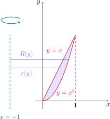{fig-align="center" width=40%}

Las funciones dadas son $x=y$ y $x=\sqrt{y}$, y los radios los calculamos tomando las respectivas distancias desde el eje de rotación a cada curva, es decir

$$
R(y)=\sqrt{y}-(-1)=\sqrt{y}+1$\quad \text{ y } \quad   r(y)=y-(-1)=y+1.
$$

De esta manera, para cada $0\leq y\leq 1$ 

$$
A(y)=\pi(R^2(y)-r^2(y))=\pi \left[(\sqrt{y}+1)^2-(y+1)^2\right]=\pi\left[-y^2-y+2y^{1/2}\right].
$$

El volumen del sólido es 

$$
V=\int_0^1 A(y)\,dy =\pi \int_0^1 \left(-y^2-y+2y^{1/2}\right)\,dy =\pi \left(-\frac{y^3}{3}-\frac{y^2}{2}+\frac{4}{3}y^{3/2}\right)\Bigg{]}_0^1=\frac{\pi}{2}.
$$
:::

[↑ Volver al inicio de la sección](#seccion_6.2)

## 6.4.  Trabajo {#seccion_6.4}

En esta sección veremos cómo aplicar integrales a determinadas situaciones físicas. Consideremos un objeto de masa $m$ que se desplaza en línea recta con función de posición $s(t)$, por lo tanto la fuerza $F$ sobre el objeto está definida por la segunda ley de Newton como

$$
F(t) = \text{masa} \times \text{aceleración} = m\frac{d^2}{dt^2}s.
$$

Recordemos unidades: la masa se mide en kilogramos (kg), el desplazamiento en me-
tros (m), el tiempo en segundos (seg) y la fuerza en newtons ( $\text{N} = \text{kg}\cdot \text{m} /\text{s}^2$ ). Es decir, una fuerza de 1 N que actúa en una masa de 1 kg produce una aceleración de 1 $\text{m}/\text{seg}^2$.

Si la aceleración del objeto es constante, la fuerza también, y el **trabajo** realizado se define como el producto de la fuerza por la distacia $d$ recorrida por el objeto, esto es
$$
W = F \cdot d.
$$

Si medimos la fuerza en newtons y la distancia en metros, la unidad de trabajo es un newton-metro, llamado joule (J).

::: {.example-box}

Ejemplo

¿Qué tanto trabajo se realiza al levantar un libro de 1.2 kg desde el suelo y colocarlo
en un escritorio que tiene 0.7 m de altura?

:::

::: {.callout-tip collapse="true"}
## Solución

Considerando que la aceleración de la gravedad es $9.8$ $\text{m}/\text{seg}^2$, y que la fuerza ejercida es igual y opuesta a la que ejerce la gravedad, tenemos que la fuerza es
$$
F = 1.2\, \text{kg} \cdot 9.8 \,\text{m}/\text{seg}^2 = 11.76\, \text{N}
$$
por lo tanto, el trabajo realizado es
$$
W = 11.76\, \text{N} \cdot 0.7 \, \text{m} = 8.232\, \text{J}.
$$

:::

Lo que vimos describe un fenómeno en el que la fuerza es constante. ¿Qué sucede si la fuerza es variable? 

Supongamos que el objeto se desplaza a lo largo del eje $x$ en la dirección positiva, desde $x=a$ hasta $x=b$, y en cada punto $x$ entre $a$ y $b$ actúa sobre el objeto una fuerza $f(x)$, donde $f$ es una función continua.

Dividamos el intervalo $[a,b]$ como siempre, en $n$ subintervalitos $[x_{i-1},x_{i}]$ de longitud $\Delta x$. Si el intervalo $[x_{i-1},x_{i}]$ es suficientemente pequeño, como $f$ es continua, puede considerarse casi constante en el mismo. Por lo tanto, el trabajo realizado será aproximadamente
$$
W_i \approx f(x_i)\Delta x
$$

Es claro que el trabajo total $W$ puede considerarse como la suma de todos los trabajos realizados en cada subintervalo $[x_{i-1},x_{i}]$, es decir 
$$
W = \sum_{i=1}^{n} W_i \approx \sum_{i=1}^{n} f(x_i)\Delta x.
$$

El valor exacto del trabajo se obtiene tomando el límite de las sumas de arriba cuando $n\to\infty$. Cuando la función $f$ es continua, este límite existe y nos da la integral definida de la función de fuerza en el intervalo dado.

::: {.callout-note title="Definición (Trabajo)"}
El **trabajo** realizado por un objeto que se mueve en un segmento representado por el intervalo $[a,b]$ y donde se ejerce una fuerza $f(x)$ para cada $x$ del intervalo, es la integral
$$
W = \int_a^b f(x)dx.
$$

:::

::: {.example-box}

Ejemplo

Cuando una partícula se ubica a $x$ metros del origen, una fuerza
de $x^2+2x$ newtons actúa sobre ella. ¿Cuánto trabajo se efectúa al moverla desde $x=1$ hasta $x=3$?

:::

::: {.callout-tip collapse="true"}
## Solución

Calculamos la integral

$$
W = \int_1^3 (x^2+2x)\,dx = \left(\frac{x^3}{3} + x^2\right)\Bigg{]}_1^3 = \frac{50}{3}.
$$

El trabajo realizado es de $\displaystyle \frac{50}{3}$ joules.

:::

::: {.example-box}

Ejemplo

Una fuerza de 40 N se requiere para detener un resorte que está estirado
desde su longitud natural de 10 cm a una longitud de 15 cm. ¿Cuánto trabajo se hace
al estirar el resorte de 15 a 18 cm?

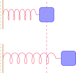{fig-align="center" width=40%}

:::

::: {.callout-tip collapse="true"}
## Solución

De acuerdo con la **ley de Hooke**, la fuerza que se requiere para mantener el resorte estirado $x$ metros más allá de su longitud natural es $f(x)=kx$, donde $k$ es la constante asociada al resorte.

Cuando el resorte pasa de los 10 cm a los 15 cm, la longitud de estiramiento es 5 cm=0.05 m, y como la fuerza requerida para producir este estiramiento es de 40 N, tenemos que $f(0.05)=40$, de donde podemos deducir que 
$$
0.05 k=40 \quad \text{ o bien } \quad k=800.
$$

Calculamos ahora el trabajo 

$$
W=\int_{0.05}^{0.08} 800 x\,dx=800\frac{x^2}{2}\Big{]}_{0.05}^{0.08}=1.56.
$$

El trabajo realizado para estirar el resorte de los 15 cm a los 18 cm es de 1.56 J.

:::

[↑ Volver al inicio de la sección](#seccion_6.4)

## 6.5. Valor promedio de una función

Cuando hablamos de **promedio** de cierta cantidad de números en la vida cotidiana, entendemos que sumamos todos los valores y dividimos por la cantidad de elementos que sumamos: comúnmente esto es lo que hacemos al calcular el promedio de calificaciones en una carrera o el promedio de edades en un grupo de personas, entre otros. 

Si tenemos $n$ valores $y_1, y_2, \dots, y_n$, el valor promedio es
$$
\overline{y}=\frac{y_1 + y_2 + \dots + y_n}{n}=\frac{\sum_{i=1}^n y_i}{n}=\frac{1}{n}\sum_{i=1}^n y_i.
$$

Pero ¿qué pasa cuando hablamos de calcular el promedio sobre una cantidad infinita de elementos? Esto sucedería si intentásemos promediar los valores que toma una función continua $f$ en todos los puntos $x$ de un intervalo $[a,b]$. Situaciones como estas podrían ocurrir en la práctica si, por ejemplo, queremos conocer la temperatura promedio de un proceso o la velocidad promedio durante un viaje, eventos en los que contaríamos con una cantidad infinita de mediciones dadas por el gráfico de una función adecuada.

Si tenemos una función $f$ definida en un intervalo $[a,b]$, ¿cómo podríamos darle sentido a esto? Para ello, dividimos el intervalo $[a,b]$ tomando puntos $x_i = a + i \Delta x$, con $0\leq i\leq n$ y $\Delta x = \frac{b-a}{n}$ y promediamos de la forma usual los números $f(x_i)$, ya que son finitos. Es decir, calculamos

$$
\frac{\sum_{i=1}^n f(x_i)}{n},
$$

que también podemos escribir de la siguiente manera 

$$
\frac{\sum_{i=1}^n f(x_i)}{n} = \frac{\sum_{i=1}^n f(x_i)}{\frac{b-a}{\Delta x}} = \frac{1}{b-a}\sum_{i=1}^n f(x_i) \Delta x.
$$

Conforme $n$ crece, estas sumas nos van a dar el promedio de una cantidad muy grande de puntos, correspondientes a valores ubicados sobre el gráfico de $f$ y muy próximos entre sí. Cuando $f$ es continua, el límite de estas expresiones para $n\to \infty$ existe. Más aún, tenemos que 

$$
\lim_{n\to \infty} \frac{1}{b-a}\sum_{i=1}^n f(x_i)\Delta x=\frac{1}{b-a}\int_a^b f(x)\,dx,
$$

lo que nos conduce a la siguiente definición. 

::: {.callout-note title="Definición (Valor promedio de una función en un intervalo)"}
Si $f$ es continua en $[a,b]$ entonces su **valor promedio** o directamente su **promedio** en este intervalo es 

$$
\overline{f}_{[a,b]}=\frac{1}{b-a}\int_a^b f(x)\,dx.
$$

:::

::: {.example-box}

Ejemplo

Determinar el valor promedio de $f(x)=1+x^2$ en el intervalo $[-1,2]$.

:::

::: {.callout-tip collapse="true"}
## Solución

En virtud de la definición anterior tenemos que 

$$
\overline{f}_{[-1,2]}=\frac{1}{2-(-1)}\int_{-1}^2 (1+x^2)\,dx=\frac{1}{3}\left(x+\frac{x^3}{3}\right)\Bigg{]}_{-1}^2=2.
$$

:::

En el ejemplo anterior podemos ver que el promedio de $f$ nos dio $2$, y $f(1)=2$, es decir, existe un valor de $x$ en el intervalo dado donde la imagen de $x$ es exactamente su valor promedio sobre el intervalo. Esto ocurre siempre cuando $f$ es continua, como lo establece el siguiente resultado.

:::{#teo-valor-medio-integral .theorem}

Teorema del valor medio para integrales

Si $f$ es continua en $[a,b]$, entonces existe un número $c$ en $[a,b]$ tal que $f(c)=\overline{f}_[a,b]$, es decir, de modo que se verifica la igualdad 

$$
f(c) = \frac{1}{b-a}\int_a^b f(x)dx.
$$

:::

Una interpretación geométrica del teorema del valor medio para integrales es que, para
funciones positivas $f$, hay un número $c$ tal que el rectángulo con base $[a,b]$ y altura $f(c)$
tiene la misma área que la región bajo la gráfica de $f$.

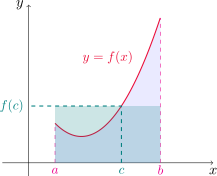{fig-align="center" width=40%}

::: {.example-box}

Ejemplo

Encontrar todos los puntos $c$ sobre el intervalo $[-1,2]$ tales que $\overline{f}_{[-1,2]}=f(c)$, siendo $f(x)=1+x^2$.

:::

::: {.callout-tip collapse="true"}
## Solución

Ya hemos encontrado $c=1$ por inspección. De todos modos, procederemos de forma general. El [teorema del valor medio integral](#teo-valor-medio-integral) nos asegura que existe al menos un valor $c$ en $[-1,2]$ ya que $f$ es continua sobre este intervalo. En el ejemplo anterior hemos calculado que 

$$
\overline{f}_{[a,b]}=2,
$$

por lo que ahora buscamos números $c$ tales que $f(c)=2$, es decir 

$$
1+c^2=2, \quad \text{ con lo cual } \quad c^2=1,
$$

de donde deducimos que $c=\pm 1$. Entonces los valores de $c$ dentro del intervalo donde $f$ toma su valor promedio son $c=-1$ y $c=1$.

:::

[↑ Volver al inicio de la sección](#seccion_6.5)

## 7.8. Integrales impropias {#seccion_7.8}

Hasta ahora hemos trabajado con integrales definidas en las que aparece una función $f$ en un intervalo cerrado $[a,b]$ y supusimos que $f$ es continua a trozos sin discontinuidades infinitas.

Para ciertos modelos es necesario considerar el caso de intervalos infinitos o funciones que tengan singularidades, esto es, que tiendan a infinito en algún punto del intervalo.

Una integral se llama **impropia** cuando el intervalo de integración es infinito o cuando el integrando tiene una singularidad (no está acotado) en el intervalo de integración. A continuación distinguiremos entre estos dos tipos de comportamiento.

### Tipo I: intervalos infinitos 

Consideremos la región $S$ bajo la curva $y=\displaystyle\frac{1}{x^2}$, por encima del eje $x$ y a la derecha de la recta $x=1$.

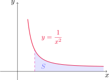{fig-align="center" width=40%}

Para $t>1$ podemos calcular la integral
$$
\int_1^t \frac{dx}{x^2} = \left(-\frac{1}{x}\right)\Bigg{]}_1^t = 1 - \frac{1}{t},
$$

que nos da el área de la subregión $S_t$ que se ecuentra a la izquierda de $x=t$.

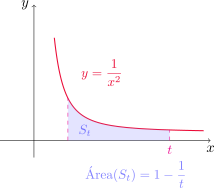{fig-align="center" width=40%}

Observermos que
$$
\lim_{t\to\infty} \left(1 - \frac{1}{t}\right) = 1
$$

y con esto podemos decir que el área de $S$ es igual a 1, ya que las regiones $S_t$ tienen un área que converge a 1 cuando $t\to \infty$. Esto motiva a la siguiente definición.

::: {.callout-note title="Definición (Integral impropia de tipo I)"}

- Si la integral $\displaystyle \int_a^{t} f(x)\,dx$ existe para todo número $t\geq a$, definimos
$$
\int_a^{\infty} f(x)\,dx = \lim_{t\to\infty} \int_a^{t} f(x)\,dx.
$$

- Si la integral $\displaystyle \int_{t}^{b} f(x)\,dx$ existe para todo número $t\leq b$, definimos
$$
\int_{-\infty}^b f(x)\,dx = \lim_{t\to-\infty} \int_{t}^b f(x)\,dx.
$$

Las integrales impropias se llaman **convergentes** si el límite correspondiente existe y **divergentes** si el límite no existe.

- Si tanto $\displaystyle \int_{-\infty}^a f(x)\,dx$ como $\displaystyle \int_a^{-\infty} f(x)\,dx$ existen para algún número $a\in\mathbb{R}$, definimos
$$
\int_{-\infty}^{\infty} f(x)\,dx = \int_{-\infty}^a f(x)\,dx + \int_a^{\infty} f(x)\,dx.
$$

:::

Estas integrales impropias pueden interpretarse como áreas cuando la función $f$ es no negativa. Por ejemplo, para el primer caso de la definición anterior, si $f(x)\geq 0$ y la integral 

$$
\int_a^\infty f(x)\,dx
$$

converge, entonces define el área de la región $S$ del plano dada por 

$$
S=\{(x,y)\in \mathbb{R}^2: 0\leq y\leq f(x), x\geq a\}.
$$

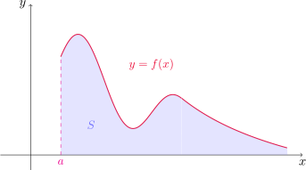{fig-align="center" width=60%}

::: {.example-box}

Ejemplo

Determinar si la integral 
$\displaystyle \int_{1}^{\infty} \frac{1}{x}\,dx$
es convergente o divergente.

:::

::: {.callout-tip collapse="true"}
## Solución

 Según la definición,
$$
\begin{aligned}
\int_{1}^{\infty} \frac{1}{x}\,dx 
&= \lim_{t\to\infty} \int_{1}^{t} \frac{1}{x}\,dx = \lim_{t\to\infty} \left(\ln|x|\right)\bigg{]}_{1}^{t} \\
\\
&= \lim_{t\to\infty} (\ln t - \ln 1) = \lim_{t\to\infty} \ln t = \infty.
\end{aligned}
$$

Como el límite no existe por infinitud, la integral impropia
$\displaystyle \int_{1}^{\infty} \frac{1}{x}\,dx$ es divergente.

:::

::: {.example-box}

Ejemplo

Evaluar la integral 
$\displaystyle \int_{-\infty}^{\infty} \frac{1}{1+x^2}\,dx$.

:::

::: {.callout-tip collapse="true"}
## Solución

Comencemos estudiando las integrales $\displaystyle\int_a^\infty f(x)\,dx$ y
$\displaystyle\int_{-\infty}^a f(x)\,dx$, para algún valor fijo de $a$. 

Si elegimos $a=0$, para $t>0$ tenemos que 

$$
\int_0^t \frac{1}{1+x^2}\,dx=(\arctan x)\big{]}_0^t=\arctan t-\arctan 0 =\arctan t.
$$

Por lo tanto 

$$
\int_0^\infty f(x)\, dx=\lim_{t\to \infty} \int_0^t \frac{1}{1+x^2}\,dx =\lim_{t\to \infty} \arctan t =\frac{\pi}{2}.
$$

De manera similar, para $t<0$ podemos escribir 

$$
\int_t^0 \frac{1}{1+x^2}\,dx=(\arctan x)\big{]}_t^0=\arctan 0-\arctan t =-\arctan t.
$$

Con lo cual 

$$
\int_{-\infty}^0 f(x)\, dx=\lim_{t\to -\infty} \int_t^0 \frac{1}{1+x^2}\,dx =\lim_{t\to -\infty} -\arctan t =\frac{\pi}{2}.
$$

Como ambas integrales impropias son convergentes, concluimos que 

$$
\int_{-\infty}^\infty \frac{1}{1+x^2}\,dx=\int_{-\infty}^0 \frac{1}{1+x^2}\,dx+\int_{0}^\infty \frac{1}{1+x^2}\,dx=\frac{\pi}{2}+\frac{\pi}{2}=\pi.
$$
:::

::: {.example-box}

Ejemplo

¿Para qué valores de $p$ es convergente la integral $\displaystyle \int_{1}^{\infty} \frac{1}{x^{p}}\,dx \, ?$

:::

::: {.callout-tip collapse="true"}
## Solución

Cuando $p=1$ la integral es divergente, según lo visto en el Ejemplo 14. Supongamos entonces que $p \ne 1$. 

Para $t>1$ tenemos que 

$$
\int_1^t \frac{1}{x^p}\,dx=\left(\frac{x^{-p+1}}{-p+1}\right)\Bigg{]}_1^t=\frac{1}{1-p}\left(t^{1-p}-1\right).
$$

Cuando $p>1$ obtenemos

$$
\begin{aligned}
\int_{1}^{\infty} \frac{1}{x^{p}}\,dx
&= \lim_{t \to \infty} \frac{1}{p - 1}\,\left(1-\frac{1}{t^{p-1}}\right)\\
\\
&=\frac{1}{p-1},
\end{aligned}
$$

dado que $\lim_{t\to \infty} \frac{1}{t^{p-1}}=0$ por ser $p>1$.

Por otro lado, si $p < 1$, entonces 

$$
\begin{aligned}
\int_{1}^{\infty} \frac{1}{x^{p}}\,dx
&= \lim_{t \to \infty} \frac{1}{1 - p}\,\left(t^{1-p}-1\right)\\
\\
&=\infty,
\end{aligned}
$$

ya que $t^{1-p}\to \infty$ por ser $p<1$. En este caso, la integral es divergente.

Concluimos entonces que la integral impropia es convergente sólamente cuando $p>1$, y en este caso 

$$
\int_{1}^{\infty} \frac{1}{x^{p}}\,dx=\frac{1}{p-1}.
$$

:::

### Tipo II: integrandos discontinuos

Supongamos ahora que $f$ es una función continua y definida en un intervalo finito $[a,b)$, pero tiene una asíntota vertical en $x=b$. Es claro que si $a<t<b$, la integral $\displaystyle \int_a^t f(x)dx$ existe. ¿Qué significado podemos darle, entonces, a la integral $\displaystyle\int_a^b f(x)dx$?

Para este tipo de situaciones será de utilidad la siguiente definición.

::: {.callout-note title="Definición (Integral impropia de tipo II)"}

- Si $f$ es continua en $[a,b)$ y discontinua en $b$, entonces  
$$
\int_a^b f(x)\,dx \;=\; \lim_{t\to b^-}\int_a^t f(x)\,dx,
$$  
si este límite existe.

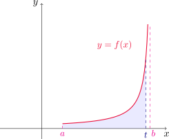{fig-align="center" width=40%}

- Si $f$ es continua en $(a,b]$ y discontinua en $a$, entonces  
$$
\int_a^b f(x)\,dx \;=\; \lim_{t\to a^+}\int_t^b f(x)\,dx,
$$  
siempre que este límite exista.

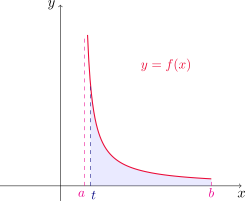{fig-align="center" width=40%}

- Si $f$ tiene una discontinuidad en $c$, donde $a<c<b$, y tanto $\displaystyle\int_a^c f(x)\,dx$
como $\displaystyle\int_c^b f(x)\,dx$ son convergentes, definimos  
$$
\int_a^b f(x)\,dx \;=\; \int_a^c f(x)\,dx \;+\; \int_c^b f(x)\,dx.
$$

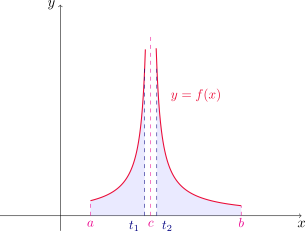{fig-align="center" width=40%}

Como en las integrales impropias de tipo I, diremos que la integral impropia $\displaystyle \int_a^b f(x)\,dx$ es **convergente** cuando los límites correspondientes existen, y **divergente** en caso contrario.

:::

::: {.example-box}

Ejemplo

Determinar para qué número $p$, la integral
$$
\int_{0}^{1} \frac{1}{x^{p}}\,dx
$$

es convergente o divergente.

:::

::: {.callout-tip collapse="true"}
## Solución

Notemos primero que si $p\leq 0$ entonces la función $\displaystyle f(x)=\frac{1}{x^p}$ es continua en $[0,1]$ y, por lo tanto, integrable. Para estos valores de $p$ no estamos ante una integral impropia. Para $p>0$ tenemos una integral impropia de tipo II ya que $f$ tiene una asíntota vertical en $x=0$, el extremo izquierdo del intervalo. Fijado $p\neq 1$, considerando $0<t<1$ tenemos que 

$$
\int_t^1 \frac{1}{x^p}\,dx=\left(\frac{x^{1-p}}{1-p}\right)\Bigg{]}_t^1=\frac{1}{1-p}\left(1-t^{1-p}\right).
$$

Luego, por la definición de este tipo de integrales impropias, si $0<p<1$ obtenemos

$$
\int_0^1 \frac{1}{x^p}\,dx=\lim_{t\to 0^+} \int_t^1 \frac{1}{x^p}\,dx=\lim_{t\to 0^+} \frac{1}{1-p}\left(1-t^{1-p}\right)=\frac{1}{1-p},
$$
ya que $t^{1-p}\to 0$ cuando $t\to 0^+$ por ser $1-p>0$. 

Cuando $p>1$ resulta 

$$
\int_0^1 \frac{1}{x^p}\,dx=\lim_{t\to 0^+} \int_t^1 \frac{1}{x^p}\,dx=\lim_{t\to 0^+} \frac{1}{p-1}\left(\frac{1}{t^{p-1}}-1\right)=\infty,
$$

ya que $\displaystyle \frac{1}{t^{p-1}}\to \infty$ cuando $t\to 0^+$, puesto que $p-1>0$. 

Finalmente, si $p=1$ obtenemos 

$$
\int_0^1 \frac{1}{x}\,dx=\lim_{t\to 0^+} \int_t^1 \frac{1}{x}\,dx=\lim_{t\to 0^+} (\ln |x|)\Big{]}_t^1=\lim_{t\to 0^+} (-\ln t)=\infty,
$$

y la integral es divergente en este caso también.

En definitiva, la integral dada es convergente cuando $p<1$ y divergente si $p\geq 1$.

:::

::: {.example-box}

Ejemplo

Decidir si la integral impropia $\displaystyle \int_2^5 \frac{1}{\sqrt{x-2}}$ converge o diverge.  

:::

::: {.callout-tip collapse="true"}
## Solución

Notemos que se trata de una integral impropia de tipo II, ya que la función tiene una asíntota vertical en $x=2$. Si $2<t<5$ entonces 

$$
\int_t^5 \frac{1}{\sqrt{x-2}}\,dx=\int_{t-2}^3 \frac{1}{\sqrt{u}}\,du=\left(2\sqrt{u}\right)\Big{]}_{t-2}^3=2\sqrt{3}-2\sqrt{t-2},
$$

donde hemos hecho la sustitución $u=x-2$.

Luego 

$$
\int_2^5 \frac{1}{\sqrt{x-2}}\,dx=\lim_{t\to 2^+} \int_t^5 \frac{1}{\sqrt{x-2}}\,dx=\lim_{t\to 2^+} \left(2\sqrt{3}-2\sqrt{t-2}\right)=2\sqrt{3},
$$

por lo que la integral dada es convergente.

:::

::: {.example-box}

Ejemplo

Evaluar, si es posible, la integral impropia
$$
\int_{0}^{3}\frac{1}{x-1}\,dx.
$$

:::

::: {.callout-tip collapse="true"}
## Solución

La recta $x=1$ es una asíntota vertical del integrando y está dentro del intervalo $[0,3]$. Por la definición de integral impropia con discontinuidad en $x=1$, debemos dividir la integral en dos partes. La integral impropia será convergente si ambas integrales impropias 

$$
\int_{0}^{1}\frac{1}{x-1}\,dx \quad \text{ y }\quad \int_{1}^{3}\frac{1}{x-1}\,dx
$$

son convergentes. Comencemos analizando la primera. Para $0<t<1$, haciendo el cambio de variable $u=x-1$ tenemos que 

$$
\int_{0}^{t}\frac{1}{x-1}\,dx=\int_{-1}^{t-1}\frac{1}{u}\,du=\left(\ln |u|\right)\Big{]}_{-1}^{t-1}=\ln (1-t)-\ln 1=\ln(1-t).
$$

Entonces 

$$
\int_{0}^{1}\frac{1}{x-1}\,dx=\lim_{t\to 0^+}\int_{0}^{t}\frac{1}{x-1}\,dx=\lim_{t\to 1^-} \ln (1-t)=\lim_{z\to 0^+}\ln z=-\infty,
$$

con lo cual la primera de las integrales es divergente. Con esto, ya podems concluir que la integral dada es divergente, sin necesidad de evaluar la segunda integral impropia. 

:::

::: {.callout-caution title="Importante"}

Si en el ejemplo anterior no hubiéramos notado la asíntota vertical en $x=1$ y, en cambio, hubiéramos confundido la integral con una integral definida ordinaria, podríamos haber hecho un cálculo erróneo usando la regla de Barrow
$$
\int_{0}^{3}\frac{1}{x^{2}-1}\,dx
\stackrel{\text{(mal)}}{=}
\ln|x-1|\big{]}_{0}^{3} = \ln 2 - \ln 1 = \ln 2,
$$
obteniendo así un número finito. Este procedimiento es incorrecto, pues 
no se cumplen las hipótesis del teorema fundamental del cálculo ya que $f$ tiene una discontinuidad infinita y por lo tanto no puede nunca ser continua a trozos en $[0,3]$.

De aquí en adelante, cada vez que aparezca el símbolo $\displaystyle \int_{a}^{b} f(x)\,dx$ debemos decidir, observando el comportamiento de $f$ en $[a,b]$, si se trata de una integral definida ordinaria o de una integral impropia que requiere límites.

:::	

::: {.example-box}

Ejemplo

Evaluar $\displaystyle \int_{0}^{1}\ln x\,dx$.

:::

::: {.callout-tip collapse="true"}
## Solución

La función $y=\ln x$ tiene una asíntota vertical en $x=0$, con lo cual se trata de una integral impropia de tipo II. Por lo tanto 

$$
\int_0^1 \ln x\,dx =\lim_{t\to 0^+} \int_t^1 \ln x\,dx.
$$

En el Ejemplo 20 de la [Sección 7.1](#seccion_7.1) obtuvimos que 

$$
\int \ln x\,dx=x(\ln x-1)+C,
$$

con lo cual 

$$
\int_0^1 \ln x\,dx =\lim_{t\to 0^+} \left(x(\ln x -1)\right)\Big{]}_{t}^1=\lim_{t\to 0^+} [1(\ln 1-1)-t(\ln t-1)]=\lim_{t\to 0^+} [-1-t\ln t+t]=-1.
$$

Entonces la integral impropia es convergente.

:::

### Prueba de comparación para integrales impropias

Muchas veces en la práctica nos encontramos con integrales impropias muy difíciles de evaluar con los métodos aprendidos. Sin embargo, si sólamente nos interesa conocer si son convergentes o divergentes, es posible compararlas con otras más sencillas. Enunciamos el criterio de comparación en el siguiente teorema.

::: {#teo-comparacion .theorem}

Teorema de comparación para integrales impropias

Supongamos que $f$ y $g$ son funciones continuas en $[a,\infty)$ para algún $a\in\mathbb{R}$ y que $f(x)\geq g(x)\geq 0$ para todo $x\geq a$.

- Si $\displaystyle \int_a^\infty f(x)\,dx$ es convergente, entonces $\displaystyle \int_a^\infty g(x)\,dx$ también.

- Si $\displaystyle \int_a^\infty g(x)\,dx$ es divergente, entonces $\displaystyle \int_a^\infty f(x)\,dx$ también.

:::

::: {.example-box}

Ejemplo

Mostrar que la integral impropia $\displaystyle \int_{0}^{\infty}e^{-x^2}\,dx$ es convergente.

:::

::: {.callout-tip collapse="true"}
## Solución

No podemos calcular la integral de manera directa, ya que $g(x)=e^{-x^2}$ no tiene una antiderivada expresable en término de funciones elementales. Sin embargo, cuando $x\geq 1$ tenemos que $x\leq x^2$, o equivalentemente $-x^2\leq -x$. Esto implica que $e^{-x^2}\leq e^{-x}$ en el intervalo $I=[1,\infty)$. Si llamamos $f(x)=e^{-x}$, entonces tenemos que $f(x)\geq g(x)\geq 0$ en $I$. 

Ahora bien, 

$$
\int_1^\infty f(x)\,dx=\lim_{t\to \infty} \int_1^t e^{-x}\,dx =\lim_{t\to \infty} \left(-e^{-x}\right)\Big{]}_1^t=\lim_{t\to \infty} \left(-e^{-t}+1\right)=1
$$

con lo que la integral impropia $\displaystyle \int_1^\infty f(x)\,dx$ es convergente. Utilizando el [teorema de comparación para integrales impropias](#teo-comparacion) concluimos que $\displaystyle \int_1^{\infty} g(x)\,dx$ es convergente.

Finalmente 

$$
\int_0^\infty e^{-x^2}\,dx=\int_0^1 e^{-x^2}\,dx+\int_1^\infty e^{-x^2}\,dx
$$

es convergente por ser la suma de una integral definida de $g$ en $[0,1]$ y una integral impropia convergente.

:::

::: {.example-box}

Ejemplo

Mostrar que la integral impropia $\displaystyle \int_{1}^{\infty}\frac{1+e^{-x}}{x}\,dx$ es divergente.

:::

::: {.callout-tip collapse="true"}
## Solución

Nuevamente estamos ante un caso donde el cálculo directo de la integral es complicado. Pero para conocer sólo su carácter de convergente o divergente basta con comparar esta integral con otra más sencilla. De hecho, observemos que para cualquier $x\geq 1$ 

$$
f(x)=\frac{1+e^{-x}}{x}\geq \frac{1}{x}=g(x),
$$

ya que $e^{-x}$>0 siempre.

Ahora bien, hemos visto que 

$$
\int_1^\infty \frac{1}{x}\,dx=\infty,
$$

es decir, la integral impropia $\displaystyle \int_1^\infty g(x)\,dx$ es divergente. Además hemos visto que $0\leq g(x)\leq f(x)$ para todo $x\in[1,\infty)$. Por el [teorema de comparación para integrales impropias](#teo-comparacion) concluimos que la integral 

$$
\int_{1}^{\infty}\frac{1+e^{-x}}{x}\,dx
$$

es divergente.

:::

[↑ Volver al inicio de la sección](#seccion_7.8)
